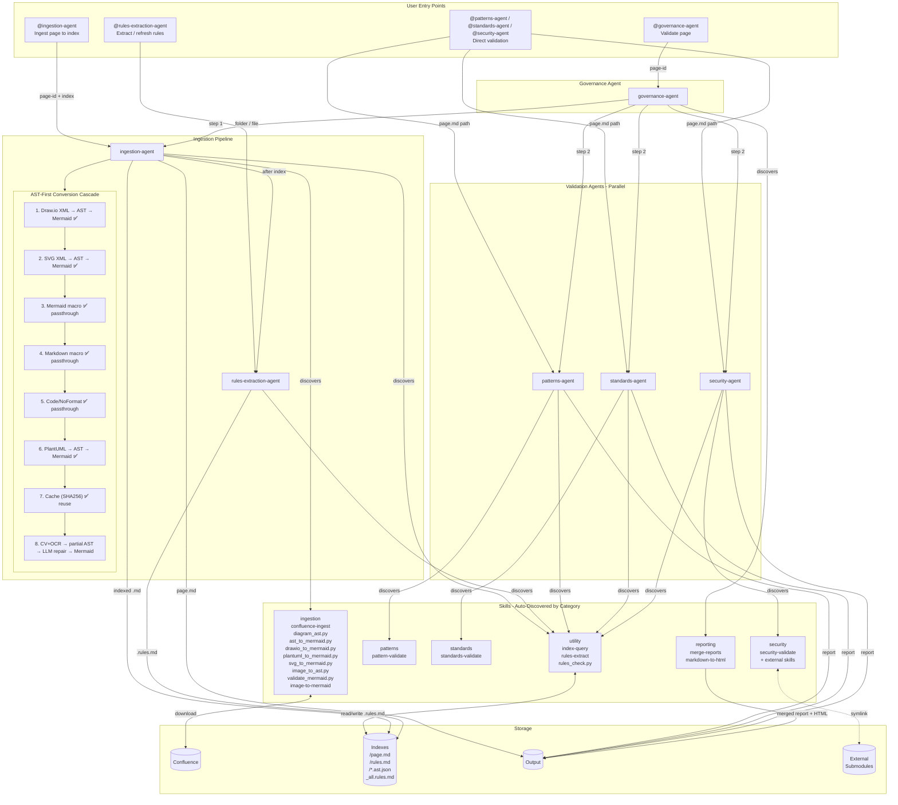
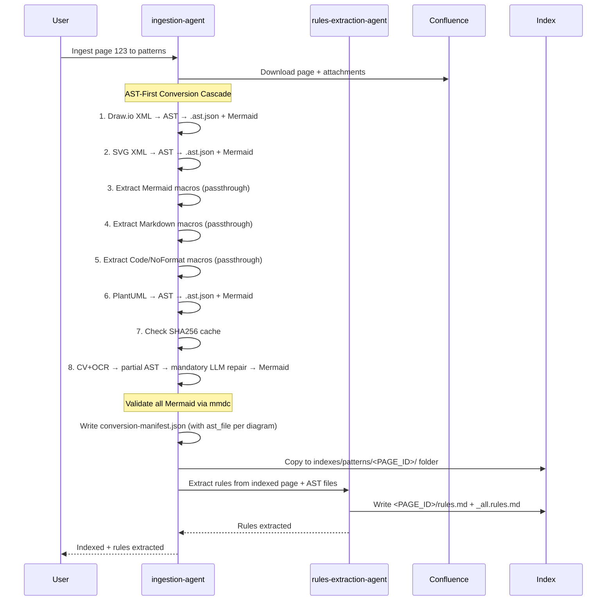
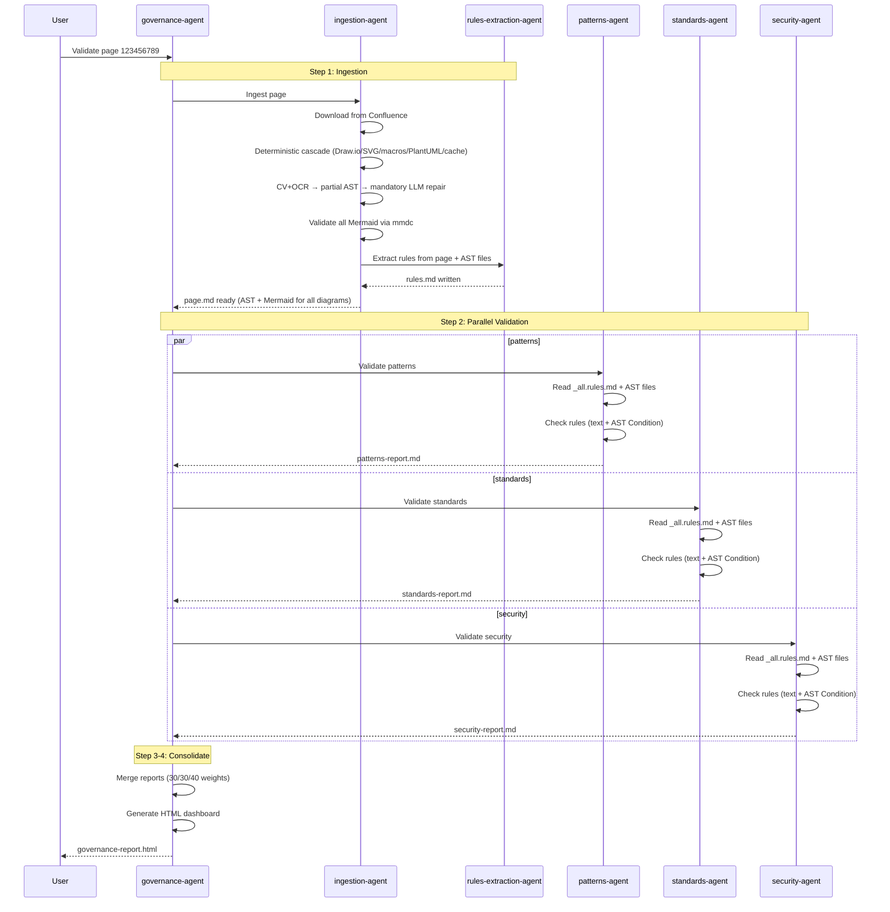
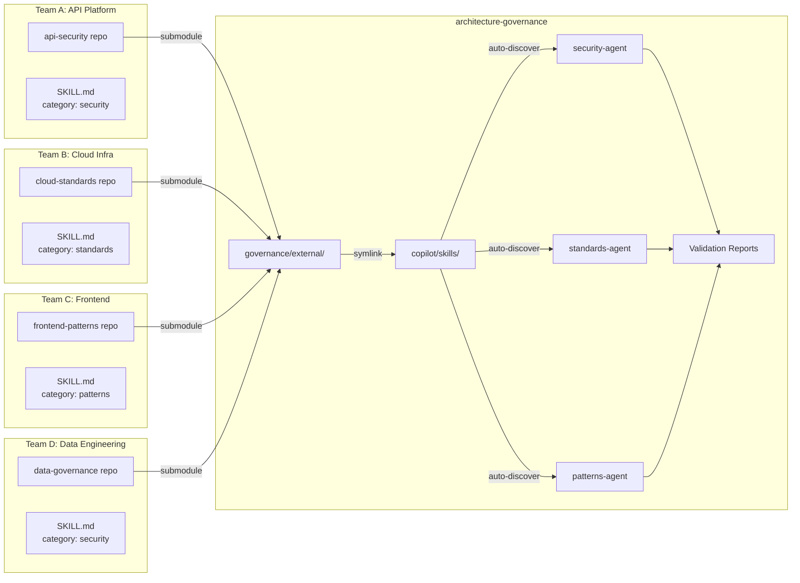

# Architecture Governance

AI-powered validation of Confluence architecture documents against patterns, standards, and security rules.

## Quick Start

### Docker (Recommended)
```bash
cp .env.example .env
# Edit .env with your tokens

make validate PAGE_ID=123456789
```

### IDE Agents
```bash
# 1. Clone (include submodules for external skills)
git clone --recurse-submodules <repo-url>
# If already cloned: git submodule init && git submodule update

# 2. Setup (first time only)
cp .env.example .env
# Edit .env with CONFLUENCE_URL and CONFLUENCE_API_TOKEN

python3 -m venv .venv
source .venv/bin/activate
pip install -r requirements.txt

# Node.js deps (Mermaid CLI for syntax validation)
npm install

# System deps: Tesseract OCR + OpenCV (for CV+OCR AST extraction)
# macOS: brew install tesseract
# Ubuntu: sudo apt-get install tesseract-ocr
# pip install opencv-python-headless pytesseract

# 3. Use agents (venv auto-activates, .env auto-loads)

# Ingest a Confluence page to an index
@ingestion-agent Ingest Confluence page 123456789 to security

# Full governance validation (ingest + patterns + standards + security)
@governance-agent Validate Confluence page 123456789

# Extract governance rules from an index folder
@rules-extraction-agent Extract rules from governance/indexes/security/

# Refresh only stale rules (after source .md files change)
@rules-extraction-agent Refresh rules in governance/indexes/security/

# Check which rules are stale (CLI, no agent)
make check-rules FOLDER=governance/indexes/security/

# Validate directly with a single agent
@patterns-agent Validate governance/output/123456789/page.md
@standards-agent Validate governance/output/123456789/page.md
@security-agent Validate governance/output/123456789/page.md
```

## Architecture Overview



## Agents

Agents auto-discover skills by `category` tag in SKILL.md frontmatter. No agent changes needed when skills are added.

| Agent | Purpose | Discovers Categories | User-Invokable |
|-------|---------|---------------------|----------------|
| **governance-agent** | Orchestrates full validation pipeline | `reporting` | Yes |
| **ingestion-agent** | Downloads Confluence pages, converts ALL diagrams to AST IR + Mermaid | `ingestion` + `utility` | Yes |
| **patterns-agent** | Validates against design patterns | `patterns` + `utility` | Yes |
| **standards-agent** | Validates against architectural standards | `standards` + `utility` | Yes |
| **security-agent** | Validates against security controls | `security` + `utility` | Yes |
| **rules-extraction-agent** | Extracts governance rules from markdown into `.rules.md` tables | `utility` | Yes |

## Agent Reference

Complete list of agents with invocation prompts.

### governance-agent

Orchestrates the full validation pipeline -- ingest, validate (patterns + standards + security in parallel), merge reports, generate HTML dashboard.

```
@governance-agent Validate Confluence page 123456789
```

Internally triggers:

| Step | Agent Called | Prompt Sent |
|------|-------------|-------------|
| 1 | ingestion-agent | `Ingest Confluence page <PAGE_ID> in governance mode` |
| 2 | patterns-agent | `Validate governance/output/<PAGE_ID>/page.md` |
| 3 | standards-agent | `Validate governance/output/<PAGE_ID>/page.md` |
| 4 | security-agent | `Validate governance/output/<PAGE_ID>/page.md` |
| 5 | (self) | Merge reports (merge-reports skill, 30/30/40 weights) |
| 6 | (self) | Generate HTML dashboard (markdown-to-html skill) |

### ingestion-agent

Downloads a Confluence page by ID, converts all diagrams to AST JSON IR + Mermaid (via deterministic parsing or CV+OCR with mandatory LLM repair for images), outputs a clean markdown file with per-page artifact folders. Triggers rules-extraction-agent when indexing.

| Task | Prompt |
|------|--------|
| Ingest only (no index) | `@ingestion-agent Ingest Confluence page 123456789` |
| Ingest to patterns index | `@ingestion-agent Ingest Confluence page 123456789 to patterns` |
| Ingest to standards index | `@ingestion-agent Ingest Confluence page 123456789 to standards` |
| Ingest to security index | `@ingestion-agent Ingest Confluence page 123456789 to security` |

### patterns-agent

Validates a document against all pattern documents in the index. Typically called by governance-agent, but can be invoked directly.

```
@patterns-agent Validate governance/output/123456789/page.md
```

### standards-agent

Validates a document against all standards documents in the index. Typically called by governance-agent, but can be invoked directly.

```
@standards-agent Validate governance/output/123456789/page.md
```

### security-agent

Validates a document against all security documents in the index. Typically called by governance-agent, but can be invoked directly.

```
@security-agent Validate governance/output/123456789/page.md
```

### rules-extraction-agent

Extracts structured governance rules from markdown documents into compact `.rules.md` table files. User-invokable with three modes.

| Mode | Prompt | What It Does |
|------|--------|--------------|
| Batch (full folder) | `@rules-extraction-agent Extract rules from governance/indexes/security/` | Scans `<PAGE_ID>/` subfolders, extracts rules from `page.md` + `*.ast.json`, produces `<PAGE_ID>/rules.md` + consolidated `_all.rules.md` |
| Batch with category | `@rules-extraction-agent Extract rules from governance/indexes/patterns/ for category patterns` | Same as above, with explicit category |
| Arbitrary folder | `@rules-extraction-agent Extract rules from /path/to/team-docs/` | Process any folder of markdown files |
| Refresh (incremental) | `@rules-extraction-agent Refresh rules in governance/indexes/security/` | Only re-extract rules for files that changed since last extraction |
| Check status (dry run) | `@rules-extraction-agent Check rules status in governance/indexes/security/` | Report which files are stale without re-extracting |
| Single file | `@rules-extraction-agent Extract rules from governance/indexes/security/123456789/page.md for category security` | Extract rules from one page folder |

**Rules staleness check** (CLI, no agent needed):

```bash
make check-rules FOLDER=governance/indexes/security/   # Check one folder
make check-rules-all                                    # Check all index folders
```

## Workflows

### 1. Ingest to Index

Add architecture documents to your knowledge base:

```
@ingestion-agent Ingest Confluence page 123456789 to patterns
@ingestion-agent Ingest Confluence page 123456789 to standards
@ingestion-agent Ingest Confluence page 123456789 to security
```



### 2. Validate Architecture

Run full governance validation:

```
@governance-agent Validate Confluence page 123456789
```



## Setup

### Environment Variables

```bash
cp .env.example .env
```

Edit `.env`:
```
# Required for Docker (Copilot CLI)
COPILOT_TOKEN=your-github-token

# Required for Confluence access
CONFLUENCE_URL=https://your-company.atlassian.net
CONFLUENCE_API_TOKEN=your-personal-access-token
```

Get tokens:
- **COPILOT_TOKEN**: https://github.com/settings/tokens (needs `copilot` scope)
- **CONFLUENCE_API_TOKEN**: https://id.atlassian.com/manage-profile/security/api-tokens

### Finding Page ID

From URL: `https://company.atlassian.net/wiki/spaces/SPACE/pages/123456789/Title`

Page ID = `123456789`

### IDE Setup (VS Code / Cursor)

The agents are stored in `copilot/` for Docker compatibility, but VS Code expects them in `.github/agents/`. Symlinks are provided:

```
.github/
├── agents -> ../copilot/agents    # VS Code detects agents here
└── skills -> ../copilot/skills    # Skills accessible here too
```

If symlinks are missing, create them:
```bash
mkdir -p .github
ln -sf ../copilot/agents .github/agents
ln -sf ../copilot/skills .github/skills
```

**Agent-to-Agent Triggering:**
- The `governance-agent` uses **handoffs** (VS Code feature) to provide workflow buttons
- It also uses the `agent` tool to programmatically invoke other agents
- In VS Code, you'll see "Step 1: Ingest Page", "Step 2: Validate Patterns", "Step 3: Validate Standards", "Step 4: Validate Security" buttons after responses

## Usage Examples

### Make Commands (Docker)

| Task | Command |
|------|---------|
| Ingest only | `make ingest PAGE_ID=123456789` |
| Full validation | `make validate PAGE_ID=123456789` |
| Clean outputs | `make clean` |
| Check rules staleness | `make check-rules FOLDER=governance/indexes/security/` |
| Check all rules | `make check-rules-all` |
| Refresh rules (show instructions) | `make refresh-rules FOLDER=governance/indexes/security/` |
| Extract rules (show instructions) | `make extract-rules` |
| Convert PlantUML to Mermaid | `make convert-plantuml FILE=path/to/file.md` |
| Add external skill | `make add-skill REPO=<url> NAME=<name>` |
| Add external skill (nested) | `make add-skill REPO=<url> NAME=<name> SKILL_PATH=<path>` |
| Update external skills | `make update-skills` |
| Remove external skill | `make remove-skill NAME=<name>` |
| List all skills | `make list-skills` |

### IDE Agent Commands

| Task | Command |
|------|---------|
| Ingest page (no index) | `@ingestion-agent Ingest Confluence page 123456789` |
| Ingest to patterns index | `@ingestion-agent Ingest Confluence page 123456789 to patterns` |
| Ingest to standards index | `@ingestion-agent Ingest Confluence page 123456789 to standards` |
| Ingest to security index | `@ingestion-agent Ingest Confluence page 123456789 to security` |
| Full validation | `@governance-agent Validate Confluence page 123456789` |

## Output

All outputs saved to `governance/output/`:

| File | Description |
|------|-------------|
| `<PAGE_ID>/page.md` | Clean markdown with ALL diagrams as Mermaid (100% text) |
| `<PAGE_ID>/metadata.json` | Page metadata from Confluence |
| `<PAGE_ID>/attachments/` | Original downloaded files |
| `<PAGE_ID>/attachments/<name>.ast.json` | AST IR per diagram (canonical semantic representation) |
| `<PAGE_ID>/attachments/<name>.mmd` | Mermaid per diagram (generated from AST) |
| `<PAGE_ID>/conversion-manifest.json` | Per-diagram: method, ast_file, mermaid_file, validity |
| `<PAGE_ID>-patterns-report.md` | Pattern validation results |
| `<PAGE_ID>-standards-report.md` | Standards validation results |
| `<PAGE_ID>-security-report.md` | Security validation results |
| `<PAGE_ID>-governance-report.md` | Merged final report |
| `<PAGE_ID>-governance-report.html` | HTML dashboard |

## Project Structure

```
.github/                        # Symlinks for VS Code/IDE
├── agents -> ../copilot/agents
└── skills -> ../copilot/skills

package.json                    # Node.js deps (@mermaid-js/mermaid-cli)
requirements.txt                # Python deps (atlassian-python-api, pytesseract, etc.)

copilot/                        # Source files (mounted as .github/ in Docker)
├── agents/                     # AI agents
│   ├── governance-agent.agent.md   # Orchestrator with handoffs
│   ├── ingestion-agent.agent.md
│   ├── patterns-agent.agent.md
│   ├── standards-agent.agent.md
│   ├── security-agent.agent.md
│   └── rules-extraction-agent.agent.md  # User-invokable rules extractor
│
└── skills/                     # Reusable skills (auto-discovered by category)
    ├── confluence-ingest/      # category: ingestion
    │   ├── SKILL.md
    │   ├── confluence_ingest.py
    │   ├── diagram_ast.py          # Shared AST schema + Mermaid generator
    │   ├── ast_to_mermaid.py       # CLI: .ast.json → Mermaid
    │   ├── drawio_to_mermaid.py    # Draw.io XML → AST → Mermaid
    │   ├── plantuml_to_mermaid.py  # PlantUML → AST → Mermaid
    │   ├── svg_to_mermaid.py       # SVG XML → AST → Mermaid
    │   ├── image_to_ast.py         # CV+OCR → partial AST (needs LLM repair)
    │   └── validate_mermaid.py     # mmdc syntax validation
    ├── image-to-mermaid/       # category: ingestion
    ├── index-query/            # category: utility
    ├── rules-extract/          # category: utility
    │   ├── SKILL.md
    │   └── rules_check.py      # Staleness checker (zero deps)
    ├── pattern-validate/       # category: patterns
    ├── standards-validate/     # category: standards
    ├── security-validate/      # category: security
    ├── merge-reports/          # category: reporting
    ├── markdown-to-html/       # category: reporting
    ├── verbose-logging/        # logging templates for all agents
    └── <external-skill>/       # symlink -> ../../governance/external/<name>/...

governance/
├── external/                   # External skill submodules
│   └── <name>/                 # Teammate's repo (git submodule)
│
├── indexes/                    # Knowledge base (per-page folders)
│   ├── patterns/
│   │   ├── _all.rules.md                 # Consolidated rules (deduplicated)
│   │   └── <PAGE_ID>/                    # Per-page artifact folder
│   │       ├── page.md                   # Source document with inline Mermaid
│   │       ├── metadata.json             # Page metadata
│   │       ├── rules.md                  # Extracted rules (with AST Condition)
│   │       ├── <name>.ast.json           # AST IR per diagram
│   │       └── <name>.mmd               # Mermaid per diagram
│   ├── standards/
│   │   ├── _all.rules.md
│   │   └── <PAGE_ID>/ ...
│   └── security/
│       ├── _all.rules.md
│       └── <PAGE_ID>/ ...
│
└── output/                     # Generated outputs
    ├── .cache/                 # SHA256-keyed conversion cache
    │   └── mermaid/
    │       ├── <hash>.mmd      # Cached Mermaid outputs
    │       └── <hash>.meta     # Cache metadata (source, method, timestamp)
    ├── <PAGE_ID>/              # Page folder
    │   ├── page.md
    │   ├── metadata.json
    │   ├── conversion-manifest.json  # Per-diagram: method, ast_file, valid
    │   └── attachments/
    │       ├── <name>.ast.json       # AST IR per diagram
    │       └── <name>.mmd           # Mermaid per diagram
    └── <PAGE_ID>-*-report.md   # Validation reports
```

## Scoring

Governance score calculated as weighted average:

| Category | Weight |
|----------|--------|
| Patterns | 30% |
| Standards | 30% |
| Security | 40% |

**Thresholds:**
- **PASS**: Score ≥ 70
- **WARN**: Score 50-69
- **FAIL**: Score < 50

## Skill Discovery

Agents automatically discover relevant skills at runtime:

1. Scan all directories in `.github/skills/`
2. Read the SKILL.md frontmatter in each
3. Use skills matching the agent's categories (e.g., security-agent uses `category: security`)
4. For untagged skills, fall back to semantic matching on the description

This means adding a new skill requires **zero changes to agent files**.

### Skill Categories

| Category | Used By | Skills |
|----------|---------|--------|
| `security` | security-agent | security-validate, + external |
| `patterns` | patterns-agent | pattern-validate |
| `standards` | standards-agent | standards-validate |
| `ingestion` | ingestion-agent | confluence-ingest, image-to-mermaid |
| `utility` | all validation agents, ingestion-agent, rules-extraction-agent | index-query, rules-extract |
| `reporting` | governance-agent | merge-reports, markdown-to-html |

### Adding a Category Tag

Every SKILL.md should include a `category` field in its frontmatter:

```yaml
---
name: my-skill
category: security
description: What this skill does and when to use it.
---
```

## Managing External Skills

Integrate skills from other repositories via git submodules. The submodule is cloned into `governance/external/` and symlinked into `copilot/skills/` so it appears as a first-class skill.

| Task | Command |
|------|---------|
| Add a skill (SKILL.md at repo root) | `make add-skill REPO=<url> NAME=<name>` |
| Add a skill (nested SKILL.md) | `make add-skill REPO=<url> NAME=<name> SKILL_PATH=<path>` |
| Update all external skills | `make update-skills` |
| Remove a skill | `make remove-skill NAME=<name>` |
| List all skills | `make list-skills` |

### Example: Add a teammate's API security skill

```bash
# SKILL.md is at src/skills/api-sec/ in the teammate's repo
make add-skill \
  REPO=https://github.com/teammate/api-security \
  NAME=api-security \
  SKILL_PATH=src/skills/api-sec
```

The security-agent will auto-discover the new skill (if it has `category: security` in its frontmatter) and use it alongside the existing `security-validate` skill.

### How it works

1. `make add-skill` clones the repo as a git submodule at `governance/external/<name>/`
2. A relative symlink is created: `copilot/skills/<name>/ -> ../../governance/external/<name>/[path]`
3. The existing `.github/skills -> ../copilot/skills` symlink makes it visible at `.github/skills/<name>/`
4. The matching agent discovers and uses it at runtime

### Cloning with submodules

Submodules are **not** pulled by a plain `git clone`. Use:

```bash
git clone --recurse-submodules <repo-url>

# Or if already cloned:
git submodule init && git submodule update
```

Symlinks (`.github/agents`, `.github/skills`, external skill links) are stored in git and recreated automatically on clone. Windows users need developer mode enabled.

## Contribution Model

This repo is designed to scale across teams. Each team owns their governance rules as **skills** in their own repos. This repo pulls them in and uses them automatically -- zero coordination overhead after initial setup.

### How It Works



### For Contributors (Coworkers)

If you want your team's rules to be enforced during architecture validation, follow these steps:

#### Step 1: Create a skill in your own repo

Create a `SKILL.md` file (at the root or any path) with this structure:

```yaml
---
name: your-skill-name
category: security | standards | patterns
description: What this skill validates and when to use it.
---
```

Below the frontmatter, write the validation instructions, rules, or prompt files your skill uses. The format is flexible -- the validation agent will attempt to use your skill's output. See the [Collation](#collation-how-your-output-is-used) section below for how output is handled.

#### Step 2: Ask the repo owner to register it

Provide the repo owner with:

| Info | Example |
|------|---------|
| Git URL | `https://github.com/your-team/api-security` |
| Skill name | `api-security` |
| Path to SKILL.md (if not at root) | `src/skills/api-sec` |

The repo owner runs:

```bash
make add-skill REPO=https://github.com/your-team/api-security NAME=api-security SKILL_PATH=src/skills/api-sec
```

That's it. Your skill is now auto-discovered and used in every validation run.

#### Step 3: Maintain your skill

You own your repo. Push updates whenever you want:

- Add new rules, update prompts, refine instructions
- The governance repo pulls latest with `make update-skills`
- No PRs needed to this repo -- your skill is pulled via submodule

### Collation: How Your Output Is Used

Your skill output is collated into the validation report with full transparency:

| Your Skill Output | What Happens |
|-------------------|--------------|
| Clean findings (PASS/FAIL/WARN) | Extracted as rows in the main findings table, tagged `🔌 External` |
| Unstructured or custom format | Best-effort parsing + raw output preserved in a collapsed `<details>` block |
| No output or error | Logged as `⚠️ SKIPPED` -- does not block the report or penalize score |
| No relevant findings | Logged as `ℹ️ NO FINDINGS` -- raw output preserved for audit |

Your skill's findings always appear in a dedicated **Discovered Skill Findings** section in the report, with your skill name and a `🔌 External` flag so reviewers know the source.

### What a Contributed Skill Looks Like in the Report

```markdown
## Skills Used

| Skill | Type | Status | Findings |
|-------|------|--------|----------|
| security-validate | 🏠 Internal | ✅ Ran | 8 findings |
| api-security | 🔌 External | ✅ Ran | 3 findings |
| data-governance | 🔌 External | ✅ Ran | 2 findings |
| cloud-standards | 🔌 External | ⚠️ Partial | 1 finding |

## Discovered Skill Findings

### 🔌 api-security Findings

**Source**: api-security (Team A: API Platform)
**Type**: External (coworker skill)
**Status**: ✅ Ran

| Control | Severity | Status | Evidence |
|---------|----------|--------|----------|
| REST-only APIs | Critical | ✅ PASS | Document specifies REST endpoints |
| OAuth2 required | High | ❌ ERROR | No OAuth2 mention found |
| Rate limiting | Medium | ⚠️ WARN | Mentioned but no specifics |
```

### Scaling: Multi-Team Example

Here's how five teams contribute governance rules independently:

| Team | Repo | Skill Name | Category | What They Validate |
|------|------|-----------|----------|-------------------|
| **API Platform** | `github.com/team-a/api-security` | `api-security` | `security` | REST standards, OAuth2, rate limits, API gateway rules |
| **Cloud Infra** | `github.com/team-b/cloud-standards` | `cloud-standards` | `standards` | Cloud-native patterns, container standards, IaC requirements |
| **Frontend** | `github.com/team-c/frontend-patterns` | `frontend-patterns` | `patterns` | SPA patterns, component architecture, state management |
| **Data Engineering** | `github.com/team-d/data-governance` | `data-governance` | `security` | PII handling, data classification, encryption at rest |
| **SRE** | `github.com/team-e/sre-standards` | `sre-standards` | `standards` | Observability, SLO definitions, runbook requirements |

Registration:

```bash
make add-skill REPO=https://github.com/team-a/api-security NAME=api-security
make add-skill REPO=https://github.com/team-b/cloud-standards NAME=cloud-standards
make add-skill REPO=https://github.com/team-c/frontend-patterns NAME=frontend-patterns
make add-skill REPO=https://github.com/team-d/data-governance NAME=data-governance
make add-skill REPO=https://github.com/team-e/sre-standards NAME=sre-standards SKILL_PATH=skills/standards
```

After registration, the project structure becomes:

```
governance/external/
├── api-security/           # Team A's repo (submodule)
├── cloud-standards/        # Team B's repo (submodule)
├── frontend-patterns/      # Team C's repo (submodule)
├── data-governance/        # Team D's repo (submodule)
└── sre-standards/          # Team E's repo (submodule)

copilot/skills/
├── security-validate/      # 🏠 Internal
├── pattern-validate/       # 🏠 Internal
├── standards-validate/     # 🏠 Internal
├── api-security/           # 🔌 symlink → Team A
├── cloud-standards/        # 🔌 symlink → Team B
├── frontend-patterns/      # 🔌 symlink → Team C
├── data-governance/        # 🔌 symlink → Team D
└── sre-standards/          # 🔌 symlink → Team E
```

Validation agents auto-discover all matching skills:

| Agent | Internal Skills | External Skills Discovered |
|-------|----------------|---------------------------|
| **security-agent** | `security-validate` | `api-security`, `data-governance` |
| **standards-agent** | `standards-validate` | `cloud-standards`, `sre-standards` |
| **patterns-agent** | `pattern-validate` | `frontend-patterns` |

### Contributor Checklist

For coworkers creating a new skill:

- [ ] Create `SKILL.md` with valid frontmatter (`name`, `category`, `description`)
- [ ] Use one of the supported categories: `security`, `standards`, `patterns`, `ingestion`, `utility`, `reporting`
- [ ] Write clear validation instructions or rules in the SKILL.md body
- [ ] Test the skill independently in your own repo first
- [ ] Share your repo URL, skill name, and SKILL.md path with the governance repo owner

For the governance repo owner:

- [ ] Run `make add-skill` with the contributor's details
- [ ] Verify with `make list-skills` that the symlink is created
- [ ] Run a test validation to confirm the skill is discovered
- [ ] Commit the submodule reference and symlink
