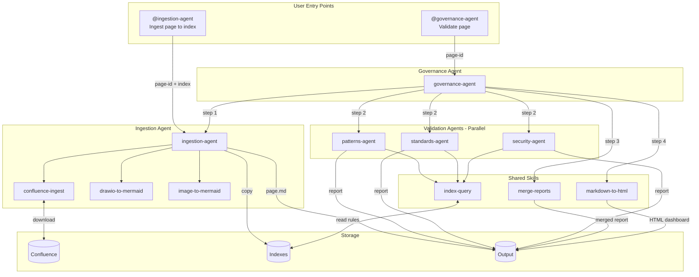
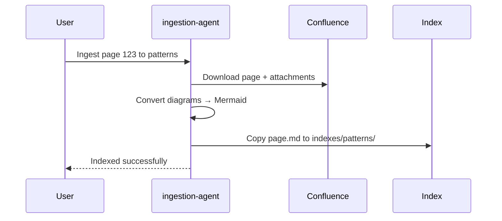
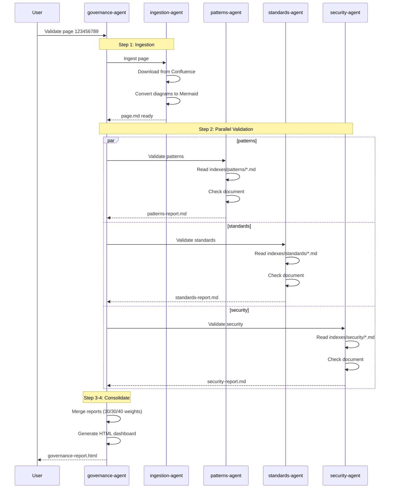

# Architecture Governance

AI-powered validation of Confluence architecture documents against patterns, standards, and security rules.

## Quick Start

```bash
# 1. Setup
cp .env.example .env
# Edit .env with your Confluence URL, PAT, and Copilot token

# 2. Run full validation (Docker)
make validate PAGE_ID=123456789

# 3. Or use agents in IDE
@governance-agent Validate Confluence page 123456789
```

## Architecture Overview



## Agents

| Agent | Purpose | Skills Used |
|-------|---------|-------------|
| **ingestion-agent** | Downloads Confluence pages, converts diagrams to Mermaid | confluence-ingest, drawio-to-mermaid, image-to-mermaid |
| **governance-agent** | Orchestrates full validation pipeline | merge-reports, markdown-to-html |
| **patterns-agent** | Validates against design patterns | index-query, pattern-validate |
| **standards-agent** | Validates against architectural standards | index-query, standards-validate |
| **security-agent** | Validates against security controls | index-query, security-validate |

## Workflows

### 1. Ingest to Index

Add architecture documents to your knowledge base:

```
@ingestion-agent Ingest Confluence page 123456789 to patterns
@ingestion-agent Ingest Confluence page 123456789 to standards
@ingestion-agent Ingest Confluence page 123456789 to security
```



### 2. Validate Architecture

Run full governance validation:

```
@governance-agent Validate Confluence page 123456789
```



## Setup

### Environment Variables

```bash
cp .env.example .env
```

Edit `.env`:
```
# Required for Docker (Copilot CLI)
COPILOT_TOKEN=your-github-token

# Required for Confluence access
CONFLUENCE_URL=https://your-company.atlassian.net
CONFLUENCE_API_TOKEN=your-personal-access-token
```

Get tokens:
- **COPILOT_TOKEN**: https://github.com/settings/tokens (needs `copilot` scope)
- **CONFLUENCE_API_TOKEN**: https://id.atlassian.com/manage-profile/security/api-tokens

### Finding Page ID

From URL: `https://company.atlassian.net/wiki/spaces/SPACE/pages/123456789/Title`

Page ID = `123456789`

## Usage Examples

### Make Commands (Docker)

| Task | Command |
|------|---------|
| Ingest only | `make ingest PAGE_ID=123456789` |
| Full validation | `make validate PAGE_ID=123456789` |
| Clean outputs | `make clean` |

### IDE Agent Commands

| Task | Command |
|------|---------|
| Ingest page (no index) | `@ingestion-agent Ingest Confluence page 123456789` |
| Ingest to patterns index | `@ingestion-agent Ingest Confluence page 123456789 to patterns` |
| Ingest to standards index | `@ingestion-agent Ingest Confluence page 123456789 to standards` |
| Ingest to security index | `@ingestion-agent Ingest Confluence page 123456789 to security` |
| Full validation | `@governance-agent Validate Confluence page 123456789` |

## Output

All outputs saved to `governance/output/<PAGE_ID>/`:

| File | Description |
|------|-------------|
| `page.md` | Clean markdown with Mermaid diagrams |
| `metadata.json` | Page metadata from Confluence |
| `attachments/` | Original downloaded files |
| `patterns-report.md` | Pattern validation results |
| `standards-report.md` | Standards validation results |
| `security-report.md` | Security validation results |
| `governance-report.md` | Merged final report |
| `governance-report.html` | HTML dashboard |

## Project Structure

```
copilot/
├── agents/                     # AI agents
│   ├── governance-agent.agent.md
│   ├── ingestion-agent.agent.md
│   ├── patterns-agent.agent.md
│   ├── standards-agent.agent.md
│   └── security-agent.agent.md
│
└── skills/                     # Reusable skills
    ├── confluence-ingest/      # Download pages
    ├── drawio-to-mermaid/      # Convert diagrams
    ├── image-to-mermaid/       # Convert images (vision)
    ├── index-query/            # Read from indexes
    ├── pattern-validate/       # Validate patterns
    ├── standards-validate/     # Validate standards
    ├── security-validate/      # Validate security
    ├── merge-reports/          # Combine reports
    └── markdown-to-html/       # Generate dashboard

governance/
├── indexes/                    # Knowledge base (add .md files here)
│   ├── patterns/
│   ├── standards/
│   └── security/
│
└── output/                     # Generated reports
    └── <PAGE_ID>/
```

## Scoring

Governance score calculated as weighted average:

| Category | Weight |
|----------|--------|
| Patterns | 30% |
| Standards | 30% |
| Security | 40% |

**Thresholds:**
- **PASS**: Score ≥ 70
- **WARN**: Score 50-69
- **FAIL**: Score < 50
