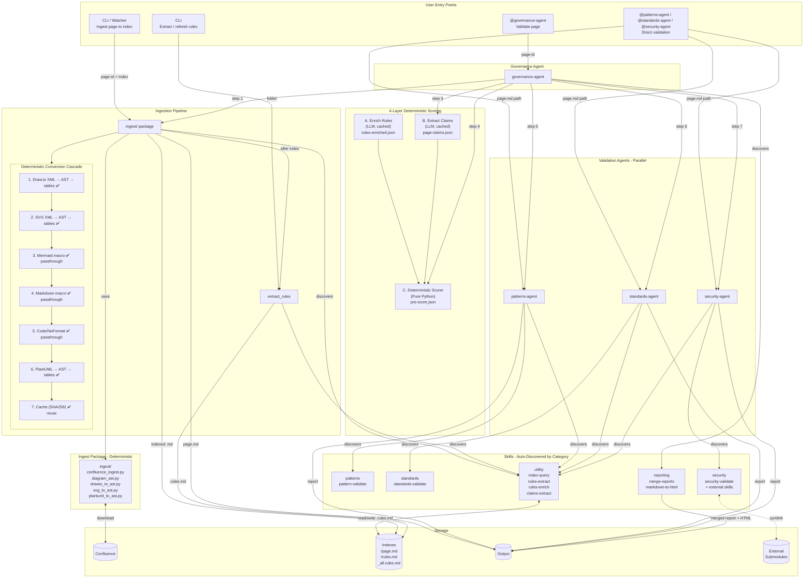
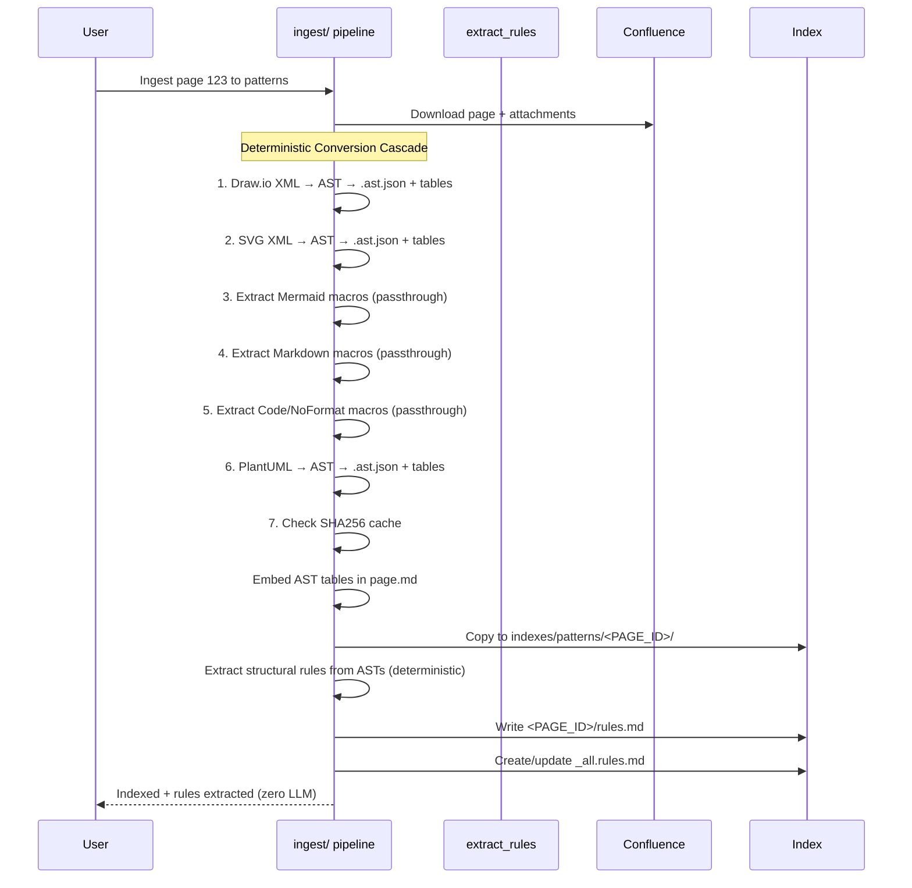
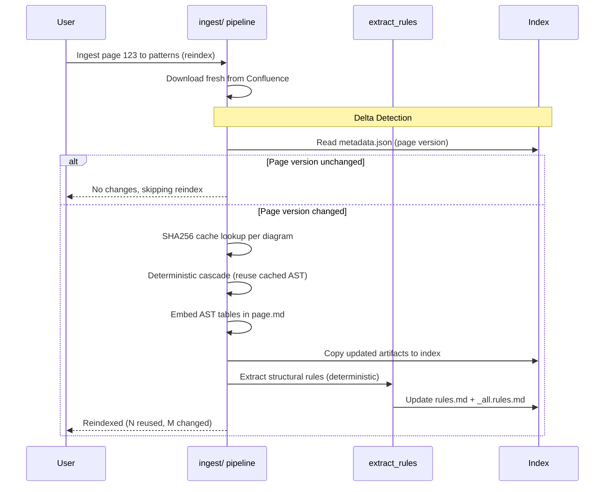
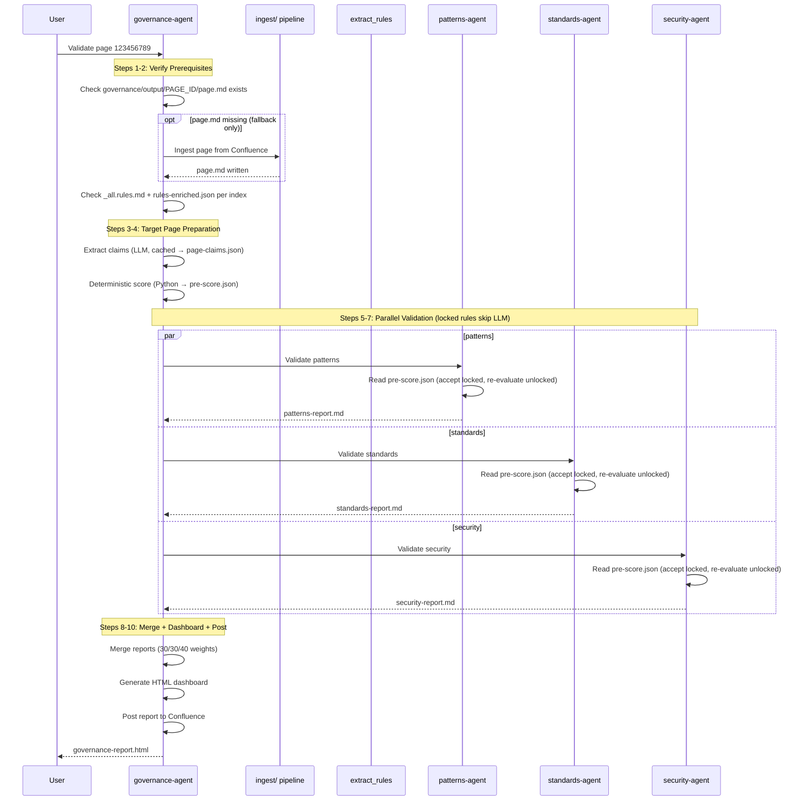
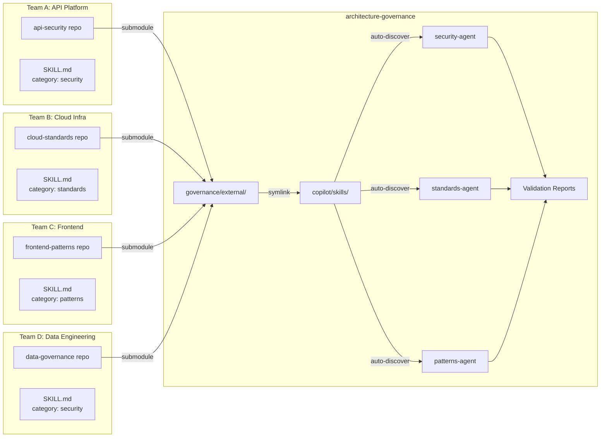

# Architecture Governance

AI-powered validation of Confluence architecture documents against patterns, standards, and security rules.

## Quick Start

### Docker (Recommended)
```bash
cp .env.example .env
# Edit .env with your tokens

make validate PAGE_ID=123456789
```

### IDE Agents
```bash
# 1. Clone (include submodules for external skills)
git clone --recurse-submodules <repo-url>
# If already cloned: git submodule init && git submodule update

# 2. Setup (first time only)
cp .env.example .env
# Edit .env with CONFLUENCE_URL and CONFLUENCE_API_TOKEN

python3 -m venv .venv
source .venv/bin/activate
pip install -r requirements.txt

# 3. Use agents (venv auto-activates, .env auto-loads)

# Ingest a Confluence page to an index
python ingest/confluence_ingest.py --page-id 123456789 --index security

# Full governance validation (ingest + patterns + standards + security)
@governance-agent Validate Confluence page 123456789

# Extract governance rules for all pages in an index
make extract-rules FOLDER=governance/indexes/security/

# Refresh only stale rules (after source .md files change)
make refresh-rules FOLDER=governance/indexes/security/

# Check which rules are stale
make check-rules FOLDER=governance/indexes/security/

# Check which pages need LLM text rule extraction
make check-zero-rules FOLDER=governance/indexes/security/

# Merge deterministic + LLM rules after extraction
make merge-llm-rules FOLDER=governance/indexes/security/

# Enrich rules with LLM-generated synonyms/patterns (cached)
make enrich-rules INDEX=security

# Extract structured claims from a page (cached)
make extract-claims PAGE_ID=123456789

# Run deterministic scoring (pure Python, no LLM)
make score PAGE_ID=123456789

# Validate directly with a single agent
@patterns-agent Validate governance/output/123456789/page.md
@standards-agent Validate governance/output/123456789/page.md
@security-agent Validate governance/output/123456789/page.md
```

## Architecture Overview


```mermaid
flowchart TB
    subgraph User[User Entry Points]
        U1["CLI / Watcher\nIngest page to index"]
        U2["@governance-agent\nValidate page"]
        U3["CLI\nExtract / refresh rules"]
        U4["@patterns-agent / @standards-agent / @security-agent\nDirect validation"]
    end

    subgraph Orchestration[Governance Agent]
        GA[governance-agent]
    end

    subgraph Scoring[4-Layer Deterministic Scoring]
        direction TB
        EN["A. Enrich Rules\n(LLM, cached)\nrules-enriched.json"]
        CL["B. Extract Claims\n(LLM, cached)\npage-claims.json"]
        SC["C. Deterministic Scorer\n(Pure Python)\npre-score.json"]
        EN --> SC
        CL --> SC
    end

    subgraph Ingestion[Ingestion Pipeline]
        IA[ingest/ package]
        RE[extract_rules]
        subgraph Cascade[Deterministic Conversion Cascade]
            direction TB
            T1["1. Draw.io XML → AST → tables ✅"]
            T2["2. SVG XML → AST → tables ✅"]
            T3["3. Mermaid macro ✅ passthrough"]
            T4["4. Markdown macro ✅ passthrough"]
            T5["5. Code/NoFormat ✅ passthrough"]
            T6["6. PlantUML → AST → tables ✅"]
            T7["7. Cache (SHA256) ✅ reuse"]
            T1 --> T2 --> T3 --> T4 --> T5 --> T6 --> T7
        end
    end

    subgraph Validation[Validation Agents - Parallel]
        PA[patterns-agent]
        SA[standards-agent]
        SEA[security-agent]
    end

    subgraph IngestPkg[Ingest Package - Deterministic]
        IngPkg["ingest/\n  confluence_ingest.py\n  diagram_ast.py\n  drawio_to_ast.py\n  svg_to_ast.py\n  plantuml_to_ast.py"]
    end

    subgraph SkillsPool[Skills - Auto-Discovered by Category]
        direction LR
        PatSkills["patterns\npattern-validate"]
        StdSkills["standards\nstandards-validate"]
        SecSkills["security\nsecurity-validate\n+ external skills"]
        UtilSkills["utility\nindex-query\nrules-extract\nrules-enrich\nclaims-extract"]
        RepSkills["reporting\nmerge-reports\nmarkdown-to-html"]
    end

    subgraph Storage
        CONF[(Confluence)]
        IDX[("Indexes\n<PAGE_ID>/page.md\n<PAGE_ID>/rules.md\n_all.rules.md")]
        OUT[(Output)]
        EXT[(External\nSubmodules)]
    end

    %% User triggers
    U1 -->|page-id + index| IA
    U2 -->|page-id| GA
    U3 -->|folder| RE
    U4 -->|page.md path| PA & SA & SEA
    GA -->|step 1| IA
    GA -->|step 3| CL
    GA -->|step 4| SC
    GA -->|step 5| PA
    GA -->|step 6| SA
    GA -->|step 7| SEA

    %% Ingestion triggers rules extraction
    IA -->|"after index"| RE

    %% Ingestion uses conversion cascade
    IA --> Cascade

    %% Discovery: agents discover skills by category
    IA -->|uses| IngPkg
    IA -->|discovers| UtilSkills
    RE -->|discovers| UtilSkills
    PA -->|discovers| PatSkills
    PA -->|discovers| UtilSkills
    SA -->|discovers| StdSkills
    SA -->|discovers| UtilSkills
    SEA -->|discovers| SecSkills
    SEA -->|discovers| UtilSkills
    GA -->|discovers| RepSkills

    %% Storage flow
    IngPkg <-->|download| CONF
    UtilSkills <-->|"read/write .rules.md"| IDX
    SecSkills <-.->|symlink| EXT
    IA -->|page.md| OUT
    IA -->|indexed .md| IDX
    RE -->|.rules.md| IDX
    PA -->|report| OUT
    SA -->|report| OUT
    SEA -->|report| OUT
    RepSkills -->|merged report + HTML| OUT
```

## Agents

Agents auto-discover skills by `category` tag in SKILL.md frontmatter. No agent changes needed when skills are added.

| Agent | Purpose | Discovers Categories | User-Invokable |
|-------|---------|---------------------|----------------|
| **governance-agent** | Orchestrates index preparation + validation pipeline | `reporting` | Yes |
| **patterns-agent** | Validates against design patterns | `patterns` + `utility` | Yes |
| **standards-agent** | Validates against architectural standards | `standards` + `utility` | Yes |
| **security-agent** | Validates against security controls | `security` + `utility` | Yes |

## Agent Reference

Complete list of agents with invocation prompts.

### governance-agent

Dual-mode orchestrator supporting **index preparation** (Process 1 LLM tasks) and **validation** (Process 2).

**Validation mode** (10 steps):

```
@governance-agent Validate Confluence page 123456789
```

| Step | Agent Called | Prompt Sent |
|------|-------------|-------------|
| 1 | (deterministic) | Verify ingested page exists at `governance/output/<PAGE_ID>/page.md` |
| 2 | (deterministic) | Verify `_all.rules.md` + `rules-enriched.json` exist per index |
| 3 | (LLM, cached) | `python -m ingest.extract_claims --check --page-id <PAGE_ID>` (extract claims -> `page-claims.json`) |
| 4 | (deterministic) | `python -m ingest.score_rules --page-id <PAGE_ID> --all` (score -> `pre-score.json`) |
| 5-7 | patterns / standards / security agent | `Validate governance/output/<PAGE_ID>/page.md` (parallel, uses `pre-score.json` for locked rules) |
| 8 | (self) | Merge reports (merge-reports skill, action summary across categories) |
| 9 | (self) | Generate HTML dashboard (markdown-to-html skill) |
| 10 | (self) | Post report to Confluence + notify watcher server with final action summary |

**Index preparation mode** (4 steps):

```
@governance-agent Prepare index security
```

| Step | What | LLM? |
|------|------|------|
| I-1 | Discover pages needing LLM extraction (check for missing/stale `rules-llm.md`) | No |
| I-2 | For each page: read `page.md`, extract text rules (R-TEXT-*), vet diagram rules (R-VET-*) → `rules-llm.md` | Yes |
| I-3 | Merge deterministic + LLM rules → rebuild `_all.rules.md` | No |
| I-4 | Enrich all rules → `rules-enriched.json` | Yes |

The watcher UI shows the appropriate `@governance-agent` command for both modes. Ingestion is done deterministically via the `ingest/` Python package or the watcher server (`make serve`).

### patterns-agent

Validates a document against all pattern documents in the index. Typically called by governance-agent, but can be invoked directly.

```
@patterns-agent Validate governance/output/123456789/page.md
```

### standards-agent

Validates a document against all standards documents in the index. Typically called by governance-agent, but can be invoked directly.

```
@standards-agent Validate governance/output/123456789/page.md
```

### security-agent

Validates a document against all security documents in the index. Typically called by governance-agent, but can be invoked directly.

```
@security-agent Validate governance/output/123456789/page.md
```

### Rules Extraction (Two-Layer)

Rules are extracted through two complementary layers:

| Layer | Source | Tool | Output | IDs | Confidence |
|-------|--------|------|--------|-----|------------|
| **Deterministic** | Diagram ASTs (Draw.io, SVG, PlantUML) | `python -m ingest.extract_rules` | `rules.md` | `R-PROTO-*`, `R-ROLE-*`, `R-ZONE-*`, etc. | 1.00 |
| **LLM** | Page prose (text, tables, bullets) | governance-agent + rules-extract skill | `rules-llm.md` | `R-TEXT-*` (new), `R-VET-*` (enhanced) | 0.70 / 0.80 |

Both are merged into the final `rules.md` and `_all.rules.md` by the merge CLI.

```bash
# Deterministic layer: extract rules from diagram ASTs
python -m ingest.extract_rules --folder governance/indexes/security/

# Refresh: only re-extract stale/missing pages
python -m ingest.extract_rules --folder governance/indexes/security/ --refresh

# Single page
python -m ingest.extract_rules --page 123456789 --index security

# All indexes
python -m ingest.extract_rules --all

# Check staleness (no extraction)
make check-rules FOLDER=governance/indexes/security/
make check-rules-all

# Find pages needing LLM extraction (0 deterministic rules)
make check-zero-rules FOLDER=governance/indexes/security/

# Merge deterministic + LLM rules (after governance-agent writes rules-llm.md)
make merge-llm-rules FOLDER=governance/indexes/security/
```

### Rule Enrichment (LLM, Cached)

Generates synonyms, regex evidence patterns, and section hints for each extracted rule. Output is cached in `rules-enriched.json` and only re-run when rules change.

```bash
python -m ingest.enrich_rules --check --index security
make enrich-rules INDEX=security
```

### Claims Extraction (LLM, Cached)

Extracts structured per-topic claims from `page.md`. Output is cached in `page-claims.json` and only re-run when page content changes.

```bash
python -m ingest.extract_claims --check --page-id 123456789
make extract-claims PAGE_ID=123456789
```

### Deterministic Scoring (Pure Python)

Matches enriched rules against extracted claims + AST facts to produce `pre-score.json`. 100% deterministic, no LLM calls. Locked rules are final; unlocked rules (~10-20%) are passed to validation agents for LLM re-evaluation.

```bash
python -m ingest.score_rules --page-id 123456789 --all
make score PAGE_ID=123456789
```

## Workflows

### 1. Ingest to Index

Add architecture documents to your knowledge base:

```
python ingest/confluence_ingest.py --page-id 123456789 --index patterns
python ingest/confluence_ingest.py --page-id 123456789 --index standards
python ingest/confluence_ingest.py --page-id 123456789 --index security
```


```mermaid
sequenceDiagram
    participant User
    participant IA as ingest/ pipeline
    participant RE as extract_rules
    participant Confluence
    participant Index

    User->>IA: Ingest page 123 to patterns
    IA->>Confluence: Download page + attachments

    Note over IA: Deterministic Conversion Cascade
    IA->>IA: 1. Draw.io XML → AST → .ast.json + tables
    IA->>IA: 2. SVG XML → AST → .ast.json + tables
    IA->>IA: 3. Extract Mermaid macros (passthrough)
    IA->>IA: 4. Extract Markdown macros (passthrough)
    IA->>IA: 5. Extract Code/NoFormat macros (passthrough)
    IA->>IA: 6. PlantUML → AST → .ast.json + tables
    IA->>IA: 7. Check SHA256 cache

    IA->>IA: Embed AST tables in page.md
    IA->>Index: Copy to indexes/patterns/<PAGE_ID>/
    IA->>IA: Extract structural rules from ASTs (deterministic)
    IA->>Index: Write <PAGE_ID>/rules.md
    IA->>Index: Create/update _all.rules.md
    IA-->>User: Indexed + rules extracted (zero LLM)
```

### 2. Reindex (Incremental)

Re-ingest a page that was previously indexed. Only changed diagrams are reprocessed — unchanged files reuse cached `.ast.json` from the SHA256 cache.

```
python ingest/confluence_ingest.py --page-id 123456789 --index patterns
```


```mermaid
sequenceDiagram
    participant User
    participant IA as ingest/ pipeline
    participant RE as extract_rules
    participant Index

    User->>IA: Ingest page 123 to patterns (reindex)
    IA->>IA: Download fresh from Confluence

    Note over IA,Index: Delta Detection
    IA->>Index: Read metadata.json (page version)
    alt Page version unchanged
        IA-->>User: No changes, skipping reindex
    else Page version changed
        IA->>IA: SHA256 cache lookup per diagram
        IA->>IA: Deterministic cascade (reuse cached AST)
        IA->>IA: Embed AST tables in page.md
        IA->>Index: Copy updated artifacts to index
        IA->>RE: Extract structural rules (deterministic)
        RE->>Index: Update rules.md + _all.rules.md
        IA-->>User: Reindexed (N reused, M changed)
    end
```

### 3. Validate Architecture

Run full governance validation:

```
@governance-agent Validate Confluence page 123456789
```


```mermaid
sequenceDiagram
    participant User
    participant GA as governance-agent
    participant IA as ingest/ pipeline
    participant RE as extract_rules
    participant PA as patterns-agent
    participant SA as standards-agent
    participant SEA as security-agent

    User->>GA: Validate page 123456789
    
    Note over GA: Steps 1-2: Verify Prerequisites
    GA->>GA: Check governance/output/PAGE_ID/page.md exists
    opt page.md missing (fallback only)
        GA->>IA: Ingest page from Confluence
        IA-->>GA: page.md written
    end
    GA->>GA: Check _all.rules.md + rules-enriched.json per index

    Note over GA: Steps 3-4: Target Page Preparation
    GA->>GA: Extract claims (LLM, cached → page-claims.json)
    GA->>GA: Deterministic score (Python → pre-score.json)

    Note over GA,SEA: Steps 5-7: Parallel Validation (locked rules skip LLM)
    par patterns
        GA->>PA: Validate patterns
        PA->>PA: Read pre-score.json (accept locked, re-evaluate unlocked)
        PA-->>GA: patterns-report.md
    and standards
        GA->>SA: Validate standards
        SA->>SA: Read pre-score.json (accept locked, re-evaluate unlocked)
        SA-->>GA: standards-report.md
    and security
        GA->>SEA: Validate security
        SEA->>SEA: Read pre-score.json (accept locked, re-evaluate unlocked)
        SEA-->>GA: security-report.md
    end

    Note over GA: Steps 8-10: Merge + Dashboard + Post
    GA->>GA: Merge reports (30/30/40 weights)
    GA->>GA: Generate HTML dashboard
    GA->>GA: Post report to Confluence
    GA-->>User: governance-report.html
```

## Setup

### Environment Variables

```bash
cp .env.example .env
```

Edit `.env`:
```
# Required for Docker (GitHub Copilot)
COPILOT_TOKEN=your-github-token

# Required for Confluence access
CONFLUENCE_URL=https://your-company.atlassian.net
CONFLUENCE_API_TOKEN=your-personal-access-token
```

Get tokens:
- **COPILOT_TOKEN**: https://github.com/settings/tokens (needs `copilot` scope for GitHub Copilot agents)
- **CONFLUENCE_API_TOKEN**: https://id.atlassian.com/manage-profile/security/api-tokens

### Finding Page ID

From URL: `https://company.atlassian.net/wiki/spaces/SPACE/pages/123456789/Title`

Page ID = `123456789`

### IDE Setup (VS Code)

The agents are stored in `copilot/` for Docker compatibility, but VS Code expects them in `.github/agents/`. Symlinks are provided:

```
.github/
├── agents -> ../copilot/agents    # VS Code detects agents here
└── skills -> ../copilot/skills    # Skills accessible here too
```

If symlinks are missing, create them:
```bash
mkdir -p .github
ln -sf ../copilot/agents .github/agents
ln -sf ../copilot/skills .github/skills
```

**Agent-to-Agent Triggering:**
- The `governance-agent` uses **handoffs** (VS Code feature) to provide workflow buttons
- It also uses the `agent` tool to programmatically invoke other agents
- In VS Code, you'll see "Step 5: Validate Patterns", "Step 6: Validate Standards", "Step 7: Validate Security" buttons after responses

## Usage Examples

### Make Commands (Docker)

| Task | Command |
|------|---------|
| Ingest only | `make ingest PAGE_ID=123456789` |
| Full validation | `make validate PAGE_ID=123456789` |
| Clean outputs | `make clean` |
| Check rules staleness | `make check-rules FOLDER=governance/indexes/security/` |
| Check all rules | `make check-rules-all` |
| Refresh rules (show instructions) | `make refresh-rules FOLDER=governance/indexes/security/` |
| Extract rules (batch) | `make extract-rules FOLDER=governance/indexes/security/` |
| Extract rules (all indexes) | `make extract-rules-all` |
| Find pages needing LLM extraction | `make check-zero-rules FOLDER=governance/indexes/security/` |
| Merge deterministic + LLM rules | `make merge-llm-rules FOLDER=governance/indexes/security/` |
| Full index preparation | `make index-prepare INDEX=security` |
| Enrich rules (LLM, cached) | `make enrich-rules INDEX=security` |
| Extract claims (LLM, cached) | `make extract-claims PAGE_ID=123456789` |
| Deterministic scoring | `make score PAGE_ID=123456789` |
| Start watcher server | `make serve` |
| Add external skill | `make add-skill REPO=<url> NAME=<name>` |
| Add external skill (nested) | `make add-skill REPO=<url> NAME=<name> SKILL_PATH=<path>` |
| Update external skills | `make update-skills` |
| Remove external skill | `make remove-skill NAME=<name>` |
| List all skills | `make list-skills` |

### IDE Agent Commands

| Task | Command |
|------|---------|
| Ingest page | `python ingest/confluence_ingest.py --page-id 123456789 --index security` |
| Full validation | `@governance-agent Validate Confluence page 123456789` |

## Output

All outputs saved to `governance/output/`:

| File | Description |
|------|-------------|
| `<PAGE_ID>/page.md` | Clean markdown with embedded AST tables for all diagrams (100% text) |
| `<PAGE_ID>/metadata.json` | Page metadata from Confluence |
| `<PAGE_ID>/attachments/` | Original downloaded files |
| `<PAGE_ID>/attachments/<name>.ast.json` | AST JSON per diagram (canonical semantic representation) |
| `<PAGE_ID>/page-claims.json` | LLM-extracted structured claims per topic (cached) |
| `<PAGE_ID>/pre-score.json` | Deterministic scoring output: locked/unlocked rule statuses |
| `governance/indexes/<category>/rules-enriched.json` | LLM-enriched rules with synonyms, patterns, section hints (per-index, cached) |
| `<PAGE_ID>-patterns-report.md` | Pattern validation results |
| `<PAGE_ID>-standards-report.md` | Standards validation results |
| `<PAGE_ID>-security-report.md` | Security validation results |
| `<PAGE_ID>-governance-report.md` | Merged final report |
| `<PAGE_ID>-governance-report.html` | HTML dashboard |

## Project Structure

```
.github/                        # Symlinks for VS Code
├── agents -> ../copilot/agents
└── skills -> ../copilot/skills

requirements.txt                # Python deps (atlassian-python-api, fastapi, etc.)

ingest/                         # Deterministic ingestion pipeline (Python package)
├── __init__.py                 # Exports ingest_page()
├── confluence_ingest.py        # Main ingestion: download page, convert diagrams, produce page.md
├── diagram_ast.py              # Canonical AST schema + markdown table generator + enrichment
├── drawio_to_ast.py            # Draw.io XML → AST JSON
├── svg_to_ast.py               # SVG XML → AST JSON
├── plantuml_to_ast.py          # PlantUML → AST JSON
├── extract_rules.py            # Rules extractor + merger (deterministic batch/refresh + LLM merge CLI)
├── enrich_rules.py             # LLM enrichment helper (staleness check, schema, validation)
├── extract_claims.py           # LLM claims extraction helper (AST facts, schema, validation)
└── score_rules.py              # Deterministic scoring engine (matches rules vs claims + AST)

server/                         # FastAPI watcher server
├── app.py                      # Routes, UI, and ingestion triggers
├── store.py                    # Watcher state persistence
├── watcher.py                  # Background Confluence poller
└── templates/
    └── index.html              # Watcher UI

copilot/                        # Source files (mounted as .github/ in Docker)
├── agents/                     # AI agents
│   ├── governance-agent.agent.md   # Orchestrator with handoffs
│   ├── patterns-agent.agent.md
│   ├── standards-agent.agent.md
│   └── security-agent.agent.md
│
└── skills/                     # Reusable skills (auto-discovered by category)
    ├── index-query/            # category: utility
    ├── rules-extract/          # category: utility
    │   ├── SKILL.md
    │   └── rules_check.py      # Staleness checker (zero deps)
    ├── rules-enrich/           # category: utility — LLM enrichment skill
    ├── claims-extract/         # category: utility — LLM claims extraction skill
    ├── pattern-validate/       # category: patterns
    ├── standards-validate/     # category: standards
    ├── security-validate/      # category: security
    ├── merge-reports/          # category: reporting
    ├── markdown-to-html/       # category: reporting
    ├── verbose-logging/        # logging templates for all agents
    └── <external-skill>/       # symlink -> ../../governance/external/<name>/...

governance/
├── external/                   # External skill submodules
│   └── <name>/                 # Teammate's repo (git submodule)
│
├── indexes/                    # Knowledge base (per-page folders)
│   ├── patterns/
│   │   ├── _all.rules.md                 # Consolidated rules (deduplicated)
│   │   ├── rules-enriched.json           # LLM-enriched rules (per-index, cached)
│   │   └── <PAGE_ID>/                    # Per-page artifact folder
│   │       ├── page.md                   # Source document with embedded AST tables
│   │       ├── metadata.json             # Page metadata
│   │       ├── rules.md                  # Merged rules (deterministic + LLM, content-hashed IDs)
│   │       └── rules-llm.md              # LLM-extracted text rules + vetted diagram rules
│   ├── standards/
│   │   ├── _all.rules.md
│   │   ├── rules-enriched.json
│   │   └── <PAGE_ID>/ ...
│   └── security/
│       ├── _all.rules.md
│       ├── rules-enriched.json
│       └── <PAGE_ID>/ ...
│
└── output/                     # Generated outputs
    ├── .cache/                 # SHA256-keyed conversion cache
    │   └── ast/
    │       ├── <hash>.ast.json # Cached AST outputs
    │       └── <hash>.meta     # Cache metadata (source, method, timestamp)
    ├── <PAGE_ID>/              # Page folder
    │   ├── page.md             # Markdown with embedded AST tables
    │   ├── metadata.json
    │   └── attachments/
    │       └── <name>.ast.json # AST JSON per diagram
    └── <PAGE_ID>-*-report.md   # Validation reports
```

## Scoring

### 4-Layer Deterministic Scoring Pipeline

The scoring system uses a hybrid approach that freezes LLM variance at extraction time, making scoring 100% deterministic:

| Layer | When | What | LLM? |
|-------|------|------|------|
| **A. Rule Enrichment** | Process 1 (cached) | Generates synonyms, regex patterns, section hints for each rule -> `rules-enriched.json` | LLM (cached) |
| **B. Page Claims** | Process 2, Step 3 (cached) | Extracts structured per-topic claims from page.md -> `page-claims.json` | LLM (cached) |
| **C. Deterministic Scorer** | Process 2, Step 4 | Matches enriched rules against claims + AST facts -> `pre-score.json` | Pure Python |
| **D. Residual LLM** | Process 2, Steps 5-7 (~10-20%) | Validation agents re-evaluate only WEAK_EVIDENCE and CONTRADICTION items | LLM (minimal) |

### Rule Scoring Statuses

| Status | Score | Locked | Description |
|--------|-------|--------|-------------|
| CONFIRMED_PASS | 100 | Yes | AST condition confirms rule is satisfied |
| STRONG_PASS | 95 | Yes | Page claims: topic implemented with evidence |
| PATTERN_PASS | 85 | Yes | 2+ evidence regex patterns matched |
| CO_OCCUR_PASS | 80 | Yes | Co-occurrence group fully matched |
| WEAK_EVIDENCE | 50 | No | Single keyword/synonym match (LLM evaluates) |
| CONTRADICTION | 40 | No | AST contradicts text claim (LLM resolves) |
| DEFERRED_ERROR | 20 | Yes | Topic explicitly marked as planned/TBD |
| NEGATION_ERROR | 10 | Yes | Negation pattern matched |
| ABSENT_ERROR | 0 | Yes | No evidence found |
| CONFIRMED_ERROR | 0 | Yes | AST condition confirms violation |

### Action Tiers

Each rule is assigned an action tier instead of a numeric score:

| Action | Meaning |
|--------|---------|
| **Compliant** | No action needed — rule is satisfied |
| **Verify** | Likely compliant — confirm in next review |
| **Investigate** | Ambiguous evidence — needs human review |
| **Plan** | Acknowledged gap — schedule on roadmap |
| **Remediate** | Violation or missing — implement or fix |

### Expected Impact

| Metric | Before | After |
|--------|--------|-------|
| Result variance per run | ~15-25 points | ~1-3 tier differences |
| % rules evaluated by LLM | 100% | ~10-20% |
| Re-evaluate unchanged page | Full LLM run (~3-5 min) | Instant (cached, Python only) |

## Skill Discovery

Agents automatically discover relevant skills at runtime:

1. Scan all directories in `.github/skills/`
2. Read the SKILL.md frontmatter in each
3. Use skills matching the agent's categories (e.g., security-agent uses `category: security`)
4. For untagged skills, fall back to semantic matching on the description

This means adding a new skill requires **zero changes to agent files**.

### Skill Categories

| Category | Used By | Skills |
|----------|---------|--------|
| `security` | security-agent | security-validate, + external |
| `patterns` | patterns-agent | pattern-validate |
| `standards` | standards-agent | standards-validate |
| `utility` | all validation agents | index-query, rules-extract, rules-enrich, claims-extract |
| `reporting` | governance-agent | merge-reports, markdown-to-html |

### Adding a Category Tag

Every SKILL.md should include a `category` field in its frontmatter:

```yaml
---
name: my-skill
category: security
description: What this skill does and when to use it.
---
```

## Managing External Skills

Integrate skills from other repositories via git submodules. The submodule is cloned into `governance/external/` and symlinked into `copilot/skills/` so it appears as a first-class skill.

| Task | Command |
|------|---------|
| Add a skill (SKILL.md at repo root) | `make add-skill REPO=<url> NAME=<name>` |
| Add a skill (nested SKILL.md) | `make add-skill REPO=<url> NAME=<name> SKILL_PATH=<path>` |
| Update all external skills | `make update-skills` |
| Remove a skill | `make remove-skill NAME=<name>` |
| List all skills | `make list-skills` |

### Example: Add a teammate's API security skill

```bash
# SKILL.md is at src/skills/api-sec/ in the teammate's repo
make add-skill \
  REPO=https://github.com/teammate/api-security \
  NAME=api-security \
  SKILL_PATH=src/skills/api-sec
```

The security-agent will auto-discover the new skill (if it has `category: security` in its frontmatter) and use it alongside the existing `security-validate` skill.

### How it works

1. `make add-skill` clones the repo as a git submodule at `governance/external/<name>/`
2. A relative symlink is created: `copilot/skills/<name>/ -> ../../governance/external/<name>/[path]`
3. The existing `.github/skills -> ../copilot/skills` symlink makes it visible at `.github/skills/<name>/`
4. The matching agent discovers and uses it at runtime

### Cloning with submodules

Submodules are **not** pulled by a plain `git clone`. Use:

```bash
git clone --recurse-submodules <repo-url>

# Or if already cloned:
git submodule init && git submodule update
```

Symlinks (`.github/agents`, `.github/skills`, external skill links) are stored in git and recreated automatically on clone. Windows users need developer mode enabled.

## Contribution Model

This repo is designed to scale across teams. Each team owns their governance rules as **skills** in their own repos. This repo pulls them in and uses them automatically -- zero coordination overhead after initial setup.

### How It Works


```mermaid
flowchart LR
    subgraph TeamA["Team A: API Platform"]
        A_REPO["api-security repo"]
        A_SKILL["SKILL.md\ncategory: security"]
    end

    subgraph TeamB["Team B: Cloud Infra"]
        B_REPO["cloud-standards repo"]
        B_SKILL["SKILL.md\ncategory: standards"]
    end

    subgraph TeamC["Team C: Frontend"]
        C_REPO["frontend-patterns repo"]
        C_SKILL["SKILL.md\ncategory: patterns"]
    end

    subgraph TeamD["Team D: Data Engineering"]
        D_REPO["data-governance repo"]
        D_SKILL["SKILL.md\ncategory: security"]
    end

    subgraph ThisRepo["architecture-governance"]
        EXT["governance/external/"]
        SKILLS["copilot/skills/"]
        SEC["security-agent"]
        STD["standards-agent"]
        PAT["patterns-agent"]
        REPORT["Validation Reports"]
    end

    A_REPO -->|submodule| EXT
    B_REPO -->|submodule| EXT
    C_REPO -->|submodule| EXT
    D_REPO -->|submodule| EXT
    EXT -->|symlink| SKILLS
    SKILLS -->|auto-discover| SEC
    SKILLS -->|auto-discover| STD
    SKILLS -->|auto-discover| PAT
    SEC --> REPORT
    STD --> REPORT
    PAT --> REPORT
```

### For Contributors (Coworkers)

If you want your team's rules to be enforced during architecture validation, follow these steps:

#### Step 1: Create a skill in your own repo

Create a `SKILL.md` file (at the root or any path) with this structure:

```yaml
---
name: your-skill-name
category: security | standards | patterns
description: What this skill validates and when to use it.
---
```

Below the frontmatter, write the validation instructions, rules, or prompt files your skill uses. The format is flexible -- the validation agent will attempt to use your skill's output. See the [Collation](#collation-how-your-output-is-used) section below for how output is handled.

#### Step 2: Ask the repo owner to register it

Provide the repo owner with:

| Info | Example |
|------|---------|
| Git URL | `https://github.com/your-team/api-security` |
| Skill name | `api-security` |
| Path to SKILL.md (if not at root) | `src/skills/api-sec` |

The repo owner runs:

```bash
make add-skill REPO=https://github.com/your-team/api-security NAME=api-security SKILL_PATH=src/skills/api-sec
```

That's it. Your skill is now auto-discovered and used in every validation run.

#### Step 3: Maintain your skill

You own your repo. Push updates whenever you want:

- Add new rules, update prompts, refine instructions
- The governance repo pulls latest with `make update-skills`
- No PRs needed to this repo -- your skill is pulled via submodule

### Collation: How Your Output Is Used

Your skill output is collated into the validation report with full transparency:

| Your Skill Output | What Happens |
|-------------------|--------------|
| Clean findings (PASS/FAIL/WARN) | Extracted as rows in the main findings table, tagged `🔌 External` |
| Unstructured or custom format | Best-effort parsing + raw output preserved in a collapsed `<details>` block |
| No output or error | Logged as `⚠️ SKIPPED` -- does not block the report or penalize action tier counts |
| No relevant findings | Logged as `ℹ️ NO FINDINGS` -- raw output preserved for audit |

Your skill's findings always appear in a dedicated **Discovered Skill Findings** section in the report, with your skill name and a `🔌 External` flag so reviewers know the source.

### What a Contributed Skill Looks Like in the Report

```markdown
## Skills Used

| Skill | Type | Status | Findings |
|-------|------|--------|----------|
| security-validate | 🏠 Internal | ✅ Ran | 8 findings |
| api-security | 🔌 External | ✅ Ran | 3 findings |
| data-governance | 🔌 External | ✅ Ran | 2 findings |
| cloud-standards | 🔌 External | ⚠️ Partial | 1 finding |

## Discovered Skill Findings

### 🔌 api-security Findings

**Source**: api-security (Team A: API Platform)
**Type**: External (coworker skill)
**Status**: ✅ Ran

| Control | Severity | Status | Evidence |
|---------|----------|--------|----------|
| REST-only APIs | Critical | ✅ PASS | Document specifies REST endpoints |
| OAuth2 required | High | ❌ ERROR | No OAuth2 mention found |
| Rate limiting | Medium | ⚠️ WARN | Mentioned but no specifics |
```

### Scaling: Multi-Team Example

Here's how five teams contribute governance rules independently:

| Team | Repo | Skill Name | Category | What They Validate |
|------|------|-----------|----------|-------------------|
| **API Platform** | `github.com/team-a/api-security` | `api-security` | `security` | REST standards, OAuth2, rate limits, API gateway rules |
| **Cloud Infra** | `github.com/team-b/cloud-standards` | `cloud-standards` | `standards` | Cloud-native patterns, container standards, IaC requirements |
| **Frontend** | `github.com/team-c/frontend-patterns` | `frontend-patterns` | `patterns` | SPA patterns, component architecture, state management |
| **Data Engineering** | `github.com/team-d/data-governance` | `data-governance` | `security` | PII handling, data classification, encryption at rest |
| **SRE** | `github.com/team-e/sre-standards` | `sre-standards` | `standards` | Observability, SLO definitions, runbook requirements |

Registration:

```bash
make add-skill REPO=https://github.com/team-a/api-security NAME=api-security
make add-skill REPO=https://github.com/team-b/cloud-standards NAME=cloud-standards
make add-skill REPO=https://github.com/team-c/frontend-patterns NAME=frontend-patterns
make add-skill REPO=https://github.com/team-d/data-governance NAME=data-governance
make add-skill REPO=https://github.com/team-e/sre-standards NAME=sre-standards SKILL_PATH=skills/standards
```

After registration, the project structure becomes:

```
governance/external/
├── api-security/           # Team A's repo (submodule)
├── cloud-standards/        # Team B's repo (submodule)
├── frontend-patterns/      # Team C's repo (submodule)
├── data-governance/        # Team D's repo (submodule)
└── sre-standards/          # Team E's repo (submodule)

copilot/skills/
├── security-validate/      # 🏠 Internal
├── pattern-validate/       # 🏠 Internal
├── standards-validate/     # 🏠 Internal
├── api-security/           # 🔌 symlink → Team A
├── cloud-standards/        # 🔌 symlink → Team B
├── frontend-patterns/      # 🔌 symlink → Team C
├── data-governance/        # 🔌 symlink → Team D
└── sre-standards/          # 🔌 symlink → Team E
```

Validation agents auto-discover all matching skills:

| Agent | Internal Skills | External Skills Discovered |
|-------|----------------|---------------------------|
| **security-agent** | `security-validate` | `api-security`, `data-governance` |
| **standards-agent** | `standards-validate` | `cloud-standards`, `sre-standards` |
| **patterns-agent** | `pattern-validate` | `frontend-patterns` |

### Contributor Checklist

For coworkers creating a new skill:

- [ ] Create `SKILL.md` with valid frontmatter (`name`, `category`, `description`)
- [ ] Use one of the supported categories: `security`, `standards`, `patterns`, `ingestion`, `utility`, `reporting`
- [ ] Write clear validation instructions or rules in the SKILL.md body
- [ ] Test the skill independently in your own repo first
- [ ] Share your repo URL, skill name, and SKILL.md path with the governance repo owner

For the governance repo owner:

- [ ] Run `make add-skill` with the contributor's details
- [ ] Verify with `make list-skills` that the symlink is created
- [ ] Run a test validation to confirm the skill is discovered
- [ ] Commit the submodule reference and symlink
