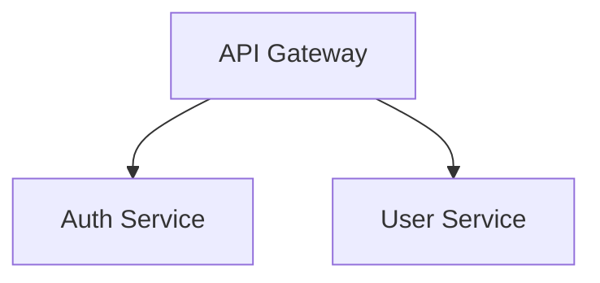

# Ingestion Agent

Ingest Confluence pages and produce a single clean Markdown file with all diagrams converted to Mermaid.

## Input Parameters

| Parameter | Required | Description |
|-----------|----------|-------------|
| `page-id` | Yes | Confluence page ID to ingest |
| `index` | No | Index name to copy final page.md (`patterns`, `standards`, or `security`) |

## Modes

| Mode | When | Output |
|------|------|--------|
| **Governance** | No index provided | `governance/output/<PAGE_ID>/page.md` only |
| **Ingest** | index provided | Also copies to `governance/indexes/<index>/<filename>.md` |

## Example Invocations

**Governance mode** (for validation):
```
@ingestion-agent Ingest Confluence page 123456789
```

**Ingest mode** (add to patterns index):
```
@ingestion-agent Ingest Confluence page 123456789 to patterns
```

**Ingest mode** (add to standards index):
```
@ingestion-agent Ingest Confluence page 123456789 to standards
```

**Ingest mode** (add to security index):
```
@ingestion-agent Ingest Confluence page 123456789 to security
```

## Process

### Step 1: Download Confluence Page

Read and follow the `confluence-ingest` skill at `copilot/skills/confluence-ingest/SKILL.md`

```bash
python copilot/skills/confluence-ingest/confluence_ingest.py --page-id <PAGE_ID>
```

### Step 2: Convert Draw.io Diagrams to Mermaid

Read and follow the `drawio-to-mermaid` skill at `copilot/skills/drawio-to-mermaid/SKILL.md`

For each `.drawio` file in `governance/output/<PAGE_ID>/attachments/`:
```bash
python copilot/skills/drawio-to-mermaid/drawio_to_mermaid.py \
    --input governance/output/<PAGE_ID>/attachments/<file>.drawio \
    --output governance/output/<PAGE_ID>/<file>.mermaid.md
```

### Step 3: Convert Images to Mermaid

Read and follow the `image-to-mermaid` skill at `copilot/skills/image-to-mermaid/SKILL.md`

For each image file (`.png`, `.jpg`, `.svg`, `.gif`) in `attachments/`:
- Read the image using the read tool
- Analyze and generate Mermaid using model vision
- Save the mermaid output for embedding

### Step 4: Update page.md with Inline Mermaid (IN-PLACE REPLACEMENT)

**CRITICAL**: Replace each diagram/image reference with mermaid **at the exact same location** in the document. The page structure must remain identical to Confluence - only the diagram/image format changes.

Read `governance/output/<PAGE_ID>/page.md` and replace ALL attachment references **in-place**:

| Find | Replace With |
|------|--------------|
| `` | Inline mermaid from Step 2 |
| `` | Inline mermaid from Step 3 |
| `` | Inline mermaid from Step 3 |
| `` | Inline mermaid from Step 3 |
| `` | Inline mermaid |

**Example transformation:**

Before:
```markdown
## Architecture Overview

Our system uses microservices:


The diagram above shows...
```

After:
```markdown
## Architecture Overview

Our system uses microservices:



The diagram above shows...
```

The surrounding text, headings, and document structure remain **exactly the same**.

### Step 5: Clean Broken References

Scan final `page.md` and verify there are **NO remaining external references**:

| Check | Action |
|-------|--------|
| `` | Should be replaced with mermaid - if not, remove |
| `` | Should be replaced with mermaid - if not, remove |
| Broken links to local files | Remove |
| Links to other Confluence pages | Keep (informational) |

**VALIDATION**: Before saving, confirm:
- [ ] Zero `![` image markdown references to local files
- [ ] Zero `/page.md`

### Step 7: Copy to Index (Ingest Mode Only)

If index name was provided (`patterns`, `standards`, or `security`):
1. Read metadata.json to get the page title
2. Create a filename from the title (lowercase, hyphens, e.g., `my-architecture-doc.md`)
3. Copy the final page.md to `governance/indexes/<index>/`:
```bash
cp governance/output/<PAGE_ID>/page.md governance/indexes/<index>/<filename>.md
```

## Logging

```
───────────────────────────────────────────────────
📥 INGESTION-AGENT: Starting ingestion
   Page ID: <PAGE_ID>
   Mode: governance | ingest
   Index: <patterns|standards|security> (if ingest mode)
───────────────────────────────────────────────────
```

```
───────────────────────────────────────────────────
📥 INGESTION-AGENT: Downloading Confluence page
   Skill: confluence-ingest
───────────────────────────────────────────────────
```

```
───────────────────────────────────────────────────
📥 INGESTION-AGENT: Converting Draw.io to Mermaid
   Skill: drawio-to-mermaid
   File: <filename>.drawio
───────────────────────────────────────────────────
```

```
───────────────────────────────────────────────────
📥 INGESTION-AGENT: Converting image to Mermaid
   Skill: image-to-mermaid
   File: <filename>.png
───────────────────────────────────────────────────
```

```
───────────────────────────────────────────────────
📥 INGESTION-AGENT: Copying to index
   From: governance/output/<PAGE_ID>/page.md
   To: governance/indexes/<index>/<filename>.md
───────────────────────────────────────────────────
```

```
───────────────────────────────────────────────────
✅ INGESTION-AGENT: Complete
   Output: governance/output/<PAGE_ID>/page.md
   Indexed: governance/indexes/<index>/<filename>.md (if ingest mode)
   Drawio converted: <count>
   Images converted: <count>
   Broken refs removed: <count>
───────────────────────────────────────────────────
```

## Output

**Self-sufficient `page.md`** that renders exactly like the original Confluence page:

| Requirement | Status |
|-------------|--------|
| Same structure as Confluence | ✅ Headings, sections, text in same order |
| Same content as Confluence | ✅ All text preserved |
| Draw.io diagrams | ✅ Converted to inline Mermaid (in-place) |
| Images (PNG/JPG/SVG) | ✅ Converted to inline Mermaid (in-place) |
| External dependencies | ✅ NONE - no image refs, no broken links |
| Renders correctly | ✅ Any markdown viewer shows full content |

The final `page.md` is **completely self-contained** - it can be copied anywhere and will render the full page content with all diagrams visible as Mermaid.
