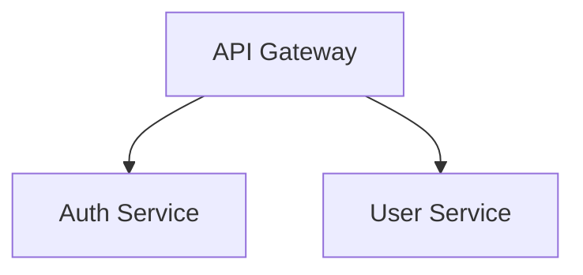

# Ingestion Agent

Ingest Confluence pages and produce a single clean Markdown file with all diagrams converted to Mermaid.

## Input Parameters

| Parameter | Required | Description |
|-----------|----------|-------------|
| `page-id` | Yes | Confluence page ID to ingest |
| `index` | No | Index name to copy final page.md (`patterns`, `standards`, or `security`) |

## Modes

| Mode | When | Output |
|------|------|--------|
| **Governance** | No index provided | `governance/output/<PAGE_ID>/page.md` only |
| **Ingest** | index provided | Also copies to `governance/indexes/<index>/<filename>.md` |

## Example Invocations

**Governance mode** (for validation):
```
@ingestion-agent Ingest Confluence page 123456789
```

**Ingest mode** (add to patterns index):
```
@ingestion-agent Ingest Confluence page 123456789 to patterns
```

**Ingest mode** (add to standards index):
```
@ingestion-agent Ingest Confluence page 123456789 to standards
```

**Ingest mode** (add to security index):
```
@ingestion-agent Ingest Confluence page 123456789 to security
```

## Process Overview

```
┌─────────────────────────────────────────────────────────────┐
│                    INGESTION LOOP                           │
├─────────────────────────────────────────────────────────────┤
│                                                             │
│  Step 0: Setup (once)                                       │
│       ↓                                                     │
│  ┌─────────────────────────────────────────────────────┐    │
│  │  REPEAT UNTIL NO MORE CONTENT TO FETCH:             │    │
│  │                                                     │    │
│  │  Step 1: Download page                              │    │
│  │       ↓                                             │    │
│  │  Step 1.5: Check for linked pages/tabs              │    │
│  │       ↓                                             │    │
│  │  If links found → Go back to Step 1 for each link   │    │
│  │       ↓                                             │    │
│  │  Step 2: Convert drawio → mermaid                   │    │
│  │       ↓                                             │    │
│  │  Step 3: Convert images → mermaid                   │    │
│  │       ↓                                             │    │
│  │  Step 4: Inline all mermaid into page.md            │    │
│  │       ↓                                             │    │
│  │  Step 5: Validate completeness                      │    │
│  │       ↓                                             │    │
│  │  If validation fails → Loop back to fix             │    │
│  │                                                     │    │
│  └─────────────────────────────────────────────────────┘    │
│       ↓                                                     │
│  Step 6: Save final page.md                                 │
│       ↓                                                     │
│  Step 7: Copy to index (if ingest mode)                     │
│                                                             │
└─────────────────────────────────────────────────────────────┘
```

**KEY PRINCIPLE**: Keep looping through Steps 1-5 until page.md is complete and self-sufficient.

---

## Detailed Steps

### Step 1: Download Confluence Page

**Use skill**: `confluence-ingest` at `.github/skills/confluence-ingest/SKILL.md`

1. Read the skill SKILL.md file
2. Follow the skill's Setup section (first run only)
3. Follow the skill's Usage section to download page

**Input**: `<PAGE_ID>`  
**Output**: `governance/output/<PAGE_ID>/page.md`, `metadata.json`, `attachments/`

### Step 1.5: Traverse and Inline ALL Content (LOOP UNTIL COMPLETE)

**CRITICAL**: The final page.md must render EXACTLY like the Confluence page.

```
┌────────────────────────────────────────────────────────────┐
│              CONTENT TRAVERSAL LOOP                         │
│                                                            │
│   while (page.md has unresolved content):                  │
│       1. Scan for linked pages                             │
│       2. Scan for tabs/macros                              │
│       3. Scan for includes/embeds                          │
│       4. For each found:                                   │
│          → Fetch content (go to Step 1 for that page)     │
│          → Inline into page.md                            │
│       5. Re-scan the newly added content                   │
│                                                            │
└────────────────────────────────────────────────────────────┘
```

#### A. Scan for Confluence Page Links

Look for these patterns in page.md:
- `[Link Text](/wiki/spaces/SPACE/pages/PAGEID/...)`
- `[Link Text](https://company.atlassian.net/wiki/spaces/SPACE/pages/PAGEID/...)`
- `<a href="/wiki/spaces/...">...</a>`

**For EACH link found - LOOP:**
1. Extract PAGE_ID from link
2. Use `confluence-ingest` skill to download linked page
3. Read `governance/output/<LINKED_PAGE_ID>/page.md`
4. Replace link in main page.md with inlined content:

   **BEFORE:**
   ```markdown
   See [Architecture Details](/wiki/spaces/ARCH/pages/987654321/Architecture-Details)
   ```
   
   **AFTER:**
   ```markdown
   See details below:
   
   ### Architecture Details
   [Full content from page 987654321 inlined here]
   ```

5. ⚠️ **Re-scan** the newly inlined content for MORE links
6. If more links found → **REPEAT** from step 1 for each

#### B. Scan for Confluence Tabs

Look for tab macros in the content:
- `{ui-tabs}` / `{ui-tab}`
- `## Tab:` sections

**For EACH tab - ensure ALL are included:**
```markdown
## Tab: Overview
[Full content from Overview tab]

## Tab: Architecture  
[Full content from Architecture tab]

## Tab: Security
[Full content from Security tab]
```

#### C. Scan for Include/Embed Macros

Look for:
- `{include:Page Title}` 
- `{excerpt-include:Page Title}`
- `{children}` macro

**For EACH include - LOOP:**
1. Identify the page being included
2. Fetch that page (go to Step 1)
3. Inline the content
4. Re-scan for more includes

#### D. Scan for Child Page References

If the page has child pages that are referenced:
1. Fetch each child page
2. Inline as subsections
3. Re-scan child content for more links

---

**LOOP EXIT CONDITION**: Stop when page.md has:
- ✅ ZERO `/wiki/spaces/` links remaining
- ✅ ZERO `atlassian.net/wiki/` links remaining
- ✅ ZERO unresolved include macros
- ✅ ALL tabs fully expanded
- ✅ ALL referenced content inlined

**⚠️ PREVENT INFINITE LOOPS:**
- Track all visited PAGE_IDs in a list
- Before fetching a page, check if already visited
- If already visited → insert reference note instead of re-fetching:
  ```markdown
  [See section: Page Title (already included above)]
  ```

### Step 2: Convert Draw.io Diagrams to Mermaid

**Use skill**: `drawio-to-mermaid` at `.github/skills/drawio-to-mermaid/SKILL.md`

For each `.drawio` file in `governance/output/<PAGE_ID>/attachments/`:
1. Read the skill instructions
2. Run the skill to convert drawio → mermaid
3. Output saved to `governance/output/<PAGE_ID>/<file>.mermaid.md`

### Step 3: Convert Images to Mermaid

**Use skill**: `image-to-mermaid` at `.github/skills/image-to-mermaid/SKILL.md`

For each image file (`.png`, `.jpg`, `.svg`, `.gif`) in `attachments/`:
1. Read the skill instructions
2. Use model vision to analyze image
3. Generate equivalent Mermaid diagram
4. Save for embedding in page.md

### Step 4: Update page.md with Inline Mermaid (IN-PLACE REPLACEMENT)

**CRITICAL**: Replace each diagram/image reference with mermaid **at the exact same location** in the document. The page structure must remain identical to Confluence - only the diagram/image format changes.

Read `governance/output/<PAGE_ID>/page.md` and replace ALL attachment references **in-place**:

| Find | Replace With |
|------|--------------|
| `` | Inline mermaid from Step 2 |
| `` | Inline mermaid from Step 3 |
| `` | Inline mermaid from Step 3 |
| `` | Inline mermaid from Step 3 |
| `` | Inline mermaid |

**Example transformation:**

Before:
```markdown
## Architecture Overview

Our system uses microservices:


The diagram above shows...
```

After:
```markdown
## Architecture Overview

Our system uses microservices:



The diagram above shows...
```

The surrounding text, headings, and document structure remain **exactly the same**.

### Step 5: Validate Content Completeness

Scan final `page.md` and verify it renders EXACTLY like the Confluence page:

| Check | Status Required |
|-------|-----------------|
| `` | ❌ NONE - all replaced with mermaid |
| `` | ❌ NONE - all replaced with mermaid |
| `/wiki/spaces/` links | ❌ NONE - all content inlined |
| `atlassian.net/wiki/` links | ❌ NONE - all content inlined |
| Tab content | ✅ ALL tabs included as sections |
| Included/embedded pages | ✅ ALL inlined |
| Broken links | ❌ NONE remaining |

**VALIDATION CHECKLIST** (all must be true):
- [ ] Zero `![` image references to local files
- [ ] Zero `/page.md`

### Step 7: Copy to Index (Ingest Mode Only)

If index name was provided (`patterns`, `standards`, or `security`):

1. Read `governance/output/<PAGE_ID>/metadata.json` to get the page title
2. Create filename slug from title (lowercase, hyphens, alphanumeric only)
3. Copy final page.md to index folder

**Filename format**: `<PAGE_ID>-<title-slug>.md`

| Example Input | Output Filename |
|---------------|-----------------|
| Page ID: `123456789`, Title: "System Architecture" | `123456789-system-architecture.md` |
| Page ID: `987654321`, Title: "API Guidelines v2" | `987654321-api-guidelines-v2.md` |

**Destination**: `governance/indexes/<index>/<PAGE_ID>-<title-slug>.md`

## Logging

```
───────────────────────────────────────────────────
📥 INGESTION-AGENT: Starting ingestion
   Page ID: <PAGE_ID>
   Mode: governance | ingest
   Index: <patterns|standards|security> (if ingest mode)
───────────────────────────────────────────────────
```

```
───────────────────────────────────────────────────
📥 INGESTION-AGENT: Downloading Confluence page
   Skill: confluence-ingest
───────────────────────────────────────────────────
```

```
───────────────────────────────────────────────────
📥 INGESTION-AGENT: Converting Draw.io to Mermaid
   Skill: drawio-to-mermaid
   File: <filename>.drawio
───────────────────────────────────────────────────
```

```
───────────────────────────────────────────────────
📥 INGESTION-AGENT: Converting image to Mermaid
   Skill: image-to-mermaid
   File: <filename>.png
───────────────────────────────────────────────────
```

```
───────────────────────────────────────────────────
📥 INGESTION-AGENT: Copying to index
   From: governance/output/<PAGE_ID>/page.md
   To: governance/indexes/<index>/<filename>.md
───────────────────────────────────────────────────
```

```
───────────────────────────────────────────────────
✅ INGESTION-AGENT: Complete
   Output: governance/output/<PAGE_ID>/page.md
   Indexed: governance/indexes/<index>/<PAGE_ID>-<title>.md (if ingest mode)
   
   Content:
   - Tabs processed: <count>
   - Linked pages inlined: <count>
   - Drawio → Mermaid: <count>
   - Images → Mermaid: <count>
   - Broken refs removed: <count>
   
   Validation:
   - External links: 0 ✅
   - Image refs: 0 ✅
   - Self-sufficient: YES ✅
───────────────────────────────────────────────────
```

## Output

**Self-sufficient `page.md`** that renders **EXACTLY** like the original Confluence page:

| Requirement | Status |
|-------------|--------|
| Same structure as Confluence | ✅ Headings, sections, text in same order |
| Same content as Confluence | ✅ ALL text preserved |
| ALL tabs included | ✅ Every tab as a section, not just first tab |
| ALL linked pages inlined | ✅ No external Confluence links |
| ALL embedded content | ✅ Includes/excerpts fully expanded |
| Draw.io diagrams | ✅ Converted to inline Mermaid (in-place) |
| Images (PNG/JPG/SVG) | ✅ Converted to inline Mermaid (in-place) |
| External dependencies | ✅ NONE - no image refs, no broken links |
| Confluence links | ✅ NONE - all content inlined |
| Renders correctly | ✅ Any markdown viewer shows FULL content |

**The final `page.md` is completely self-contained:**
- Renders identically to the Confluence page
- ALL tabs, ALL linked content, ALL diagrams included
- Can be copied anywhere and renders the complete page
- No external access needed to view full content
