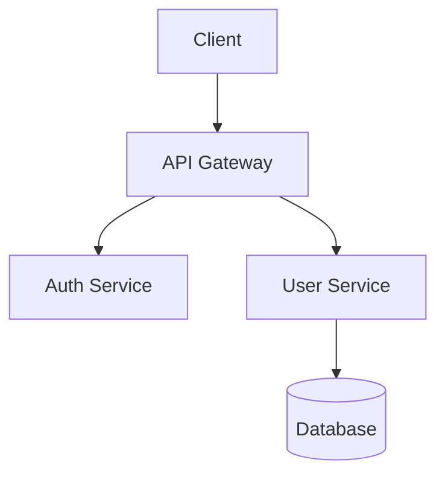

# Draw.io to Mermaid Conversion

Convert Draw.io (.drawio) files to Mermaid syntax using Python script + model enhancement.

## Usage

```bash
python .github/skills/drawio-to-mermaid/drawio_to_mermaid.py \
    --input <diagram.drawio> \
    --output <output.mermaid.md>
```

## Process

| Step | Who | What |
|------|-----|------|
| 1. Parse | Script | Extract shapes/connections from XML |
| 2. Convert | Script | Generate initial Mermaid syntax |
| 3. Enhance | Model | Review and improve the output |

## Step 1-2: Parse and Convert (Script)

The script extracts:
- Shapes (boxes, circles, etc.)
- Connections (arrows, lines)
- Labels and text

## Step 3: Enhance (Model)

After script converts, review the Mermaid output and improve:
- Fix any parsing errors
- Improve node names for clarity
- Add missing connections if obvious
- Choose best diagram type (flowchart, sequence, etc.)
- Add styling if helpful

## Output

Mermaid code block ready for embedding:



## Integration

The ingestion-agent embeds the Mermaid output directly into `page.md`, replacing the original drawio reference.
