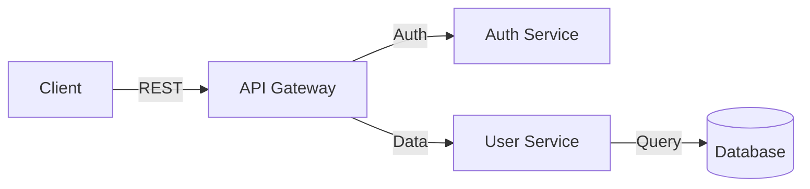

# Draw.io to Mermaid Conversion

Convert Draw.io diagrams to Mermaid using BOTH model intelligence AND Python scripts.

## Approach: Model + Script

| Step | Who | What |
|------|-----|------|
| 1. Parse | Script | Extract shapes/connections from XML |
| 2. Convert | Script | Generate initial Mermaid syntax |
| 3. Enhance | Model | Improve diagram, fix issues |
| 4. Integrate | Model | Add to architecture document |

## Step 1-2: Parse and Convert (Script)

```bash
python governance/scripts/drawio_to_mermaid.py \
    --input <diagram.drawio> \
    --output governance/output/diagrams/
```

This extracts:
- Shapes (boxes, circles, etc.)
- Connections (arrows, lines)
- Labels and text
- Layout information

## Step 3: Enhance Diagram (Model)

After script converts, review the Mermaid output:
- Fix any parsing errors
- Improve node names for clarity
- Add missing connections
- Choose best diagram type (flowchart, sequence, etc.)
- Add styling if helpful

Example enhancement:


## Step 4: Integrate (Model)

Add the Mermaid diagram to `governance/output/architecture.md`:
- Place in appropriate section
- Add caption/description
- Reference in text

## Output

Mermaid diagram integrated into architecture document
