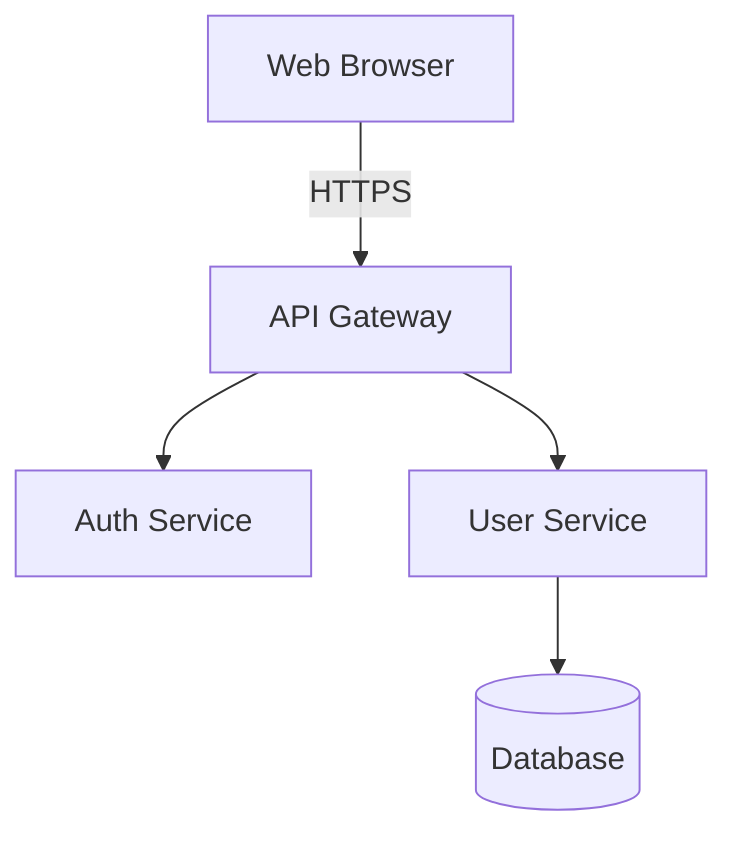

# Image to Mermaid Conversion

Convert architecture diagram images directly to Mermaid code.

## Instructions

1. **Read the image file**
2. **Output Mermaid code** that represents the diagram

That's it. No descriptions needed.

## Example

**Input:** Read `governance/output/123/attachments/architecture.png`

**Output:**

## Mermaid Types

| Diagram Type      | Use                                      |
| ----------------- | ---------------------------------------- |
| `flowchart TB`    | Architecture, components (top-to-bottom) |
| `flowchart LR`    | Processes, pipelines (left-to-right)     |
| `sequenceDiagram` | Request/response flows                   |
| `classDiagram`    | Class relationships                      |
| `erDiagram`       | Database schemas                         |
| `stateDiagram-v2` | State machines                           |

## Node Shapes

| Type        | Syntax      |
| ----------- | ----------- |
| Service/Box | `A[Name]`   |
| Database    | `A[(Name)]` |
| Decision    | `A{Name}`   |
| Process     | `A([Name])` |

## Connections

| Type    | Syntax     |
| ------- | ---------- | ----- | --- |
| Arrow   | `A --> B`  |
| Labeled | `A -->     | label | B`  |
| Dotted  | `A -.-> B` |
