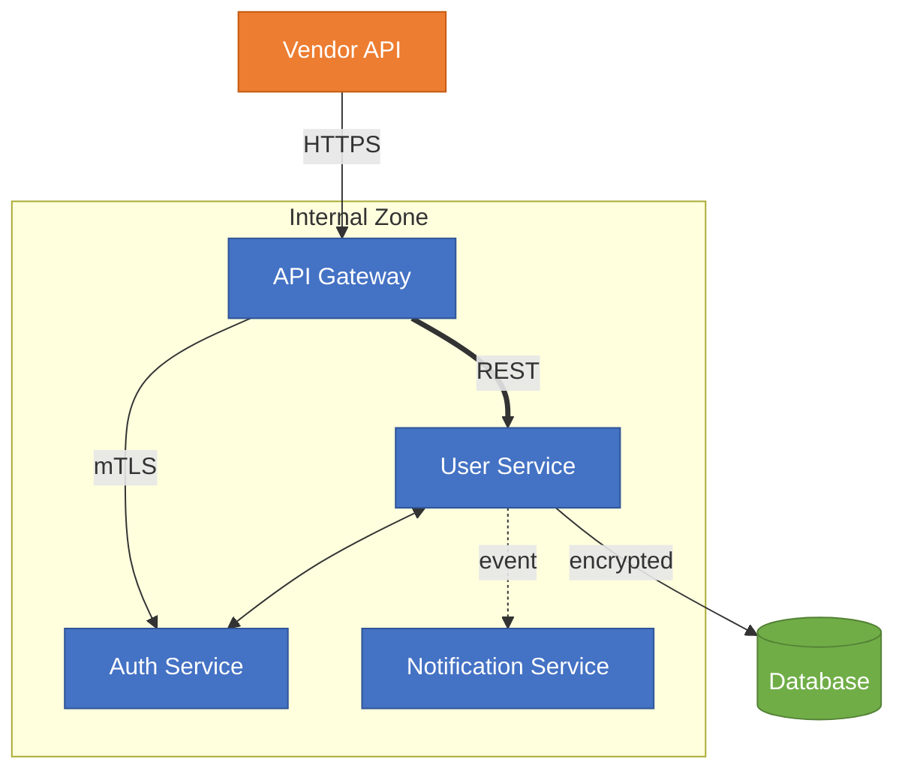

# Image to Mermaid Conversion (Vision -- Last Resort)

This skill is the **fallback** for images that cannot be converted deterministically.

## Before Using Vision

**Check the conversion cascade first:**

1. Does a `.drawio` source file exist? -> Use `drawio_to_mermaid.py` (deterministic, FREE)
2. Is the image an SVG? -> Use `svg_to_mermaid.py` (deterministic, FREE)
3. Is there a SHA256 cache hit? -> Check `governance/output/.cache/mermaid/`
4. **Only if all above fail** -> Use this vision skill

## Pre-Extraction Step (MANDATORY before vision)

Before reading the image with the LLM, run pre-extraction to get deterministic facts:

```bash
python copilot/skills/confluence-ingest/preextract_diagram.py --input <IMAGE_PATH> --format-prompt
```

This outputs OCR text labels, exact hex colors, shape counts, and line counts. **Include the full output in your prompt alongside the image.** This constrains the LLM so it cannot hallucinate labels, miss components, or guess at colors.

## Instructions

1. **Run `preextract_diagram.py`** on the image and read the `.context.json` output
2. **Read the image file**
3. **Include the pre-extracted context** in your reasoning:
   - Use the exact OCR labels (do not invent or omit any)
   - Use the exact hex color values from color extraction
   - Ensure your node count matches the shape detection count
4. **Reproduce the diagram in Mermaid** preserving ALL of the following:

| Property | What to Preserve | Mermaid Feature |
|----------|-----------------|-----------------|
| **Node colors** | Background fill, border, text color | `style` or `classDef` directives |
| **Node shapes** | Rectangles, cylinders, diamonds, circles | Mermaid shape syntax (`[]`, `[()]`, `{}`, `(())`) |
| **Line styles** | Solid, dashed, thick | `-->`, `-.->`, `==>` |
| **Arrow direction** | Forward, bidirectional, reverse, no-arrow | `-->`, `<-->`, `<--`, `---` |
| **Edge labels** | Protocol names, descriptions on lines | `-->\|label\|` syntax |
| **Grouping** | Boxes/boundaries around component clusters | `subgraph` blocks |
| **Layout direction** | Top-to-bottom vs left-to-right | `flowchart TB` vs `flowchart LR` |

3. **Add a visual legend comment** at the bottom documenting color meanings and any line style conventions

**Why this matters**: Downstream agents (rules-extraction, validation) use colors to identify component types (internal vs vendor), line styles to infer coupling and criticality, and arrow directions to determine data flow rules. Stripping ANY visual property loses governance context.

## Example

**Input:** Read `governance/output/123/attachments/architecture.png`

Image shows:
- Dark blue internal services
- Orange external vendor
- Green database
- Solid arrows for synchronous calls with protocol labels
- Dashed arrow for async event
- Thick arrow for primary data path
- Bidirectional arrow between two tightly-coupled services

**Output:**



## Color Preservation

**CRITICAL**: Always preserve the color scheme from the original diagram.

### How to Capture Colors

| What to Look For | Mermaid Syntax |
|-------------------|----------------|
| Node background color | `style NodeID fill:#hex` |
| Node border color | `style NodeID stroke:#hex` |
| Node text color | `style NodeID color:#hex` |
| Multiple properties | `style NodeID fill:#hex,stroke:#hex,color:#hex` |

### Using classDef for Repeated Colors

When multiple nodes share the same color, use `classDef` for efficiency:


## Line Style Preservation

**CRITICAL**: Preserve the exact line style and arrow direction from the original diagram. Each combination carries different architectural meaning.

### Line Styles

| Visual in Image | Mermaid Syntax | Governance Meaning |
|----------------|----------------|-------------------|
| Solid line with arrow | `A --> B` | Confirmed, required dependency |
| Dashed/dotted line with arrow | `A -.-> B` | Optional, async, or event-driven |
| Thick/bold line with arrow | `A ==> B` | Critical path, high throughput, primary flow |

### Arrow Directions

| Visual in Image | Solid | Dashed | Thick |
|----------------|-------|--------|-------|
| Single arrow (A to B) | `A --> B` | `A -.-> B` | `A ==> B` |
| Double arrow (both ways) | `A <--> B` | `A <-.-> B` | `A <==> B` |
| Reverse arrow (B to A) | `A <-- B` | `A <-.- B` | `A <== B` |
| No arrow (plain line) | `A --- B` | `A -.- B` | `A === B` |

### With Labels

| Direction | Solid | Dashed | Thick |
|-----------|-------|--------|-------|
| Forward | `A -->\|label\| B` | `A -.->\|label\| B` | `A ==>\|label\| B` |
| Bidirectional | `A <-->\|label\| B` | `A <-.->\|label\| B` | `A <==>\|label\| B` |

## Mermaid Types

| Diagram Type      | Use                                      |
| ----------------- | ---------------------------------------- |
| `flowchart TB`    | Architecture, components (top-to-bottom) |
| `flowchart LR`    | Processes, pipelines (left-to-right)     |
| `sequenceDiagram` | Request/response flows                   |
| `classDiagram`    | Class relationships                      |
| `erDiagram`       | Database schemas                         |
| `stateDiagram-v2` | State machines                           |

## Node Shapes

| Type        | Syntax      |
| ----------- | ----------- |
| Service/Box | `A[Name]`   |
| Database    | `A[(Name)]` |
| Decision    | `A{Name}`   |
| Process     | `A([Name])` |
| Circle      | `A((Name))` |
| Hexagon     | `A{{Name}}`  |

## Visual Legend Comment

Always add a `%% Visual Legend` comment block at the end of every Mermaid diagram documenting:

```
%% Visual Legend:
%% Colors:
%%   <hex> = <what it represents>
%% Line Styles:
%%   <style> = <what it represents>
%% Subgraphs:
%%   <name> = <boundary meaning>
```

This helps downstream validation and rules-extraction agents interpret the full diagram semantics without needing the original image.

## Post-Conversion Validation (MANDATORY)

After generating Mermaid, validate syntax:

```bash
python copilot/skills/confluence-ingest/validate_mermaid.py --code "<MERMAID_CODE>" --json
```

If validation fails:
1. Read the error message
2. Fix the Mermaid syntax
3. Re-validate
4. Maximum 3 attempts -- if still invalid, keep the original image reference

## Caching

After successful validation, the result is cached by SHA256 hash of the source image.
Re-ingestion of the same unchanged image will use the cached result (deterministic).

## Manual Review Flag

All vision-converted diagrams are flagged with `"manual_review": true` in the conversion manifest.
The ingestion summary will print a reminder for manual verification.
