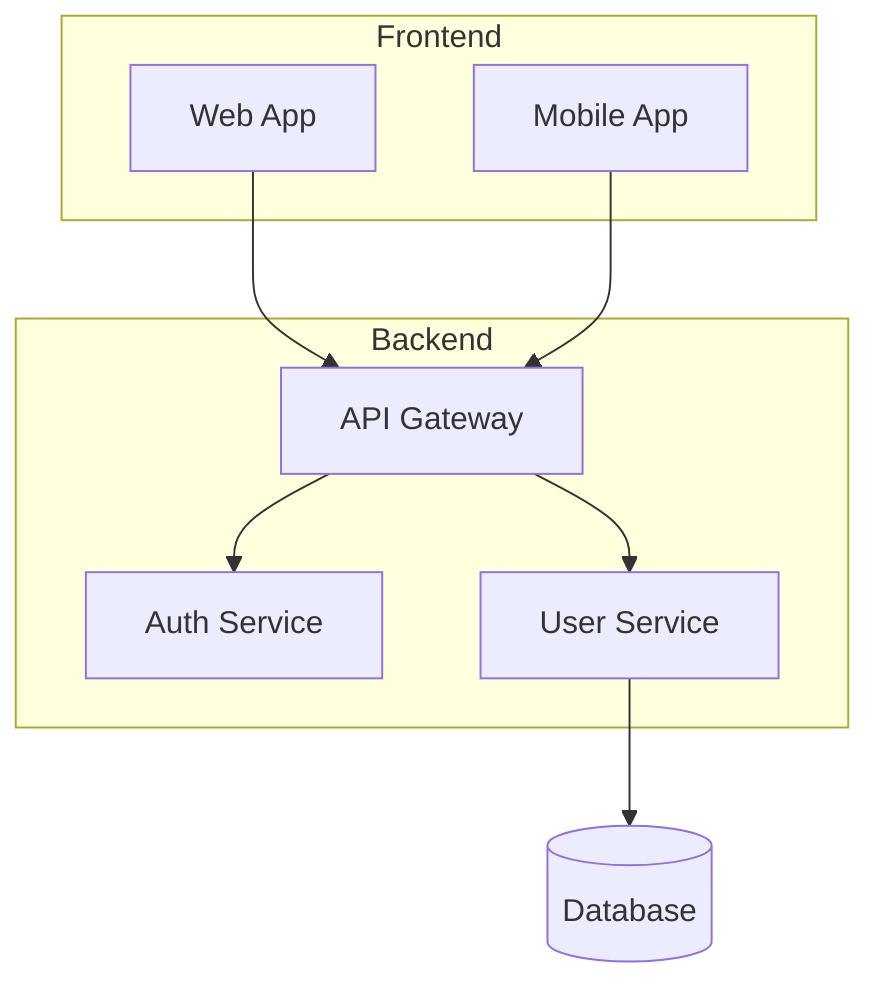

# Image to Mermaid Conversion

Convert architecture diagram images to Mermaid using model vision capabilities. No scripts required.

## Instructions

1. **Read the image** using the read tool with the image path
2. **Analyze** the visual content
3. **Generate** equivalent Mermaid syntax

## Analysis Checklist

When viewing an image, identify:

| Element | Look For |
|---------|----------|
| **Nodes** | Boxes, circles, cylinders, icons with labels |
| **Connections** | Arrows, lines (solid, dashed) |
| **Labels** | Text on connections, annotations |
| **Direction** | Top-to-bottom, left-to-right flow |
| **Groups** | Clusters, boundaries, regions |

## Mermaid Type Selection

| Image Shows | Use Mermaid Type |
|-------------|------------------|
| Architecture/components | `flowchart TB` or `flowchart LR` |
| Request/response flow | `sequenceDiagram` |
| Class relationships | `classDiagram` |
| Database schema | `erDiagram` |
| Timeline/process | `flowchart LR` |
| State transitions | `stateDiagram-v2` |

## Output Format

Generate clean Mermaid wrapped in code block:

## Node Shapes

Use appropriate shapes:

| Component Type | Mermaid Syntax |
|----------------|----------------|
| Service/App | `A[Service Name]` |
| Database | `A[(Database)]` |
| Decision | `A{Decision}` |
| Process | `A([Process])` |
| Data/Document | `A>Document]` |

## Connection Styles

| Connection Type | Mermaid Syntax |
|-----------------|----------------|
| Normal flow | `A --> B` |
| With label | `A -->|label| B` |
| Dotted | `A -.-> B` |
| Thick | `A ==> B` |

## Quality Guidelines

- Preserve the **structure** and **hierarchy** of the original
- Keep **all visible labels** and text
- Maintain **flow direction** (TB, LR)
- Use **subgraphs** for grouped components
- Add **connection labels** where shown
