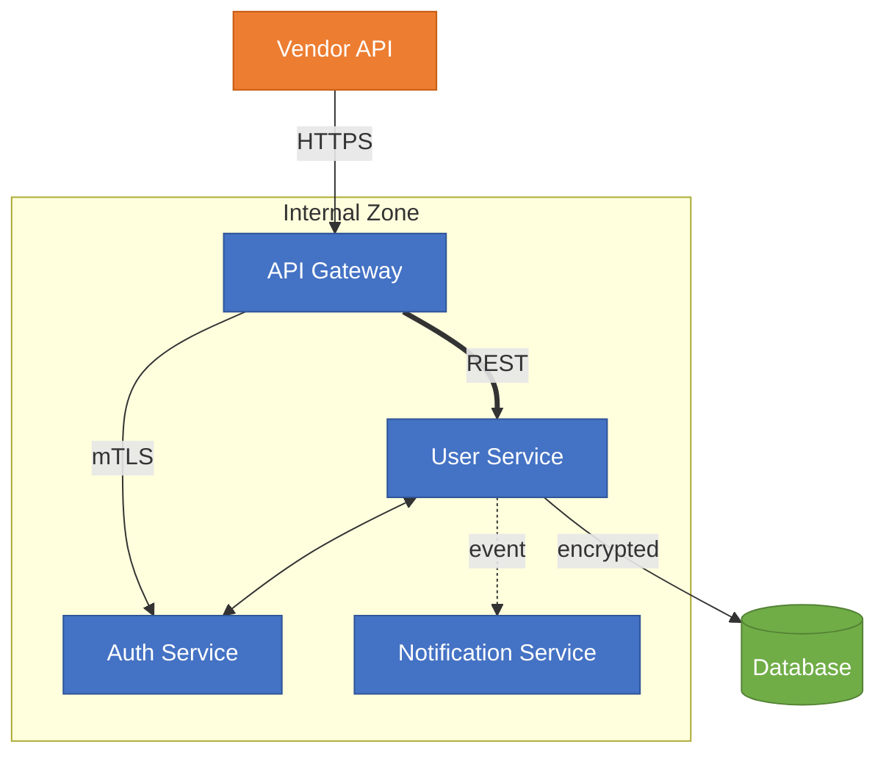
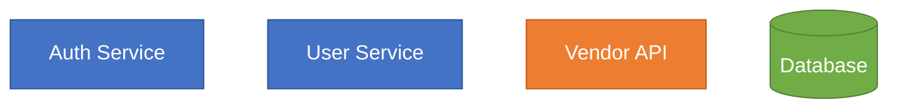

# Image to Mermaid Conversion

Convert diagram images to Mermaid syntax by reading the image file and reproducing its structure.

**Note:** The ingestion script already converts Draw.io (`.drawio`) and SVG files to Mermaid via XML parsing. This skill handles PNG/JPG images that remain as `` references in page.md.

## AST-First Image Conversion Flow

The flow is: **CV → partial AST → mandatory LLM repair → final AST → Mermaid**. Follow these steps in order:

### Step 1: Run `image_to_ast.py` (Deterministic CV Extraction)

Produces a partial AST with confidence scores. No LLM involved.

```bash
python copilot/skills/confluence-ingest/image_to_ast.py --input <IMAGE_PATH> [--output <OUTPUT>.ast.json]
```

Default output: `<input>.ast.json` alongside the image.

### Step 2: LLM Repair (MANDATORY)

Send the partial AST + the original image to the LLM. Receive a corrected AST as structured JSON. **This is not optional** — all image-sourced ASTs must be repaired by the LLM before rendering to Mermaid.

### Step 3: Save Final Repaired `.ast.json`

Write the LLM's corrected AST to the output path (e.g. `governance/output/<PAGE_ID>/attachments/<image>.ast.json`).

### Step 4: Run `ast_to_mermaid.py` to Generate Mermaid

```bash
python copilot/skills/confluence-ingest/ast_to_mermaid.py --input <REPAIRED>.ast.json [--output <OUTPUT>.mmd]
```

### What the LLM Must Preserve in the Repaired AST

When repairing the partial AST, ensure the final structure preserves ALL of the following:

| Property | What to Preserve | Mermaid Feature |
|----------|-----------------|-----------------|
| **Node colors** | Background fill, border, text color | `style` or `classDef` directives |
| **Node shapes** | Rectangles, cylinders, diamonds, circles | Mermaid shape syntax (`[]`, `[()]`, `{}`, `(())`) |
| **Line styles** | Solid, dashed, thick | `-->`, `-.->`, `==>` |
| **Arrow direction** | Forward, bidirectional, reverse, no-arrow | `-->`, `<-->`, `<--`, `---` |
| **Edge labels** | Protocol names, descriptions on lines | `-->\|label\|` syntax |
| **Grouping** | Boxes/boundaries around component clusters | `subgraph` blocks |
| **Layout direction** | Top-to-bottom vs left-to-right | `flowchart TB` vs `flowchart LR` |

- **Visual legend** — document color meanings and line style conventions in metadata or comments

**Why this matters**: Downstream agents (rules-extraction, validation) use colors to identify component types (internal vs vendor), line styles to infer coupling and criticality, and arrow directions to determine data flow rules. Stripping ANY visual property loses governance context.

## Example

**Input:** Read `governance/output/123/attachments/architecture.png`

Image shows:
- Dark blue internal services
- Orange external vendor
- Green database
- Solid arrows for synchronous calls with protocol labels
- Dashed arrow for async event
- Thick arrow for primary data path
- Bidirectional arrow between two tightly-coupled services

**Output:**



## Color Preservation

**CRITICAL**: Always preserve the color scheme from the original diagram.

### How to Capture Colors

| What to Look For | Mermaid Syntax |
|-------------------|----------------|
| Node background color | `style NodeID fill:#hex` |
| Node border color | `style NodeID stroke:#hex` |
| Node text color | `style NodeID color:#hex` |
| Multiple properties | `style NodeID fill:#hex,stroke:#hex,color:#hex` |

### Using classDef for Repeated Colors

When multiple nodes share the same color, use `classDef` for efficiency:



## Line Style Preservation

**CRITICAL**: Preserve the exact line style and arrow direction from the original diagram. Each combination carries different architectural meaning.

### Line Styles

| Visual in Image | Mermaid Syntax | Governance Meaning |
|----------------|----------------|-------------------|
| Solid line with arrow | `A --> B` | Confirmed, required dependency |
| Dashed/dotted line with arrow | `A -.-> B` | Optional, async, or event-driven |
| Thick/bold line with arrow | `A ==> B` | Critical path, high throughput, primary flow |

### Arrow Directions

| Visual in Image | Solid | Dashed | Thick |
|----------------|-------|--------|-------|
| Single arrow (A to B) | `A --> B` | `A -.-> B` | `A ==> B` |
| Double arrow (both ways) | `A <--> B` | `A <-.-> B` | `A <==> B` |
| Reverse arrow (B to A) | `A <-- B` | `A <-.- B` | `A <== B` |
| No arrow (plain line) | `A --- B` | `A -.- B` | `A === B` |

### With Labels

| Direction | Solid | Dashed | Thick |
|-----------|-------|--------|-------|
| Forward | `A -->\|label\| B` | `A -.->\|label\| B` | `A ==>\|label\| B` |
| Bidirectional | `A <-->\|label\| B` | `A <-.->\|label\| B` | `A <==>\|label\| B` |

## Mermaid Types

| Diagram Type      | Use                                      |
| ----------------- | ---------------------------------------- |
| `flowchart TB`    | Architecture, components (top-to-bottom) |
| `flowchart LR`    | Processes, pipelines (left-to-right)     |
| `sequenceDiagram` | Request/response flows                   |
| `classDiagram`    | Class relationships                      |
| `erDiagram`       | Database schemas                         |
| `stateDiagram-v2` | State machines                           |

## Node Shapes

| Type        | Syntax      |
| ----------- | ----------- |
| Service/Box | `A[Name]`   |
| Database    | `A[(Name)]` |
| Decision    | `A{Name}`   |
| Process     | `A([Name])` |
| Circle      | `A((Name))` |
| Hexagon     | `A{{Name}}`  |

## Visual Legend Comment

Always add a `%% Visual Legend` comment block at the end of every Mermaid diagram documenting:

```
%% Visual Legend:
%% Colors:
%%   <hex> = <what it represents>
%% Line Styles:
%%   <style> = <what it represents>
%% Subgraphs:
%%   <name> = <boundary meaning>
```

This helps downstream validation and rules-extraction agents interpret the full diagram semantics without needing the original image.

## Post-Conversion: Replace Diagrams in page.md

After LLM repair of all image ASTs, run the **replace_diagrams.py** tool to inline Mermaid into `page.md` without LLM cost:

```bash
python copilot/skills/confluence-ingest/replace_diagrams.py --page-dir governance/output/<PAGE_ID>
```

This replaces all remaining `` references with the Mermaid content from `.mmd` files, auto-converts any leftover PlantUML blocks, and auto-fixes common Mermaid syntax errors. See the `confluence-ingest` skill for full details.

## Post-Conversion Validation

After generating Mermaid, optionally validate syntax if the tool is available:

```bash
python copilot/skills/confluence-ingest/validate_mermaid.py --code "<MERMAID_CODE>" --json
```

If validation fails, read the error, fix the syntax, and retry (max 3 attempts). If the validator is not available, proceed without it.
