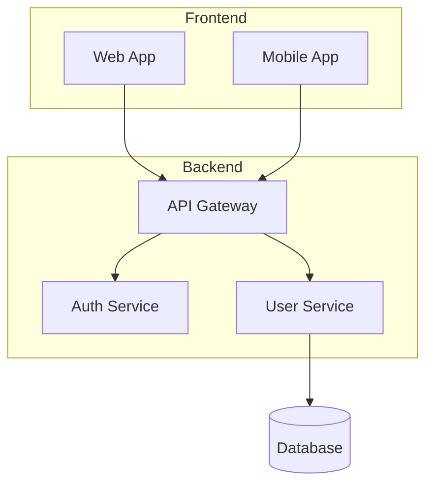

# Image to Mermaid Conversion

Convert architecture diagram images to Mermaid using model vision capabilities. No scripts required.

## CRITICAL: USE ACTUAL VISION - DO NOT ASSUME

⚠️ **YOU MUST ACTUALLY READ AND VIEW THE IMAGE FILE** ⚠️

```
✅ CORRECT APPROACH:
1. Read file: attachments/diagram.png  ← Actually invoke the read tool on the image
2. Vision sees the image content
3. Describe what you see: "I see 3 boxes labeled X, Y, Z with arrows..."
4. Generate Mermaid matching what you SAW

❌ WRONG APPROACH:
1. See filename "BusinessContext.png"
2. Assume it's a business context diagram
3. Generate generic/sample Mermaid ← THIS IS FABRICATION!
```

**If you cannot see/read the image**: Say "I cannot read this image file" - do NOT make up content.

## Instructions

1. **Read the image file** using the read tool with the FULL path (e.g., `governance/output/<PAGE_ID>/attachments/file.png`)
2. **Describe what you see** - list the actual boxes, labels, arrows visible in the image
3. **Generate Mermaid** that exactly matches what you described

## Analysis Checklist

When viewing an image, identify:

| Element | Look For |
|---------|----------|
| **Nodes** | Boxes, circles, cylinders, icons with labels |
| **Connections** | Arrows, lines (solid, dashed) |
| **Labels** | Text on connections, annotations |
| **Direction** | Top-to-bottom, left-to-right flow |
| **Groups** | Clusters, boundaries, regions |

## Mermaid Type Selection

| Image Shows | Use Mermaid Type |
|-------------|------------------|
| Architecture/components | `flowchart TB` or `flowchart LR` |
| Request/response flow | `sequenceDiagram` |
| Class relationships | `classDiagram` |
| Database schema | `erDiagram` |
| Timeline/process | `flowchart LR` |
| State transitions | `stateDiagram-v2` |

## Output Format

Generate clean Mermaid wrapped in code block:



## Node Shapes

Use appropriate shapes:

| Component Type | Mermaid Syntax |
|----------------|----------------|
| Service/App | `A[Service Name]` |
| Database | `A[(Database)]` |
| Decision | `A{Decision}` |
| Process | `A([Process])` |
| Data/Document | `A>Document]` |

## Connection Styles

| Connection Type | Mermaid Syntax |
|-----------------|----------------|
| Normal flow | `A --> B` |
| With label | `A -->|label| B` |
| Dotted | `A -.-> B` |
| Thick | `A ==> B` |

## Quality Guidelines

- Preserve the **structure** and **hierarchy** of the original
- Keep **all visible labels** and text
- Maintain **flow direction** (TB, LR)
- Use **subgraphs** for grouped components
- Add **connection labels** where shown

## Before Generating Mermaid - Describe What You See

**ALWAYS describe the image content first:**

```
Looking at governance/output/123/attachments/architecture.png:

I can see:
- Top: Box labeled "Web Browser"
- Middle: Box labeled "API Gateway" 
- Bottom left: Box labeled "Auth Service"
- Bottom right: Box labeled "User Service"
- Arrow from Web Browser to API Gateway labeled "HTTPS"
- Arrow from API Gateway to Auth Service
- Arrow from API Gateway to User Service

Now generating Mermaid to match:
```

This ensures you're converting what you ACTUALLY SEE, not what you assume.
