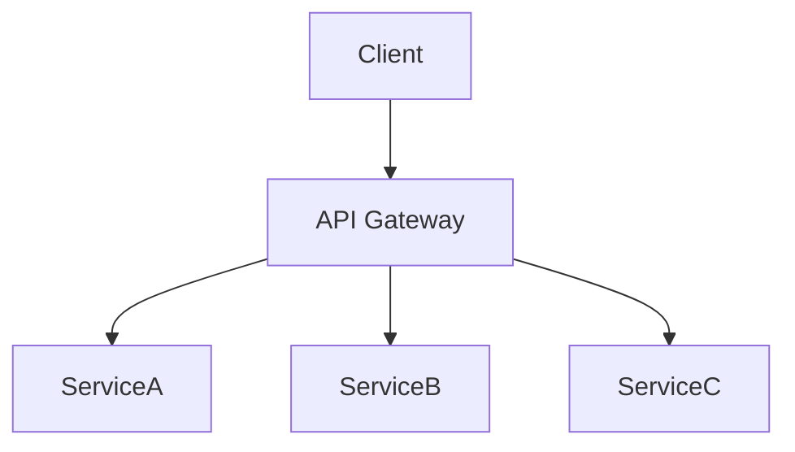
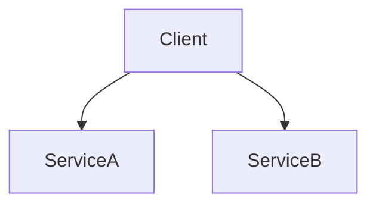

# Pattern Validation

Validate architecture document against all design pattern documents in the index.

## Inputs

1. **Document**: `governance/output/<PAGE_ID>/page.md` (provided by agent)
2. **Index**: `governance/indexes/patterns/` (ALL .md files)

## Instructions

1. Read ALL .md files from `governance/indexes/patterns/`
2. Read the architecture document
3. For each pattern found in the index files, analyze if the document addresses it:
   - **Required patterns**: Must be present → PASS/FAIL
   - **Recommended patterns**: Nice to have → PASS/WARN
   - **Anti-patterns**: Must NOT be present → PASS/FAIL
4. Calculate score and write report

## Validation Approach

For each pattern found in index files:
- Search the document **text sections** for evidence of the pattern
- Search **Mermaid diagram code blocks** for architectural evidence (see below)
- Look for keywords, descriptions, and structural patterns
- Determine if pattern is implemented or just mentioned

### Interpreting Mermaid Diagrams as Evidence

The document may contain `\`\`\`mermaid` code blocks representing architecture diagrams. These are **first-class evidence** -- treat them with the same weight as written text.

**How to extract pattern evidence from Mermaid:**

| Mermaid Element | What to Check | Pattern Evidence |
|-----------------|---------------|------------------|
| Node names and shapes | Component types | Service names imply patterns (e.g., `Gateway` = API Gateway pattern, `Queue` = async messaging) |
| Edge labels (`-->\|REST\|`, `-->\|gRPC\|`) | Communication patterns | Synchronous vs asynchronous, protocol choices |
| Subgraph boundaries (`subgraph Frontend`, `subgraph Backend`) | Layered architecture | Tier separation, bounded contexts, domain boundaries |
| Fan-out edges (one node to many) | Distribution patterns | Load balancing, pub/sub, event-driven |
| Bidirectional edges (`A <--> B`) | Coupling patterns | Tight coupling vs loose coupling |
| Intermediate nodes (A --> B --> C) | Mediation patterns | Proxy, adapter, facade, gateway patterns |
| Isolated subgraphs (no cross-links) | Isolation patterns | Microservice independence, bounded context isolation |
| Database nodes (`[(DB)]`, `[( )]`) | Data patterns | Shared database, database-per-service, CQRS |

**Example -- matching a pattern rule against a diagram:**

Rule: *"API Gateway pattern required"*
Keywords: `gateway, api, routing, entry point`



Evidence: `GW[API Gateway]` node exists with `Client --> GW` as single entry point and fan-out to services. **Status: PASS**

**Anti-pattern example:**

Anti-pattern: *"No direct client-to-service calls"*



Evidence: `Client --> ServiceA` and `Client --> ServiceB` show direct calls bypassing gateway. **Status: FAIL (anti-pattern detected)**

**Important**: If a rule's keywords appear in Mermaid node names, edge labels, or subgraph titles, that is valid evidence. Cite the specific Mermaid line(s) in your report's Evidence column.

## Scoring

- Required pattern present: +15 points
- Required pattern missing: 0 points
- Recommended pattern present: +5 bonus
- Anti-pattern detected: -10 points
- Base score: Start at 0, max 100

## Output

Write to `governance/output/<PAGE_ID>-patterns-report.md`:

```markdown
# Pattern Validation Report

**Generated**: [timestamp]
**Model**: <actual model that produced this report>
**Page ID**: <PAGE_ID>
**Document**: governance/output/<PAGE_ID>/page.md
**Index Files**: [count] files from governance/indexes/patterns/
**Score**: X/100
**Status**: ✅ PASS / ⚠️ WARN / ❌ FAIL

## Summary

| Status | Count |
|--------|-------|
| ✅ Passed | N |
| ❌ Failed | N |
| ⚠️ Warnings | N |

## Patterns Checked

| Pattern | Source File | Status | Evidence |
|---------|-------------|--------|----------|
| [pattern] | [index file] | ✅/❌/⚠️ | [brief evidence] |

## Required Patterns

### [Pattern Name]
- **Source**: [index file that defines this pattern]
- **Status**: ✅ PASS / ❌ FAIL
- **Evidence**: [quote or describe what you found]
- **Recommendation**: [if failed, what to add]

[... repeat for each pattern ...]

## Anti-Patterns

[List any detected anti-patterns]

## Recommendations

[Prioritized list of improvements]
```
