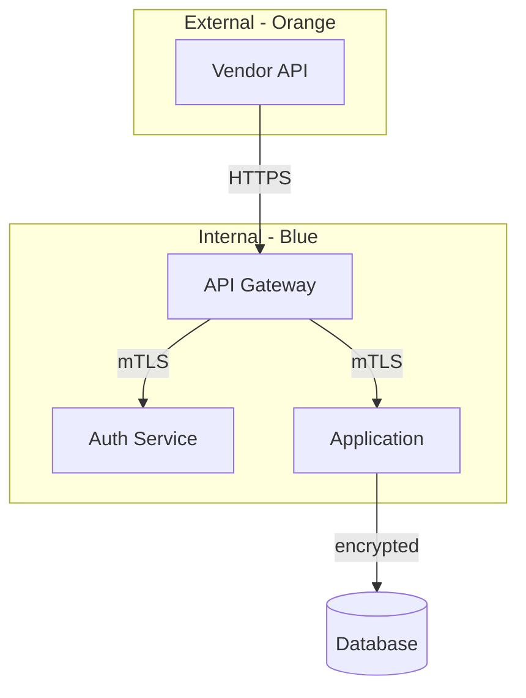

# Rules Extraction (Deterministic CLI)

Rules extraction is a **deterministic CLI tool** (`python -m ingest.extract_rules`), not an agent. It runs automatically during index-mode ingestion (zero LLM). Use the CLI directly when you need to run rules extraction manually.

## CLI Usage

```bash
# Batch: all pages in an index folder
python -m ingest.extract_rules --folder governance/indexes/security/

# Batch with refresh: only process stale pages
python -m ingest.extract_rules --folder governance/indexes/security/ --refresh

# Single page
python -m ingest.extract_rules --page 123 --index security

# All indexes
python -m ingest.extract_rules --all
```

## Input

Extract structured governance rules from raw architecture documents and save as compact `.rules.md` files for efficient validation.

## Input

### Single-file mode

- **Document path**: `governance/indexes/<category>/<PAGE_ID>/page.md` (provided by caller)
- **Category**: `patterns`, `standards`, `security`, or `general` (provided by caller)

### Batch-folder mode

- **Folder path**: any index directory containing `<PAGE_ID>/` subfolders with `page.md` files
- **Category**: auto-detected from folder name or specified by caller
- Process ALL `page.md` files in subfolders

## Output

### Single-file mode

Write to `<PAGE_ID>/rules.md` inside the index (same subfolder as `page.md`).

### Batch-folder mode

1. **Per-page**: `<PAGE_ID>/rules.md` for each source `page.md` in subfolders
2. **Consolidated**: `_all.rules.md` in the folder root -- merged, deduplicated, sorted by severity

## What to Extract

### Explicit Rules (stated in text)
- Requirements, standards, controls, guidelines
- Must/must-not statements
- Compliance requirements
- Technology mandates (e.g., "must use REST", "no GraphQL")
- Security controls (e.g., "encryption at rest required")

### Implicit Rules (from diagrams and architecture)
- Architectural constraints implied by AST tables (embedded diagrams)
- Integration patterns (e.g., all external calls go through API gateway)
- Technology choices shown in diagrams
- Data flow restrictions
- Component boundaries and isolation patterns

### Conventions (from visual patterns)
- Color coding conventions (e.g., dark blue = firm applications, green = application in context, orange = external vendors)
- Node shape conventions (e.g., cylinders for databases, rectangles for services)
- Naming conventions visible in diagrams
- Layer/tier boundaries shown in subgraphs

## Diagram Interpretation Guide

When reading AST tables (embedded diagram data), extract governance rules from:

| Diagram Element | What to Infer |
|-----------------|---------------|
| Subgraph boundaries | Isolation requirements, trust zones, network segments |
| Edge labels | Protocol requirements (HTTPS, gRPC, REST), data flow rules |
| Node shapes | Component types, technology mandates |
| Color/style annotations | Classification (internal, external, vendor), sensitivity levels |
| Missing connections | Forbidden communication paths (e.g., no direct DB access from frontend) |
| Gateway/proxy nodes | All traffic must route through specific components |
| Encryption labels (TLS, mTLS) | Encryption requirements between components |

### Example: Inferring rules from a diagram

Given this diagram data in the document:



Extract these rules:

| ID | Rule | Sev | Req | Keywords | Condition |
|----|------|-----|-----|----------|-----------|
| R-001 | External vendor isolation | C | Y | vendor,gateway,external | All external vendor traffic must route through API gateway |
| R-002 | Internal mTLS | H | Y | mTLS,internal,service | Internal service-to-service communication must use mTLS |
| R-003 | Database encryption | C | Y | database,encrypted,storage | Database connections must be encrypted |
| R-004 | No direct vendor access | C | Y | vendor,direct,forbidden | Vendors must not directly access internal services |

## Extraction Process

1. **Read the full document** including all Mermaid code blocks
2. **Scan text sections** for explicit rules, requirements, and standards
3. **Parse each Mermaid diagram** for architectural constraints and conventions
4. **Deduplicate** rules that appear in both text and diagrams
5. **Classify** each rule with severity and required/recommended
6. **Generate keywords** for each rule (used by validation agents for quick matching)
7. **Write** the compact markdown table output

## Severity Classification

| Code | Severity | Criteria |
|------|----------|----------|
| C | Critical | Security controls, data protection, auth requirements |
| H | High | Architectural patterns, integration standards, performance |
| M | Medium | Naming conventions, documentation standards, best practices |
| L | Low | Style preferences, optional enhancements |

## Output Format

Rules are written to `<PAGE_ID>/rules.md` inside the index. Rules now include an **AST Condition** column when structural conditions are extracted from `*.ast.json` files (nodes, edges, groups).

```markdown
# Rules - <source-filename>

> Source: <path> | Extracted: <timestamp> | Model: <actual model> | Category: <category> | Fingerprint: <md5-first-12-chars>

| ID | Rule | Sev | Req | Keywords | Condition | AST Condition |
|----|------|-----|-----|----------|-----------|---------------|
| R-001 | <rule name> | C/H/M/L | Y/N | <comma-separated keywords> | <one-line condition> | <ast constraint or - > |

## Probe Questions

These yes/no questions help validation agents check rules systematically. Generate one question per rule or group of related rules:

| # | Question | Rule IDs |
|---|----------|----------|
| 1 | <yes/no question that checks whether the rule is satisfied> | R-001 |
| 2 | <yes/no question for next rule or rule group> | R-002, R-003 |
```

### Probe Questions Guidelines

- Generate one probe question per rule, or group closely related rules into a single question
- Questions must be answerable with YES/NO by examining the architecture document
- Each question must reference the Rule ID(s) it validates
- Phrase questions so that YES = rule satisfied, NO = rule violated
- Example: Rule "External vendor isolation" → Question: "Does all external vendor traffic route through the API gateway?"

### Fingerprint

The `Fingerprint` field contains the first 12 characters of the MD5 hash of the source `.md` file's first 64KB. This allows the staleness checker (`rules_check.py`) to detect when a source file has changed without relying only on file timestamps.

**To compute the fingerprint** before writing the `.rules.md`:

```bash
python3 -c "import hashlib; print(hashlib.md5(open('<source-path>','rb').read(65536)).hexdigest()[:12])"
```

The CLI tool computes this automatically.

Rules:
- **ID**: Sequential `R-001`, `R-002`, etc.
- **Rule**: Short descriptive name (max 5 words)
- **Sev**: C=Critical, H=High, M=Medium, L=Low
- **Req**: Y=Required, N=Recommended
- **Keywords**: Comma-separated, lowercase, for quick matching
- **Condition**: One-line description of what must be true
- **AST Condition**: (optional) Structural constraint from `*.ast.json` (e.g., "node:X in group:Y", "edge:A->B exists")

## Consolidation (Incremental -- after each file)

When processing multiple files, merge into `_all.rules.md` **immediately after each per-file extraction** rather than reading all files at the end. This keeps context usage bounded as indexes grow.

**After extracting each `<PAGE_ID>/rules.md`:**

1. If `_all.rules.md` does not exist → create it with this file's rules as initial content
2. If `_all.rules.md` exists → read it, then:
   a. **Append** new rules from this file
   b. **Deduplicate** rules with overlapping keywords AND similar conditions:
      - If rule A (existing) and rule B (new) share 3+ keywords AND describe the same constraint → keep the more specific one
      - Note both sources in the `Source` column
   c. **Re-number** IDs sequentially: `R-001`, `R-002`, etc.
   d. **Sort** by severity: Critical first, then High, Medium, Low
   e. **Write** updated `_all.rules.md` back to disk
3. **Release context**: the source document can be forgotten -- its rules are now in both `<filename>.rules.md` and `_all.rules.md`

**Identify cross-document patterns**: rules that appear in 2+ source files represent widely-agreed governance principles and should be called out in the Cross-Document Patterns section

### Consolidated output adds a `Source` column

```markdown
| ID | Rule | Sev | Req | Keywords | Condition | AST Condition | Source |
|----|------|-----|-----|----------|-----------|---------------|--------|
| R-001 | External vendor isolation | C | Y | vendor,gateway | Must route through gateway | - | 12345/rules.md, 67890/rules.md |
```

### Cross-document patterns section

After the main table, add a summary of rules found across multiple sources:

```markdown
## Cross-Document Patterns

| Rule Pattern | Appears In | Severity |
|-------------|-----------|----------|
| mTLS for internal services | auth-standards.md, microservices.md, api-guidelines.md | Critical |
| API gateway routing | auth-standards.md, vendor-integration.md | Critical |
```

These cross-document patterns are the highest-confidence rules and should be prioritized by validation agents.

## Important

- Extract ALL rules, not just obvious ones -- diagrams often contain implicit rules
- Keep the table compact -- every token saved here saves tokens across every future validation run
- Preserve the raw `page.md` files unchanged -- `rules.md` files are derived artifacts
- If a document has no extractable rules, write a `.rules.md` with an empty table and a note
- In batch mode, continue processing remaining files if one file fails
