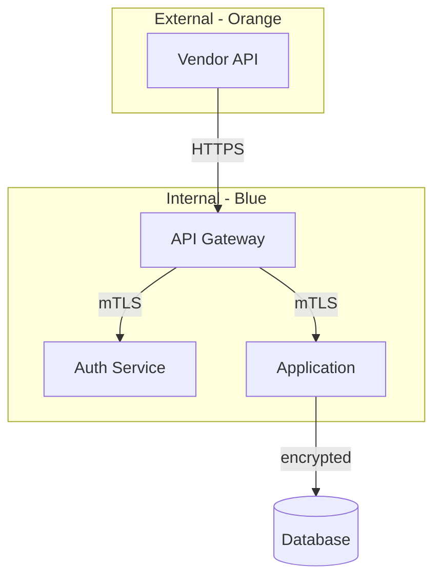

# Rules Extraction

Rule extraction has **two layers** that work together:

| Layer | Source | Tool | Output | Confidence |
|-------|--------|------|--------|------------|
| **Deterministic** | Diagrams (Draw.io, SVG, PlantUML AST) | `python -m ingest.extract_rules` | `rules.md` with `R-PROTO-*`, `R-ROLE-*`, etc. | 1.00 |
| **LLM** | Page prose (text, tables, bullet points) | This skill (agent reads page.md) | `rules-llm.md` with `R-TEXT-*` | 0.70 |

Both are merged into the final `rules.md` and `_all.rules.md` by the merge CLI.

## Deterministic Layer (CLI — zero LLM)

Runs automatically during ingestion. Only extracts from diagram AST files.

```bash
python -m ingest.extract_rules --folder governance/indexes/security/
python -m ingest.extract_rules --folder governance/indexes/security/ --refresh
python -m ingest.extract_rules --page 123 --index security
python -m ingest.extract_rules --all
```

## LLM Layer (This Skill — Agent)

**You are the LLM layer.** Read `page.md` and extract rules that the deterministic layer cannot find — requirements written in prose, mandates in bullet points, controls in tables, compliance references in paragraphs.

### Input

- **Document path**: `governance/indexes/<category>/<PAGE_ID>/page.md`
- **Existing diagram rules** (if any): `governance/indexes/<category>/<PAGE_ID>/rules.md`
- **Category**: `patterns`, `standards`, `security`, or `general`

### Output

Write to `governance/indexes/<category>/<PAGE_ID>/rules-llm.md` — the LLM-extracted rules file.

After processing all pages, run the merge:

```bash
python -m ingest.extract_rules --merge-llm --folder governance/indexes/<category>/
```

## What to Extract (LLM Layer)

### Step 1: Extract text-based rules from prose

Read the page prose (everything outside embedded AST tables) and extract:

**Explicit Rules** — stated directly in text:
- Requirements ("must", "shall", "required", "mandatory")
- Prohibitions ("must not", "shall not", "forbidden", "no direct")
- Security controls ("encryption at rest required", "OAuth2 mandatory")
- Technology mandates ("must use REST", "no GraphQL", "gRPC only for internal")
- Compliance references ("PCI-DSS requires", "SOC2 control", "GDPR Article 32")
- SLA/SLO requirements ("99.9% uptime", "< 200ms p99 latency")
- Documentation standards ("API versioning required", "all services must log")

**Implicit Rules** — inferred from context:
- Architectural constraints implied by the page structure
- Integration patterns described in paragraphs
- Data flow restrictions mentioned in text
- Naming conventions described or demonstrated

### Step 2: Vet and enhance diagram-derived rules

If `rules.md` already exists with diagram-derived rules (`R-PROTO-*`, `R-ROLE-*`, etc.):

1. Read each existing rule
2. Check if the page prose provides **additional context** for that rule
3. If yes, write an enhanced version in `rules-llm.md` with:
   - Same rule name but prefixed `[VET]` in the Condition column
   - A richer Condition text incorporating the prose context
   - Keep the original rule ID reference in Keywords (e.g., "vetted:R-PROTO-3f2a1b")
   - Use ID prefix `R-VET-` and Conf `0.80`
4. If the diagram rule is already well-described, skip it — don't duplicate

### Step 3: Identify cross-reference rules

Look for rules that span both text and diagrams — the page says "must use HTTPS" AND the diagram shows HTTPS edges. These are highest-confidence rules. Note them with `[CROSS]` in the Condition.

## Diagram Interpretation Guide

When reading AST tables (embedded diagram data), extract governance rules from:

| Diagram Element | What to Infer |
|-----------------|---------------|
| Subgraph boundaries | Isolation requirements, trust zones, network segments |
| Edge labels | Protocol requirements (HTTPS, gRPC, REST), data flow rules |
| Node shapes | Component types, technology mandates |
| Color/style annotations | Classification (internal, external, vendor), sensitivity levels |
| Missing connections | Forbidden communication paths (e.g., no direct DB access from frontend) |
| Gateway/proxy nodes | All traffic must route through specific components |
| Encryption labels (TLS, mTLS) | Encryption requirements between components |

### Example: Inferring rules from a diagram

Given this diagram data in the document:


```mermaid
flowchart TB
    subgraph External [External - Orange]
        Vendor[Vendor API]
    end
    subgraph Internal [Internal - Blue]
        GW[API Gateway]
        Auth[Auth Service]
        App[Application]
    end
    Vendor -->|HTTPS| GW
    GW -->|mTLS| Auth
    GW -->|mTLS| App
    App -->|encrypted| DB[(Database)]
```

Extract these rules:

| ID | Rule | Sev | Req | Keywords | Condition |
|----|------|-----|-----|----------|-----------|
| R-001 | External vendor isolation | C | Y | vendor,gateway,external | All external vendor traffic must route through API gateway |
| R-002 | Internal mTLS | H | Y | mTLS,internal,service | Internal service-to-service communication must use mTLS |
| R-003 | Database encryption | C | Y | database,encrypted,storage | Database connections must be encrypted |
| R-004 | No direct vendor access | C | Y | vendor,direct,forbidden | Vendors must not directly access internal services |

## Extraction Process

1. **Read the full page.md** — prose sections, tables, bullet lists, code blocks, embedded AST tables
2. **Read existing rules.md** if it exists — note which rules were already diagram-derived
3. **Extract text-based rules** from prose (Step 1 above)
4. **Vet diagram rules** against prose context (Step 2 above)
5. **Classify** each new rule with severity and required/recommended
6. **Generate keywords** — comma-separated, lowercase, for quick matching by scorer
7. **Write** `rules-llm.md` in standard table format

## Severity Classification

| Code | Severity | Criteria |
|------|----------|----------|
| C | Critical | Security controls, data protection, auth requirements |
| H | High | Architectural patterns, integration standards, performance |
| M | Medium | Naming conventions, documentation standards, best practices |
| L | Low | Style preferences, optional enhancements |

## Output Format

Write to `governance/indexes/<category>/<PAGE_ID>/rules-llm.md`:

```markdown
# LLM Rules - <PAGE_ID>

> Source: <path> | Extracted: <timestamp> | Model: <actual model> | Category: <category> | Fingerprint: <md5-first-12-chars>

| ID | Rule | Sev | Req | Keywords | Condition | AST Condition | Conf |
|----|------|-----|-----|----------|-----------|---------------|------|
| R-TEXT-a1b2c3 | <rule from prose> | C/H/M/L | Y/N | <keywords> | <condition> | - | 0.70 |
| R-VET-d4e5f6 | <enhanced diagram rule> | H | Y | vetted:R-PROTO-xxx, <keywords> | [VET] <enriched condition> | <original ast condition> | 0.80 |

## Probe Questions

| # | Question | Rule IDs |
|---|----------|----------|
| 1 | <yes/no question checking if the rule is satisfied> | R-TEXT-a1b2c3 |
| 2 | <yes/no question for next rule or rule group> | R-TEXT-d4e5f6, R-VET-g7h8i9 |
```

### Rule ID conventions

| Prefix | Source | Confidence | Description |
|--------|--------|------------|-------------|
| `R-TEXT-` | LLM extracted from prose | 0.70 | New rule found in text only |
| `R-VET-` | LLM vetting of diagram rule | 0.80 | Diagram rule enhanced with prose context |

To generate the 6-char hash suffix: `md5(rule_name + "|" + condition)[:6]`

### Column reference

- **ID**: `R-TEXT-{hash6}` or `R-VET-{hash6}`
- **Rule**: Short name (max 5 words)
- **Sev**: C=Critical, H=High, M=Medium, L=Low
- **Req**: Y=Required, N=Recommended
- **Keywords**: Comma-separated, lowercase. For `R-VET-*` rules, include `vetted:<original-rule-id>`
- **Condition**: One-line description. For vetted rules, prefix with `[VET]` and include prose context
- **AST Condition**: Copy from original diagram rule for `R-VET-*`, `-` for `R-TEXT-*`
- **Conf**: `0.70` for text-extracted, `0.80` for vetted

### Fingerprint

Compute: `md5(first 64KB of page.md)[:12]`

```bash
python3 -c "import hashlib; print(hashlib.md5(open('<source-path>','rb').read(65536)).hexdigest()[:12])"
```

### Probe Questions

- One question per rule (or group closely related rules)
- Questions must be answerable YES/NO from the architecture document
- YES = rule satisfied, NO = rule violated
- Example: Rule "OAuth2 required" → "Does the document specify OAuth2 as the authentication mechanism?"

## Merging (CLI — after LLM extraction)

**IMPORTANT**: The merge command already exists and MUST be run after LLM extraction. Do NOT merge manually — use this exact command:

```bash
source .venv/bin/activate && python -m ingest.extract_rules --merge-llm --folder governance/indexes/<category>/
```

You can verify it exists: `python -m ingest.extract_rules --help` shows `--merge-llm`.

This does:
1. For each page: reads `rules.md` (deterministic) + `rules-llm.md` (LLM) → merged `rules.md`
2. Deduplicates: if a `R-VET-*` rule covers the same condition as an existing `R-PROTO-*` etc., keeps both (the vet enhances, doesn't replace)
3. Rebuilds `_all.rules.md` from all merged per-page `rules.md` files
4. Outputs JSON with per-page merge stats (ast count, llm count, merged count)

## Important

- Extract ALL rules, not just obvious ones — prose often contains critical requirements
- Keep the table compact — every token saved here saves tokens across every future validation run
- Write to `rules-llm.md`, NOT `rules.md` — the merge CLI combines them
- If a page has no extractable text rules AND no diagram rules to vet, write a `rules-llm.md` with an empty table and a note
- Always include the Fingerprint for staleness detection
- For `R-VET-*` rules, always include `vetted:<original-rule-id>` in Keywords so the merge can track lineage
