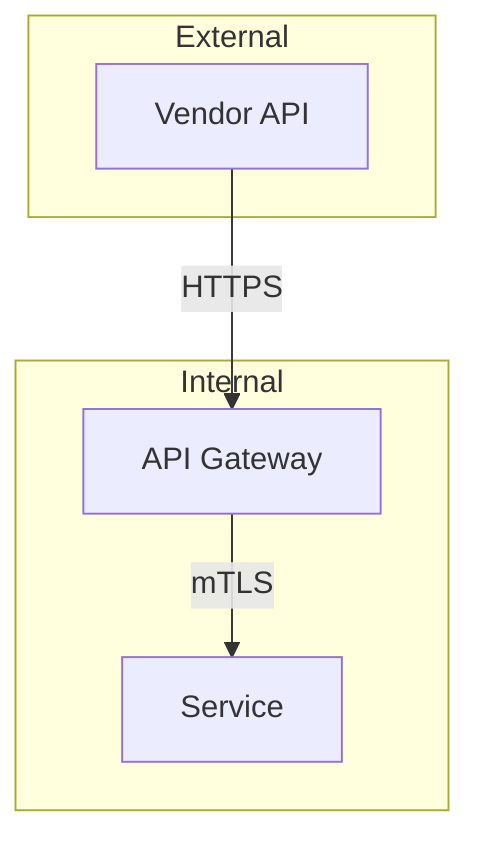

# Security Validation

Validate architecture document against all security documents in the index.

## Inputs

1. **Document**: `governance/output/<PAGE_ID>/page.md` (provided by agent)
2. **Index**: `governance/indexes/security/` (ALL .md files)

## Instructions

1. Read ALL .md files from `governance/indexes/security/`
2. Read the architecture document
3. For each security control found in the index files, check if addressed
4. Look for vulnerabilities (hardcoded secrets, etc.)
5. Calculate score and write report

## Validation Approach

For each security control found in index files:
- Search the document **text sections** for evidence of the control
- Search **Mermaid diagram code blocks** for architectural evidence (see below)
- Look for security mechanisms, protocols, configurations
- Identify any vulnerabilities or security gaps

### Interpreting Mermaid Diagrams as Evidence

The document may contain `\`\`\`mermaid` code blocks representing architecture diagrams. These are **first-class evidence** -- treat them with the same weight as written text.

**How to extract security evidence from Mermaid:**

| Mermaid Element | What to Check | Security Evidence |
|-----------------|---------------|-------------------|
| Edge labels (`--\|HTTPS\|-->`, `--\|mTLS\|-->`) | Protocol between components | Encryption in transit, TLS requirements |
| Node names (`Gateway`, `Auth`, `WAF`) | Component types | Presence of security components (API gateway, WAF, auth service) |
| Subgraph boundaries (`subgraph DMZ`, `subgraph Internal`) | Network segmentation | Trust zones, isolation boundaries |
| Missing edges (A has no path to B) | Forbidden communication | Access control, data flow restrictions |
| Arrow direction (A --> B but not B --> A) | One-way data flow | Data flow controls, read-only access patterns |
| Style/class annotations (`:::critical`, color notes) | Classification | Sensitivity levels, security tiers |

**Example -- matching a rule against a diagram:**

Rule: *"All external vendor traffic must route through API gateway"*
Keywords: `vendor, gateway, external`



Evidence: `Vendor -->|HTTPS| GW` confirms vendor traffic routes through gateway. No direct `Vendor --> App` edge confirms isolation. **Status: PASS**

**Important**: If a rule's keywords appear in Mermaid node names, edge labels, or subgraph titles, that is valid evidence. Cite the specific Mermaid line(s) in your report's Evidence column.

## Vulnerabilities to Detect

- Hardcoded passwords/secrets
- Missing encryption
- No authentication mentioned
- Direct database access without validation
- Sensitive data exposure

## Scoring

- Critical control met: +15 points
- Critical control missing: 0 points (MAJOR issue)
- High control met: +10 points
- Medium control met: +5 points
- Vulnerability found: -20 points each
- Base score: Start at 0, max 100

## Output

Write to `governance/output/<PAGE_ID>-security-report.md`:

```markdown
# Security Validation Report

**Generated**: [timestamp]
**Model**: <actual model that produced this report>
**Page ID**: <PAGE_ID>
**Document**: governance/output/<PAGE_ID>/page.md
**Index Files**: [count] files from governance/indexes/security/
**Score**: X/100
**Risk Level**: LOW / MEDIUM / HIGH / CRITICAL
**Status**: ✅ PASS / ⚠️ WARN / ❌ FAIL

## Summary

| Status | Count |
|--------|-------|
| ✅ Passed | N |
| ❌ Failed | N |
| 🚨 Critical | N |

## Security Controls Checked

| Control | Source File | Severity | Status | Evidence |
|---------|-------------|----------|--------|----------|
| [control] | [index file] | Critical/High/Medium | ✅/❌ | [brief evidence] |

## Security Controls

### [Control Name]
- **Source**: [index file that defines this control]
- **Severity**: Critical / High / Medium
- **Status**: ✅ PASS / ❌ FAIL
- **Evidence**: [quote or describe what you found]
- **Risk**: [what could go wrong if missing]
- **Recommendation**: [if failed, what to add]

[... repeat for each control ...]

## Vulnerabilities Detected

[List any security issues found with severity]

## Risk Assessment

[Overall security posture analysis]

## Recommendations

[Prioritized security improvements]
```
