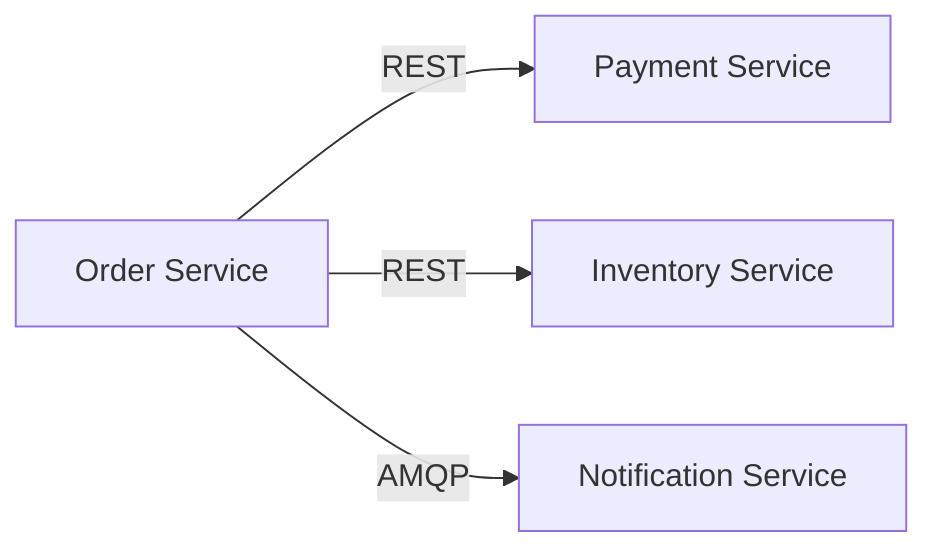

# Standards Validation

Validate architecture document against all standards documents in the index.

## Inputs

1. **Document**: `governance/output/<PAGE_ID>/page.md` (provided by agent)
2. **Index**: `governance/indexes/standards/` (ALL .md files)

## Instructions

1. Read ALL .md files from `governance/indexes/standards/`
2. Read the architecture document
3. For each standard found in the index files, check if the document addresses it
4. Calculate score and write report

## Validation Approach

For each standard found in index files:
- Search the document **text sections** for evidence of compliance
- Search **Mermaid diagram code blocks** for architectural evidence (see below)
- Look for keywords, sections, and structural patterns addressing the standard
- Determine compliance level

### Interpreting Mermaid Diagrams as Evidence

The document may contain `\`\`\`mermaid` code blocks representing architecture diagrams. These are **first-class evidence** -- treat them with the same weight as written text.

**How to extract standards evidence from Mermaid:**

| Mermaid Element | What to Check | Standards Evidence |
|-----------------|---------------|--------------------|
| Node naming conventions | Naming standards | Do component names follow required conventions (e.g., PascalCase, kebab-case)? |
| Edge labels (`-->\|REST\|`, `-->\|HTTPS\|`) | Protocol standards | Required protocols used between components? |
| Subgraph structure | Architecture standards | Required layers/tiers present (e.g., presentation, business, data)? |
| Node types (`[(DB)]`, `[Queue]`, `{Decision}`) | Technology standards | Required technology types used? |
| Diagram type (`flowchart`, `sequenceDiagram`, `C4Context`) | Documentation standards | Correct diagram notation used for the context? |
| Annotations and notes (`note right of`, `%%` comments) | Documentation standards | Components properly annotated? |

**Example -- matching a standard against a diagram:**

Standard: *"All services must use REST for synchronous communication"*
Keywords: `REST, API, synchronous, protocol`



Evidence: `A -->|REST| B` and `A -->|REST| C` show REST for synchronous calls. `A -->|AMQP| D` is asynchronous (AMQP), which is acceptable for async. **Status: PASS**

**Important**: If a rule's keywords appear in Mermaid node names, edge labels, or subgraph titles, that is valid evidence. Cite the specific Mermaid line(s) in your report's Evidence column.

## Scoring

- Required standard met: +12 points
- Required standard missing: 0 points
- Optional standard met: +4 bonus
- Base score: Start at 0, max 100

## Output

Write to `governance/output/<PAGE_ID>-standards-report.md`:

```markdown
# Standards Validation Report

**Generated**: [timestamp]
**Model**: <actual model that produced this report>
**Page ID**: <PAGE_ID>
**Document**: governance/output/<PAGE_ID>/page.md
**Index Files**: [count] files from governance/indexes/standards/
**Score**: X/100
**Status**: ✅ PASS / ⚠️ WARN / ❌ FAIL

## Summary

| Status | Count |
|--------|-------|
| ✅ Passed | N |
| ❌ Failed | N |
| ⚠️ Warnings | N |

## Standards Checked

| Standard | Source File | Status | Evidence |
|----------|-------------|--------|----------|
| [standard] | [index file] | ✅/❌/⚠️ | [brief evidence] |

## Documentation Standards

### [Standard Name]
- **Source**: [index file that defines this standard]
- **Status**: ✅ PASS / ❌ FAIL
- **Evidence**: [quote or describe what you found]
- **Recommendation**: [if failed, what to add]

[... repeat for each standard ...]

## Recommendations

[Prioritized list of improvements]
```
