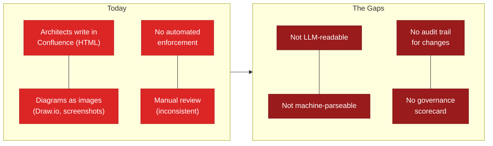
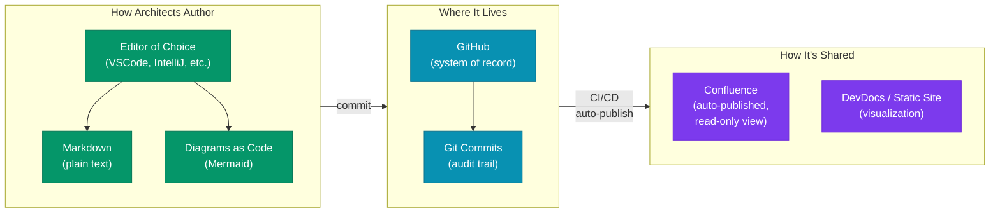
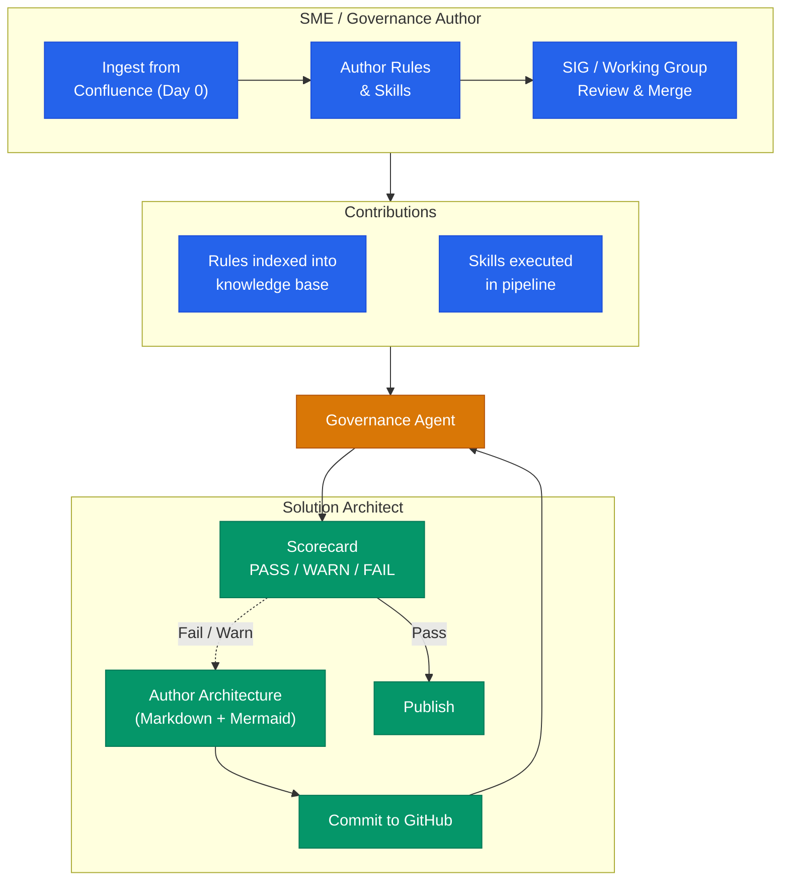
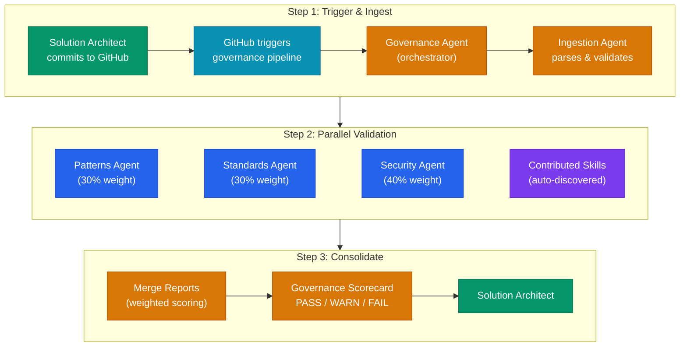
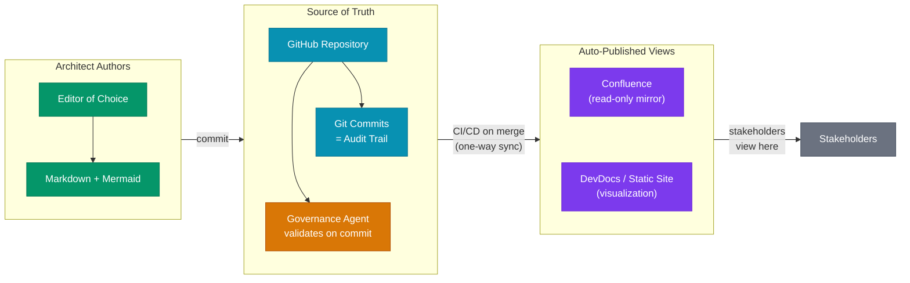
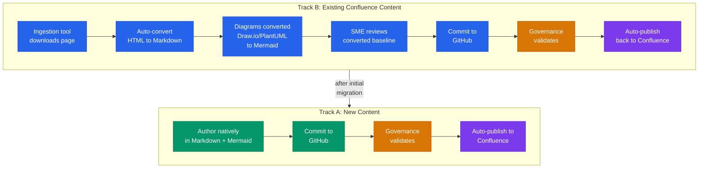
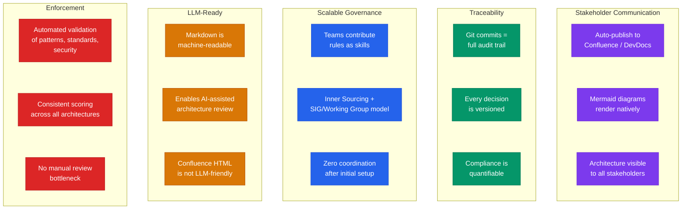
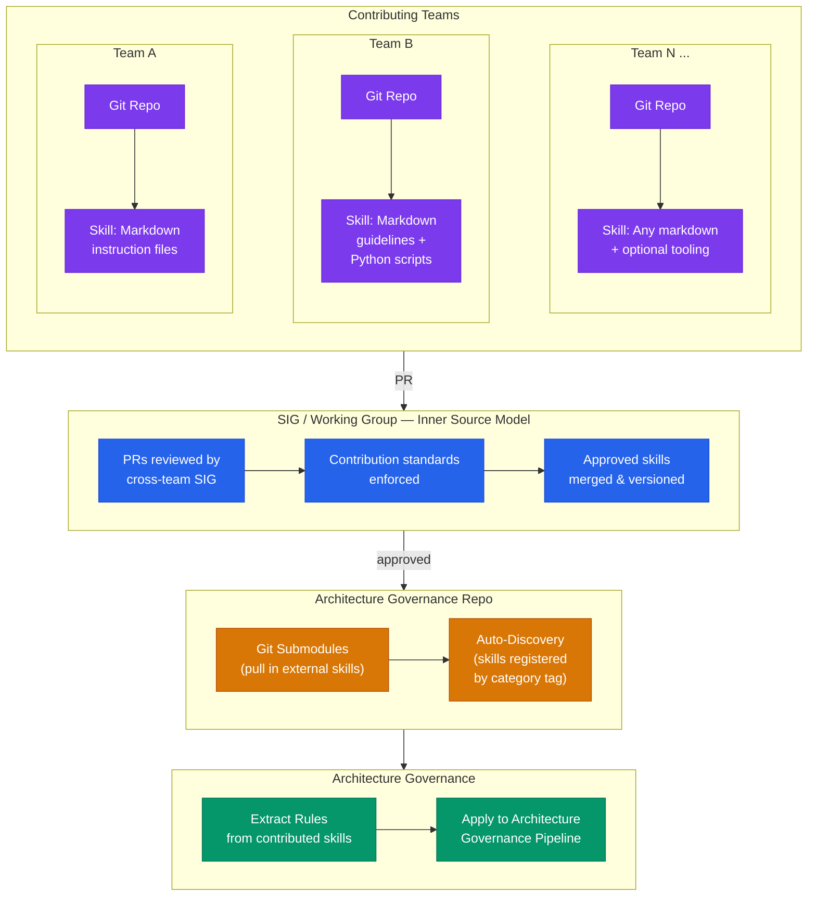
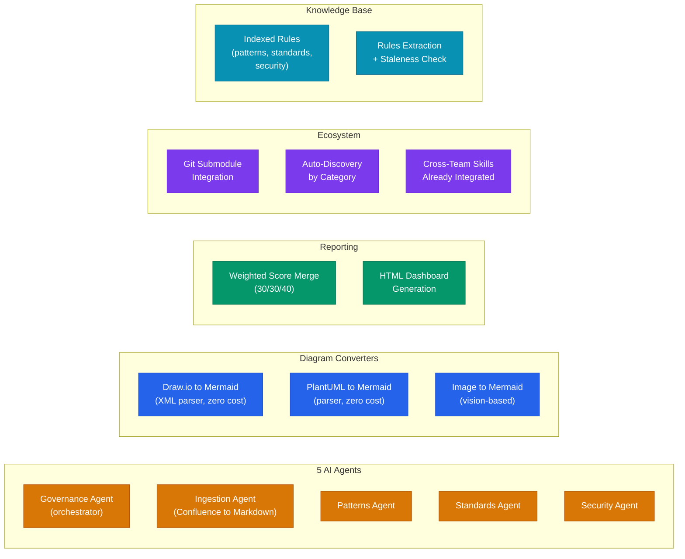
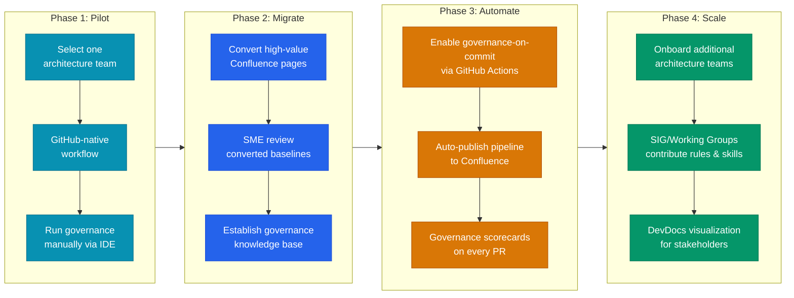

# Architecture Governance Lifecycle

> Slide-by-slide content with mermaid diagrams for the leadership presentation.
> Render in any markdown preview to screenshot diagrams for PowerPoint.

---

## Slide 1: The Problem Today

 Current State &nbsp;&nbsp;  Resulting Gaps

### Talking Points

- Architecture documentation today lives in Confluence as unstructured HTML with embedded images
- No automated enforcement of patterns, standards, or security rules -- reviews are manual and inconsistent
- Confluence content is not usable by LLMs or automation tools -- it's HTML with proprietary markup, not clean text
- No standardized audit trail for architectural decisions -- Confluence page history is opaque
- No quantifiable governance scorecard -- compliance is subjective

### Speaker Notes

The core issue: we have knowledge locked in a format that neither humans can consistently govern nor machines can process. Every review is ad-hoc, and there's no way to scale enforcement as the organization grows.

---

## Slide 2: What We're Prescribing

 Solution Architect &nbsp;&nbsp;  Infrastructure &nbsp;&nbsp;  Publishing

### Talking Points

- **Format:** Architects author in Markdown + Mermaid diagrams-as-code -- plain text, version-controllable, LLM-readable
- **Tooling:** Use VSCode or any editor of choice on their machines -- no proprietary tooling lock-in
- **System of Record:** GitHub -- every change is a git commit with full traceability (who, what, when, why)
- **Sharing:** Auto-published to Confluence (read-only) and/or DevDocs for stakeholder consumption
- This is the same toolchain engineers already use -- architects join the same workflow

### Speaker Notes

We're not inventing a new tool. We're adopting the same markdown + git workflow that engineering uses, applied to architecture documentation. The format is the enabler: plain-text markdown is machine-readable, version-controllable, and universally supported.

---

## Slide 3: Two Lifecycles, One Platform

 SME / Governance Author &nbsp;&nbsp;  Governance Agent &nbsp;&nbsp;  Solution Architect

### Talking Points

- **Two personas, one platform:** SMEs build the governance, Solution Architects consume it -- both work in markdown + git
- **SME lifecycle (left):**
  - Day 0: existing Confluence content auto-ingested and converted to markdown (don't start from scratch)
  - Ongoing: author rules and skills in markdown, submit PRs under Inner Sourcing model
  - All contributions reviewed by a SIG or Working Group (Nucleus-style governance) before merge
- **Two types of SME contributions:**
  - **Rules/Standards** -- indexed into the knowledge base for agents to validate against
  - **Skills** -- executable packages that run as active validation steps in the pipeline
- **Solution Architect lifecycle (right):**
  - Author architecture in markdown + mermaid, commit to GitHub
  - Governance agent auto-triggers, validates against rules AND executes contributed skills
  - Scorecard (PASS/WARN/FAIL) -- iterate if needed, publish when passing
- **The governance agent is the bridge** connecting both lifecycles

### Speaker Notes

This is the centerpiece slide. The left side shows how governance content is built and contributed (with proper organizational oversight). The right side shows how architects experience it. The governance agent in the center is the automated bridge -- it consumes everything SMEs produce and applies it to everything architects create. No manual review bottleneck.

---

## Slide 4: How Governance Works

 Architect &nbsp;&nbsp;  Infrastructure &nbsp;&nbsp;  Pipeline &nbsp;&nbsp;  Validation Agents &nbsp;&nbsp;  Contributed Skills

### Talking Points

- **Trigger:** Governance agent executes automatically on commit to GitHub -- no manual invocation needed
- **Ingestion:** Content is parsed and validated for structure
- **Parallel validation:** Three built-in agents run simultaneously, plus any contributed skills
  - Patterns Agent (30% weight) -- design patterns, anti-patterns
  - Standards Agent (30% weight) -- naming conventions, documentation standards
  - Security Agent (40% weight) -- security controls, vulnerabilities
  - Contributed Skills -- discovered and executed alongside built-in agents
- **Scoring:** Weighted average produces a single governance score
  - PASS: score >= 70
  - WARN: score 50-69
  - FAIL: score < 50
- **Output:** Merged report + HTML dashboard delivered back to the architect

### Speaker Notes

The key message: this is fully automated. The architect commits, the pipeline runs, and they get a scorecard. The weighting reflects organizational priorities -- security is weighted highest at 40%. Contributed skills from other teams are auto-discovered and run as first-class participants in the pipeline.

---

## Slide 5: System of Record and Sync Strategy

 Architect &nbsp;&nbsp;  Infrastructure &nbsp;&nbsp;  Governance &nbsp;&nbsp;  Publishing &nbsp;&nbsp;  Stakeholders

### Talking Points

- **GitHub is the single source of truth** -- all architecture artifacts live as markdown + mermaid in git repos
- **Change history = git commits** -- who changed what, when, and why -- full audit trail with no ambiguity
- **Auto-publish to Confluence on merge** -- CI/CD pipeline pushes rendered markdown to Confluence via API after each merge to main
- **Confluence becomes a read-only view** -- stakeholders who prefer Confluence still see the content, but it's always in sync
- **One-way sync eliminates drift** -- there is no manual copy/paste, no "which version is correct?" problem
- Architects never touch Confluence directly -- they author in their editor, commit, and the pipeline handles the rest

### Speaker Notes

This is critical for leadership: we're not asking anyone to give up Confluence as a viewing experience. Stakeholders still see content in Confluence if they prefer. But the source of truth is git, and the sync is automated and one-way. This eliminates the "two sources of truth" problem that plagues organizations using both tools.

---

## Slide 6: Confluence Migration Path

 New Content &nbsp;&nbsp;  Migration &nbsp;&nbsp;  Governance &nbsp;&nbsp;  Publishing

### Talking Points

- **Track A (new content):** Authored natively in markdown + mermaid from day one -- straight into the governed pipeline
- **Track B (existing content):** Ingestion tool auto-converts Confluence pages to clean markdown
  - HTML to markdown conversion
  - Draw.io diagrams converted to Mermaid (XML parsing, no LLM cost)
  - PlantUML converted to Mermaid (parser-based, zero cost)
  - Images converted to Mermaid (vision-based, where needed)
- **SME review:** Converted content is reviewed for accuracy before committing as the baseline
- **Convergence:** After initial migration, Track B content joins Track A -- everything is markdown-native going forward
- **Already built:** The ingestion and conversion tooling is fully operational today

### Speaker Notes

This is how we address the "we already have years of content in Confluence" concern. We don't ask anyone to re-author from scratch. The ingestion tool handles the conversion, SMEs review it, and from that point forward it's all markdown-native. The conversion tooling for Draw.io and PlantUML is parser-based (not LLM), so it's fast and free.

---

## Slide 7: Business Benefits

 Enforcement &nbsp;&nbsp;  LLM-Ready &nbsp;&nbsp;  Scalable &nbsp;&nbsp;  Traceability &nbsp;&nbsp;  Communication

### Talking Points

- **Enforcement of best practices:** Automated, consistent validation of every architecture against organizational patterns, standards, and security rules -- no subjectivity
- **LLM-ready documentation:** Markdown is machine-readable; Confluence HTML is not. This positions architecture docs for AI-assisted review and generation
- **Scalable governance:** Teams contribute their own rules via Inner Sourcing model under SIG/Working Group oversight. After initial setup, zero coordination overhead
- **Full traceability:** Git commits provide complete audit trail -- who changed what, when, why. Compliance becomes quantifiable via governance scores
- **Stakeholder communication:** Architecture is auto-published and visualized for stakeholders via Confluence or DevDocs -- no extra effort from architects

### Speaker Notes

Tie every benefit to an organizational outcome. Enforcement reduces risk. LLM-readiness future-proofs the investment. Scalability means this doesn't become a bottleneck as the org grows. Traceability satisfies audit requirements. And auto-publishing means architects focus on architecture, not formatting Confluence pages.

---

## Slide 8: Cross-Team Ecosystem -- Already in Motion

 External Teams &nbsp;&nbsp;  Governance Repo &nbsp;&nbsp;  Consumers &nbsp;&nbsp;  SIG / Working Group

### Talking Points

- **Already in production:** Other engineering teams have built governance skills (markdown instructions, Python scripts) for their own code governance purposes
- **Team A:** Created a skill as a set of markdown instruction files in their own git repo -- integrated via git submodules
- **Team B:** Created a skill with markdown guidelines + Python scripts for code governance -- also integrated via submodules
- **We extract the rules:** Their skills contain rich patterns, guidelines, and standards -- we pull those rules out and apply them to architecture governance
- **Same governance model:** All contributions follow Inner Sourcing principles under SIG/Working Group review
- **Key message:** This is not a greenfield experiment -- teams are already producing governance content in markdown + git, and we extract and reuse their rules for architecture validation

### Speaker Notes

This is powerful proof of adoption. Two teams independently built skills for code governance, and we extract the rules embedded in those skills -- patterns, standards, guidelines -- and apply them to architecture governance. The submodule model means each team owns their skill in their own repo, pushes updates on their own schedule, and the governance pipeline picks up rule changes automatically. We don't do code governance ourselves -- we leverage the rules others have codified.

---

## Slide 9: What's Already Built

 AI Agents &nbsp;&nbsp;  Converters &nbsp;&nbsp;  Reporting &nbsp;&nbsp;  Ecosystem &nbsp;&nbsp;  Knowledge Base

### Talking Points

- **5 AI agents** operational: governance orchestrator, ingestion, patterns, standards, security
- **Diagram conversion** built and working:
  - Draw.io XML to Mermaid (parser-based, zero LLM cost)
  - PlantUML to Mermaid (parser-based, zero cost)
  - Image to Mermaid (vision-based, for non-parseable diagrams)
- **Weighted scoring** with merged reports: Patterns 30%, Standards 30%, Security 40%
- **HTML dashboard** generation for governance results
- **Multi-team skill contribution** model via git submodules with auto-discovery by category tag
- **Cross-team skills** from two engineering teams already integrated and running
- **Knowledge base** with indexed rules, automated extraction, and staleness checking

### Speaker Notes

Everything described in the previous slides is not aspirational -- the core platform is built and operational. The agents run, the converters work, the scoring produces results, and cross-team skills are already integrated. What remains is the CI/CD trigger on commit (requires engineering partnership) and the auto-publish to Confluence pipeline.

---

## Slide 10: Rollout Plan

 Phase 1: Pilot &nbsp;&nbsp;  Phase 2: Migrate &nbsp;&nbsp;  Phase 3: Automate &nbsp;&nbsp;  Phase 4: Scale

### Talking Points

- **Phase 1 -- Pilot:** Select one architecture team, adopt GitHub-native markdown workflow, run governance via IDE agents (already works today)
- **Phase 2 -- Migrate:** Convert high-value existing Confluence pages using the ingestion tool, SMEs review converted baselines, build out the governance knowledge base
- **Phase 3 -- Automate:** Partner with engineering to enable governance-on-commit via GitHub Actions, set up auto-publish pipeline to Confluence, governance scorecards appear on every PR
- **Phase 4 -- Scale:** Onboard additional architecture teams, SIGs and Working Groups contribute domain-specific rules and skills, enable DevDocs or static site visualization for broader stakeholder communication

### Speaker Notes

Phase 1 is achievable immediately with what's already built. Phase 2 uses the existing ingestion tooling. Phase 3 requires engineering partnership for CI/CD integration. Phase 4 is the organizational scaling play. Each phase builds on the previous one with clear, measurable outcomes.
