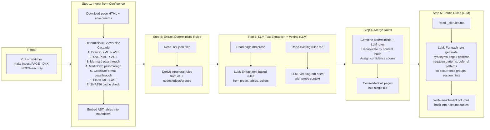
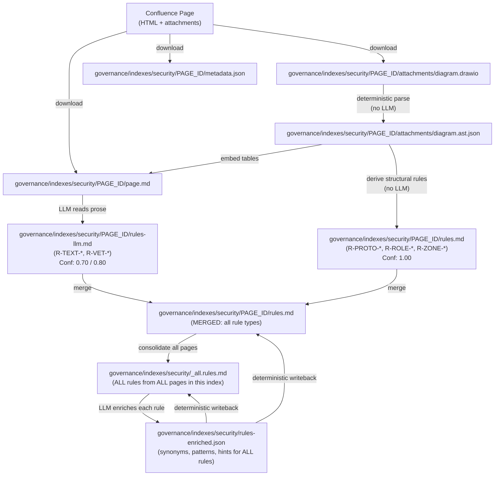
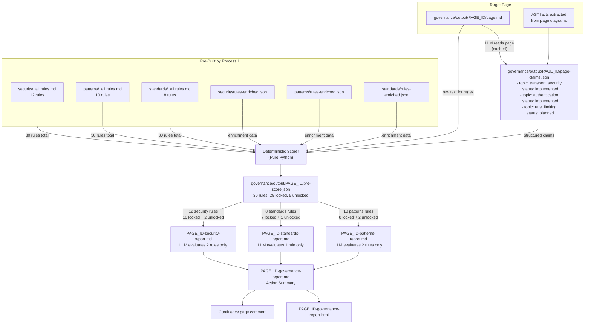
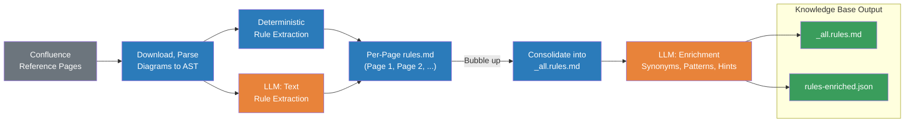
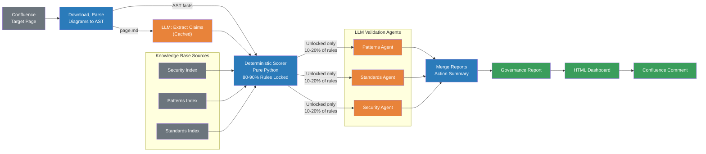

# Architecture Governance — Complete Flow

Two fully disjoint processes: **Indexing** (prepare the knowledge base) and **Validation** (check a target page against it).

---

## Process 1: Indexing Pipeline

Runs per reference page, per index. Builds the knowledge base that validation reads from.



### Files Produced (Indexing)

All paths relative to `governance/indexes/<category>/` (e.g. `governance/indexes/security/`).

| Step | File | Location | LLM? |
|------|------|----------|------|
| 1 | `page.md` | `<PAGE_ID>/page.md` | No |
| 1 | `metadata.json` | `<PAGE_ID>/metadata.json` | No |
| 1 | `*.ast.json` | `<PAGE_ID>/attachments/<name>.ast.json` | No |
| 1 | Cache files | `governance/output/.cache/ast/<hash>.ast.json` | No |
| 2 | `rules.md` (deterministic only) | `<PAGE_ID>/rules.md` | No |
| 2 | `_all.rules.md` (first pass) | `_all.rules.md` | No |
| 3 | `rules-llm.md` | `<PAGE_ID>/rules-llm.md` | **Yes** |
| 4 | `rules.md` (merged final) | `<PAGE_ID>/rules.md` (overwritten) | No (merge is deterministic) |
| 4 | `_all.rules.md` (rebuilt) | `_all.rules.md` (overwritten) | No |
| 5 | `rules-enriched.json` | `rules-enriched.json` (index level) | **Yes** |
| 5 | `rules.md` (with enrichment columns) | `<PAGE_ID>/rules.md` (updated) | No (writeback is deterministic) |
| 5 | `_all.rules.md` (with enrichment columns) | `_all.rules.md` (updated) | No |

### Data Flow (Indexing)



### CLI Commands (Indexing)

```bash
# Step 1: Ingest reference page to an index
python ingest/confluence_ingest.py --page-id 123456789 --index security

# Step 2: Extract deterministic rules (automatic during ingest, or manual)
make extract-rules FOLDER=governance/indexes/security/

# Step 3: LLM text extraction (triggered manually or via watcher)
# Uses governance-agent's rules-extract skill
make check-zero-rules FOLDER=governance/indexes/security/

# Step 4: Merge deterministic + LLM rules
make merge-llm-rules FOLDER=governance/indexes/security/

# Step 5: Enrich rules
make enrich-rules INDEX=security

# Full pipeline shortcut (planned)
make index-prepare INDEX=security
```

---

## Process 2: Validation Pipeline (governance-agent)

Runs per target page. Reads pre-built index artifacts and validates the target page against ALL rules from ALL indexes.

```mermaid
flowchart LR
    subgraph trigger [Trigger]
        GA["@governance-agent<br/>Validate page PAGE_ID"]
    end

    subgraph step1 [Step 1: Verify Page]
        direction TB
        CHECK_PAGE["Check governance/output/PAGE_ID/page.md exists"]
        FALLBACK["Fallback: ingest from Confluence"]
        CHECK_PAGE -.->|missing| FALLBACK
    end

    subgraph step2 [Step 2: Verify Index Prerequisites]
        direction TB
        CHECK_RULES["Check _all.rules.md exists<br/>in security, patterns, standards"]
        CHECK_ENRICH["Check rules-enriched.json exists<br/>and is not stale"]
        CHECK_RULES --> CHECK_ENRICH
    end

    subgraph step3 ["Step 3: Extract Claims (LLM)"]
        direction TB
        READ_TARGET["Read target page.md"]
        GET_FACTS["Get deterministic AST facts"]
        LLM_CLAIMS["LLM: Extract structured claims<br/>per topic with status"]
        READ_TARGET --> LLM_CLAIMS
        GET_FACTS --> LLM_CLAIMS
    end

    subgraph step4 [Step 4: Deterministic Scoring]
        direction TB
        LOAD["Load enriched rules from ALL indexes<br/>+ claims + AST facts + page text"]
        EVAL["Evaluate each rule:<br/>1. AST condition<br/>2. Claims match<br/>3. Pattern match<br/>4. Co-occurrence<br/>5. Keyword fallback"]
        LOCK["Lock definitive results<br/>Flag ambiguous for LLM"]
        LOAD --> EVAL --> LOCK
    end

    subgraph steps57 ["Steps 5-7: Validation Agents (LLM on unlocked only)"]
        direction TB
        PAT["patterns-agent<br/>accept locked, re-evaluate unlocked"]
        STD["standards-agent<br/>accept locked, re-evaluate unlocked"]
        SEC["security-agent<br/>accept locked, re-evaluate unlocked"]
    end

    subgraph steps810 [Steps 8-10: Reporting]
        direction TB
        MERGE_R["Merge 3 reports<br/>30% + 30% + 40%"]
        HTML_R["Generate HTML dashboard"]
        POST_R["Post to Confluence<br/>Notify watcher"]
        MERGE_R --> HTML_R --> POST_R
    end

    GA --> step1 --> step2 --> step3 --> step4 --> steps57 --> steps810
```



### Files Read and Produced (Validation)

| Step | Reads | Produces | LLM? |
|------|-------|----------|------|
| 1 | `governance/output/<PAGE_ID>/page.md` | (nothing new) | No |
| 2 | `governance/indexes/*/_all.rules.md` | (nothing new) | No |
| 2 | `governance/indexes/*/rules-enriched.json` | (nothing new) | No |
| 3 | `governance/output/<PAGE_ID>/page.md` | `governance/output/<PAGE_ID>/page-claims.json` | **Yes** (cached) |
| 4 | `rules-enriched.json` (all indexes) | `governance/output/<PAGE_ID>/pre-score.json` | No |
| 4 | `page-claims.json` | | No |
| 4 | `page.md` (text for regex matching) | | No |
| 5-7 | `pre-score.json` | `<PAGE_ID>-patterns-report.md` | **Yes** (unlocked only, ~10-20%) |
| 5-7 | `page.md` | `<PAGE_ID>-standards-report.md` | |
| 5-7 | `_all.rules.md` | `<PAGE_ID>-security-report.md` | |
| 8 | 3 report `.md` files | `<PAGE_ID>-governance-report.md` | No |
| 9 | governance report | `<PAGE_ID>-governance-report.html` | No |
| 10 | governance report | Confluence page comment | No |

### Data Flow (Validation)



---

## Scoring Pipeline Detail

The scoring system uses a hybrid approach that freezes LLM variance at extraction time, making scoring 100% deterministic.

### 4 Layers

| Layer | When | What | LLM? |
|-------|------|------|------|
| **A. Rule Enrichment** | Process 1, step 5 (cached) | Generates synonyms, regex patterns, section hints for each rule -> `rules-enriched.json` | Yes (once) |
| **B. Page Claims** | Process 2, step 3 (cached) | Extracts structured per-topic claims from page.md -> `page-claims.json` | Yes (once) |
| **C. Deterministic Scorer** | Process 2, step 4 (every run) | Matches enriched rules against claims + AST facts -> `pre-score.json` | Pure Python |
| **D. Residual LLM** | Process 2, steps 5-7 (unlocked only) | Validation agents re-evaluate only WEAK_EVIDENCE and CONTRADICTION items | Yes (~10-20%) |

### Rule Scoring Statuses

| Status | Score | Locked | Description |
|--------|-------|--------|-------------|
| CONFIRMED_PASS | 100 | Yes | AST condition confirms rule is satisfied |
| STRONG_PASS | 95 | Yes | Page claims: topic implemented with evidence |
| PATTERN_PASS | 85 | Yes | 2+ evidence regex patterns matched |
| CO_OCCUR_PASS | 80 | Yes | Co-occurrence group fully matched |
| WEAK_EVIDENCE | 50 | No | Single keyword/synonym match (LLM evaluates) |
| CONTRADICTION | 40 | No | AST contradicts text claim (LLM resolves) |
| DEFERRED_ERROR | 20 | Yes | Topic explicitly marked as planned/TBD |
| NEGATION_ERROR | 10 | Yes | Negation pattern matched |
| ABSENT_ERROR | 0 | Yes | No evidence found |
| CONFIRMED_ERROR | 0 | Yes | AST condition confirms violation |

### Scoring Priority Chain (per rule)

```
1. AST CONDITION CHECK (strongest signal)
   Rule has an AST condition like "edge.protocol == HTTPS"?
   Target page AST satisfies it?
   -> Yes: CONFIRMED_PASS (100, locked)
   -> Violated: CONFIRMED_ERROR (0, locked)

2. CLAIMS MATCH
   Any claim topic matches rule keywords/synonyms?
   Claim status is "implemented" with evidence?
   -> Yes: STRONG_PASS (95, locked)
   -> Status "planned/TBD": DEFERRED_ERROR (20, locked)

3. EVIDENCE PATTERN MATCH
   2+ regex evidence_patterns from enrichment match page text?
   -> Yes: PATTERN_PASS (85, locked)

4. CO-OCCURRENCE CHECK
   Full co-occurrence group appears in page?
   -> Yes: CO_OCCUR_PASS (80, locked)

5. NEGATION CHECK
   Any negation_patterns match?
   -> Yes: NEGATION_ERROR (10, locked)

6. SINGLE KEYWORD/SYNONYM MATCH
   Only 1 keyword or synonym found, no strong evidence
   -> WEAK_EVIDENCE (50, UNLOCKED — needs LLM)

7. CONTRADICTION
   AST says one thing, text claims say another
   -> CONTRADICTION (40, UNLOCKED — needs LLM)

8. NO EVIDENCE AT ALL
   Nothing found anywhere
   -> ABSENT_ERROR (0, locked)
```

### Action Tiers

Each rule is assigned an action tier instead of a numeric score:

| Action | Meaning |
|--------|---------|
| **Compliant** | No action needed — rule is satisfied |
| **Verify** | Likely compliant — confirm in next review |
| **Investigate** | Ambiguous evidence — needs human review |
| **Plan** | Acknowledged gap — schedule on roadmap |
| **Remediate** | Violation or missing — implement or fix |

### Expected Impact

| Metric | Without Scoring Pipeline | With Scoring Pipeline |
|--------|------------------------|----------------------|
| Result variance per run | ~15-25 points | ~1-3 tier differences |
| % rules evaluated by LLM | 100% | ~10-20% |
| Re-evaluate unchanged page | Full LLM run (~3-5 min) | Instant (cached, Python only) |

---

## LLM Usage Summary

| Process | Step | LLM Purpose | Frequency |
|---------|------|-------------|-----------|
| **1 (Index)** | 3 | Extract text rules from prose, vet diagram rules | Once per reference page change |
| **1 (Index)** | 5 | Generate synonyms, regex patterns, section hints | Once per `_all.rules.md` change |
| **2 (Validate)** | 3 | Extract structured claims from target page | Once per target page change (cached) |
| **2 (Validate)** | 5-7 | Re-evaluate ambiguous rules (WEAK_EVIDENCE, CONTRADICTION) | ~5 out of 30 rules per run |

Everything else — ingestion, AST conversion, rule extraction, merging, scoring, report merging, HTML generation — is **pure deterministic Python**, zero LLM.

---

## File System Layout

```
governance/indexes/
├── security/
│   ├── _all.rules.md              # Consolidated rules from ALL pages in this index
│   ├── rules-enriched.json        # Enrichment of ALL rules (index level, not per-page)
│   ├── 111111111/
│   │   ├── page.md                # Reference page with embedded AST tables
│   │   ├── metadata.json
│   │   ├── rules.md               # Merged rules (deterministic + LLM)
│   │   ├── rules-llm.md           # LLM-extracted text rules + vetted diagram rules
│   │   └── attachments/
│   │       ├── diagram.drawio
│   │       └── diagram.ast.json
│   └── 222222222/
│       ├── page.md
│       ├── rules.md
│       └── ...
├── patterns/
│   ├── _all.rules.md
│   ├── rules-enriched.json
│   └── .../
└── standards/
    ├── _all.rules.md
    ├── rules-enriched.json
    └── .../

governance/output/
├── .cache/ast/                    # SHA256-keyed conversion cache
├── <PAGE_ID>/                     # Target page folder
│   ├── page.md                    # Target page markdown
│   ├── metadata.json
│   ├── page-claims.json           # LLM-extracted claims (cached)
│   ├── pre-score.json             # Deterministic scoring output
│   └── attachments/
├── <PAGE_ID>-patterns-report.md
├── <PAGE_ID>-standards-report.md
├── <PAGE_ID>-security-report.md
├── <PAGE_ID>-governance-report.md
└── <PAGE_ID>-governance-report.html
```

---

## Executive Summary Diagrams

### Slide 1 — Ingestion: Building the Knowledge Base



### Slide 2 — Validation: Scoring a Target Page


