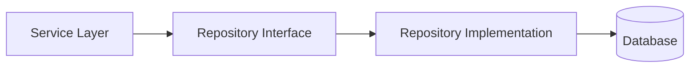
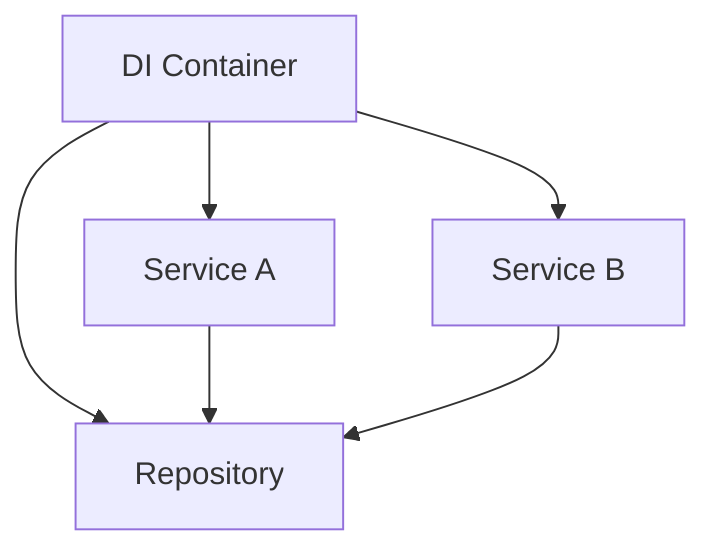
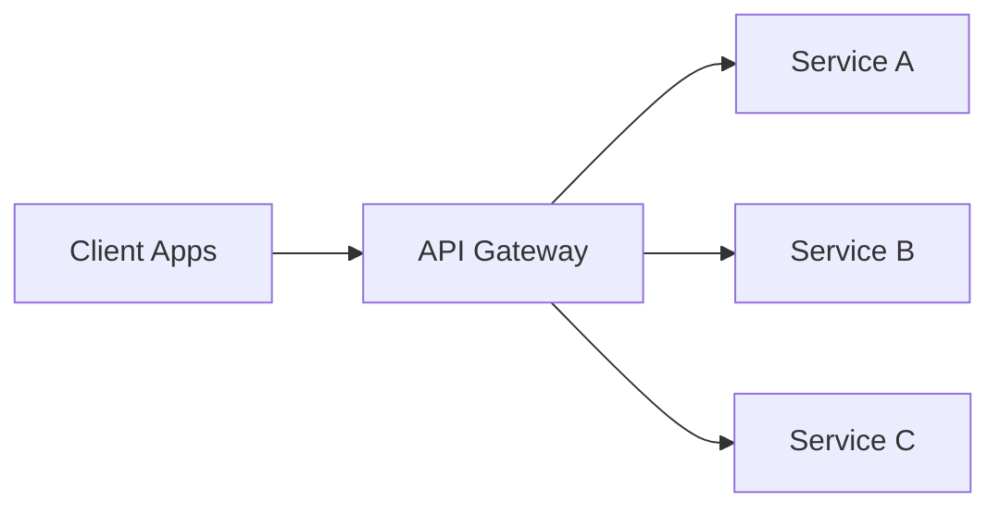
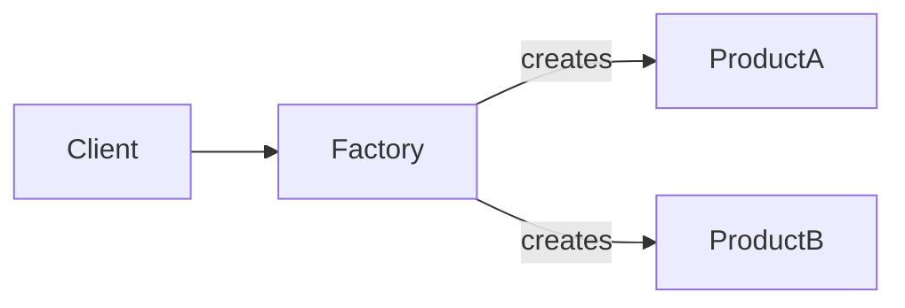
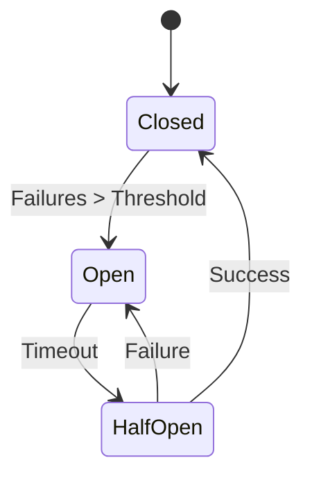
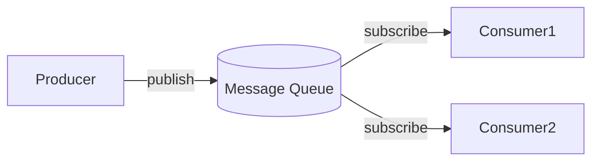
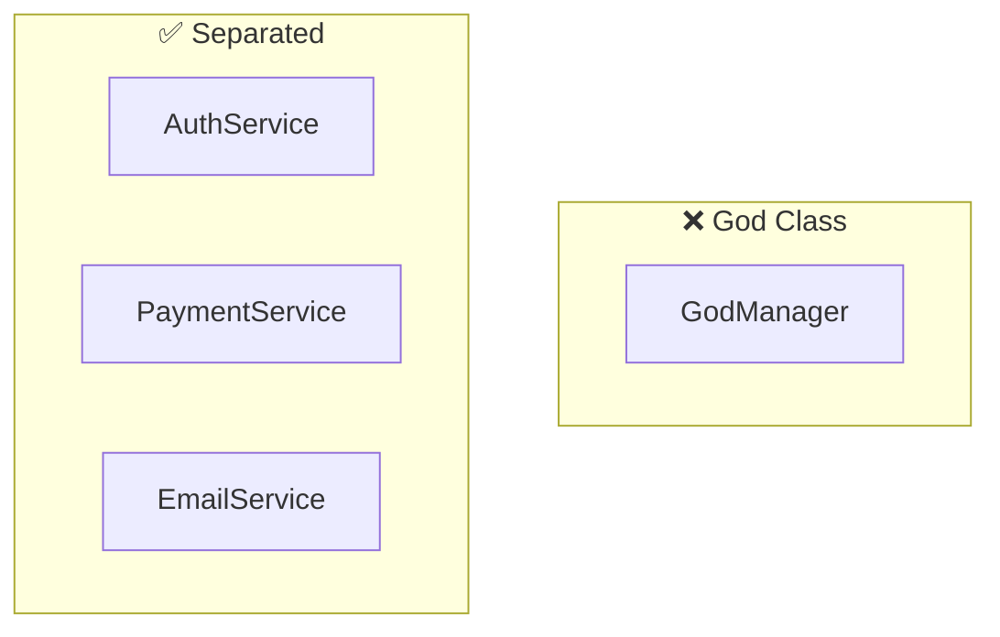

# Architecture Pattern Standards

> Source: Confluence - Architecture Standards
> Last Updated: 2026-01-24

---

## Required Patterns

### 1. Repository Pattern

**Severity**: High | **Required**: Yes

All data access must be abstracted through repository interfaces. Direct database access from business logic is not permitted.



**Why?**
- Abstracts the data persistence layer
- Enables unit testing with mock repositories
- Single responsibility principle
- Allows changing data sources without affecting business logic

**Keywords**: `repository`, `data access`, `persistence`, `database layer`, `DAO`

---

### 2. Dependency Injection

**Severity**: High | **Required**: Yes

Dependencies should be injected rather than created directly within components.



**Why?**
- Loose coupling between components
- Enables testing with mock dependencies
- Configurable at runtime
- Inversion of Control

**Keywords**: `dependency injection`, `DI`, `IoC`, `inversion of control`, `inject`, `container`

---

### 3. API Gateway Pattern

**Severity**: High | **Required**: Yes

External API access should go through a centralized API gateway.



**Why?**
- Single entry point for API consumers
- Centralized authentication/authorization
- Rate limiting and throttling
- API versioning management

**Keywords**: `API gateway`, `gateway`, `API management`, `entry point`, `facade`

---

## Recommended Patterns

### 4. Factory Pattern

**Severity**: Medium | **Required**: No

Complex object creation should use factory methods.



**Keywords**: `factory`, `create`, `builder`, `instantiation`, `object creation`

---

### 5. Circuit Breaker

**Severity**: Medium | **Required**: No

External service calls should implement circuit breaker for resilience.



**Keywords**: `circuit breaker`, `fault tolerance`, `resilience`, `fallback`, `retry`

---

### 6. Event-Driven Architecture

**Severity**: Medium | **Required**: No

Asynchronous communication should use event-driven patterns.



**Keywords**: `event`, `message`, `queue`, `async`, `pub/sub`, `event-driven`

---

## Anti-Patterns to Avoid

### God Class

**Severity**: High | **Type**: Anti-Pattern

Classes should NOT handle too many responsibilities.



**Detection**: Large classes with `manager`, `handler`, `processor` doing everything.

---

## Structured Rules

```json
{
  "category": "patterns",
  "rules": [
    {"id": "PAT-001", "name": "Repository Pattern", "severity": "high", "required": true, "keywords": ["repository", "data access", "persistence", "DAO"]},
    {"id": "PAT-002", "name": "Dependency Injection", "severity": "high", "required": true, "keywords": ["dependency injection", "DI", "IoC", "inject", "container"]},
    {"id": "PAT-003", "name": "API Gateway", "severity": "high", "required": true, "keywords": ["API gateway", "gateway", "entry point", "facade"]},
    {"id": "PAT-004", "name": "Factory Pattern", "severity": "medium", "required": false, "keywords": ["factory", "create", "builder"]},
    {"id": "PAT-005", "name": "Circuit Breaker", "severity": "medium", "required": false, "keywords": ["circuit breaker", "resilience", "fallback", "retry"]},
    {"id": "PAT-006", "name": "Event-Driven", "severity": "medium", "required": false, "keywords": ["event", "message", "queue", "pub/sub"]}
  ],
  "anti_patterns": [
    {"id": "ANTI-001", "name": "God Class", "severity": "high", "keywords": ["manager", "handler", "processor"]}
  ]
}
```
