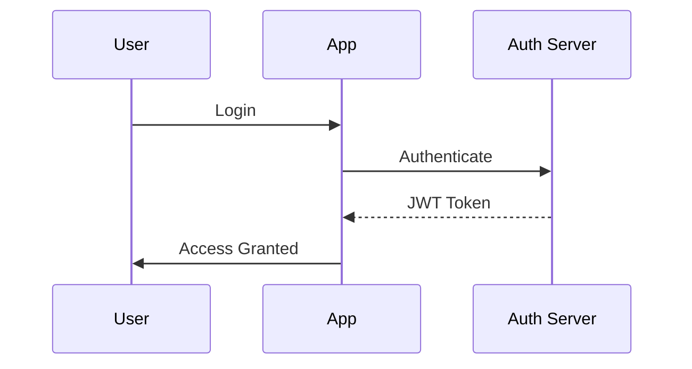
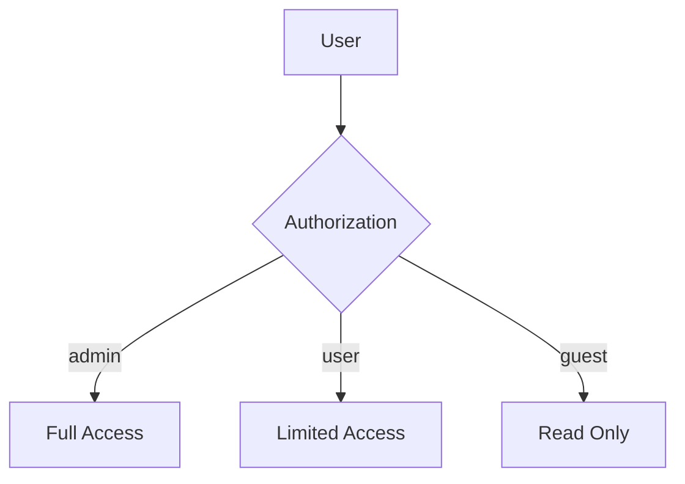
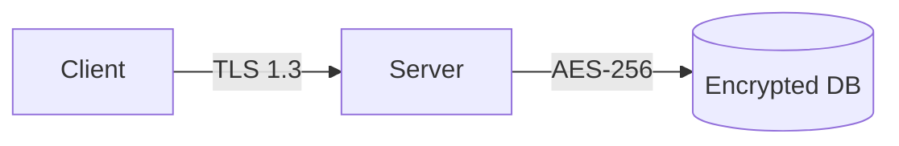
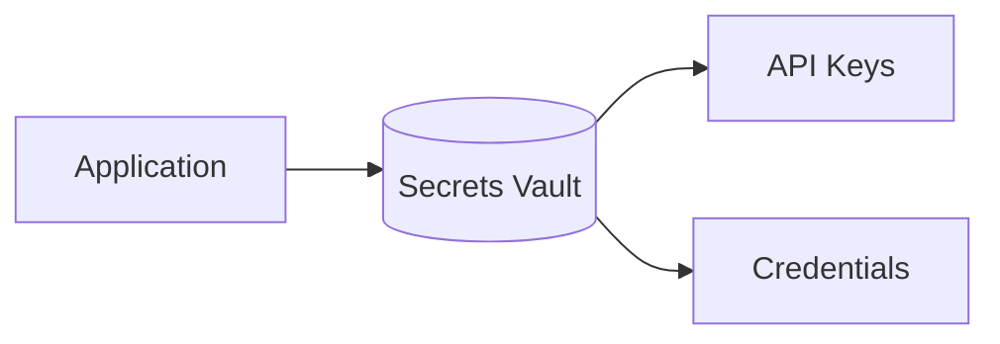
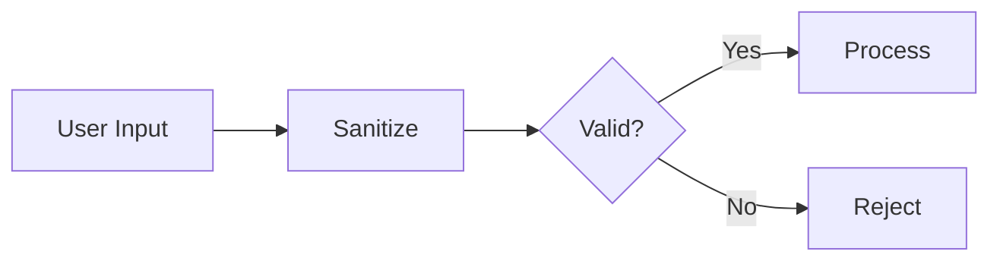
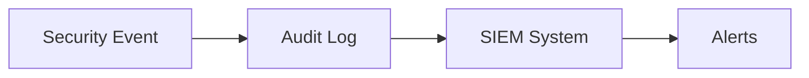
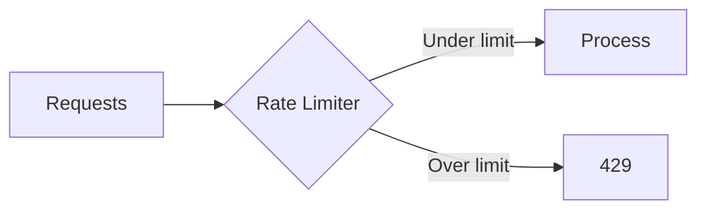

# Security Guidelines

> Source: Confluence - Security Standards
> Last Updated: 2026-01-24

---

## Authentication & Authorization

### 1. Authentication Mechanism

**Severity**: Critical | **Required**: Yes

Authentication mechanism must be explicitly defined.



**Acceptable Methods**: OAuth 2.0, JWT tokens, SSO, API keys (service-to-service only)

**Keywords**: `authentication`, `auth`, `login`, `OAuth`, `JWT`, `SSO`, `identity`

**Risk if Missing**: Unauthorized access to system resources.

---

### 2. Authorization / Access Control

**Severity**: Critical | **Required**: Yes

Authorization model must be defined.



**Expected**: RBAC, permission definitions, access control lists

**Keywords**: `authorization`, `RBAC`, `permission`, `access control`, `role`, `ACL`

**Risk if Missing**: Privilege escalation and unauthorized actions.

---

## Data Protection

### 3. Data Encryption

**Severity**: Critical | **Required**: Yes

Encryption requirements for data at rest and in transit.



**Requirements**: TLS 1.2+ in transit, AES-256 at rest, key management strategy

**Keywords**: `encryption`, `TLS`, `SSL`, `HTTPS`, `encrypted`, `AES`, `at rest`

**Risk if Missing**: Data exposure and breach.

---

### 4. Secrets Management

**Severity**: Critical | **Required**: Yes

Secrets must NOT be hardcoded. Secret management solution required.



**Acceptable Solutions**: HashiCorp Vault, AWS Secrets Manager, Azure Key Vault

**Keywords**: `secrets`, `vault`, `key management`, `credential`, `secret management`

**Risk if Missing**: Credential exposure in source code.

---

## Input Validation

### 5. Input Validation

**Severity**: High | **Required**: Yes

All user inputs must be validated.



**Requirements**: Server-side validation, input sanitization, parameterized queries

**Keywords**: `validation`, `input validation`, `sanitize`, `sanitization`, `validate`

**Risk if Missing**: Injection attacks (SQL, XSS, etc.)

---

### 6. SQL Injection Prevention

**Severity**: Critical | **Required**: Yes

Database queries must use parameterized queries or ORM.

```
❌ BAD:  "SELECT * FROM users WHERE id = " + userId
✅ GOOD: "SELECT * FROM users WHERE id = ?" with params
✅ GOOD: ORM: User.findById(userId)
```

**Keywords**: `parameterized`, `prepared statement`, `ORM`, `SQL injection`

**Risk if Missing**: SQL injection attacks, data breach.

---

## Audit & Monitoring

### 7. Audit Logging

**Severity**: High | **Required**: Yes

Security-relevant events must be logged.



**Required Events**: Authentication attempts, authorization failures, data access, config changes

**Keywords**: `audit`, `audit log`, `security log`, `compliance`, `trail`

**Risk if Missing**: Inability to detect and investigate security breaches.

---

## Network Security

### 8. Rate Limiting

**Severity**: Medium | **Required**: No (Recommended)

APIs should implement rate limiting.



**Keywords**: `rate limit`, `throttle`, `throttling`, `DDoS`

---

### 9. CORS Configuration

**Severity**: Medium | **Required**: No (Recommended)

CORS must be properly configured.

**Keywords**: `CORS`, `cross-origin`, `origin`, `allowed origins`

---

## Vulnerabilities to Detect

### Hardcoded Credentials

**Severity**: Critical | **Type**: Vulnerability

Flag as CRITICAL if found:
```
❌ password = "secret123"
❌ api_key = "sk-xxxx"
❌ token = "hardcoded-token"
```

**Keywords (presence = violation)**: `password=`, `secret=`, `apikey=`, `token=`

---

## Structured Rules

```json
{
  "category": "security",
  "rules": [
    {"id": "SEC-001", "name": "Authentication", "severity": "critical", "required": true, "keywords": ["authentication", "auth", "OAuth", "JWT", "SSO"]},
    {"id": "SEC-002", "name": "Authorization", "severity": "critical", "required": true, "keywords": ["authorization", "RBAC", "permission", "access control"]},
    {"id": "SEC-003", "name": "Data Encryption", "severity": "critical", "required": true, "keywords": ["encryption", "TLS", "HTTPS", "AES", "at rest"]},
    {"id": "SEC-004", "name": "Secrets Management", "severity": "critical", "required": true, "keywords": ["secrets", "vault", "key management"]},
    {"id": "SEC-005", "name": "Input Validation", "severity": "high", "required": true, "keywords": ["validation", "sanitize", "input validation"]},
    {"id": "SEC-006", "name": "SQL Injection Prevention", "severity": "critical", "required": true, "keywords": ["parameterized", "prepared statement", "ORM"]},
    {"id": "SEC-007", "name": "Audit Logging", "severity": "high", "required": true, "keywords": ["audit", "audit log", "security log"]},
    {"id": "SEC-008", "name": "Rate Limiting", "severity": "medium", "required": false, "keywords": ["rate limit", "throttle"]},
    {"id": "SEC-009", "name": "CORS Configuration", "severity": "medium", "required": false, "keywords": ["CORS", "cross-origin"]}
  ],
  "vulnerabilities": [
    {"id": "VULN-001", "name": "Hardcoded Credentials", "severity": "critical", "keywords": ["password=", "secret=", "apikey=", "token="]}
  ]
}
```
