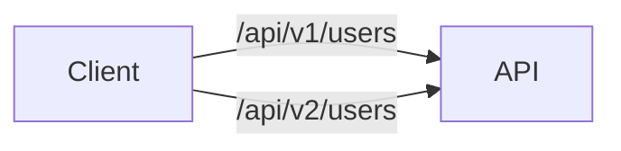
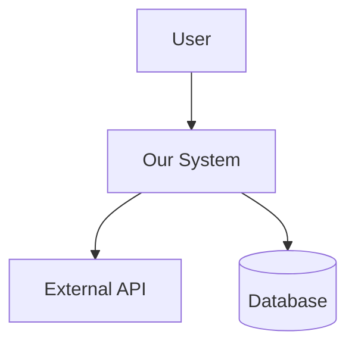
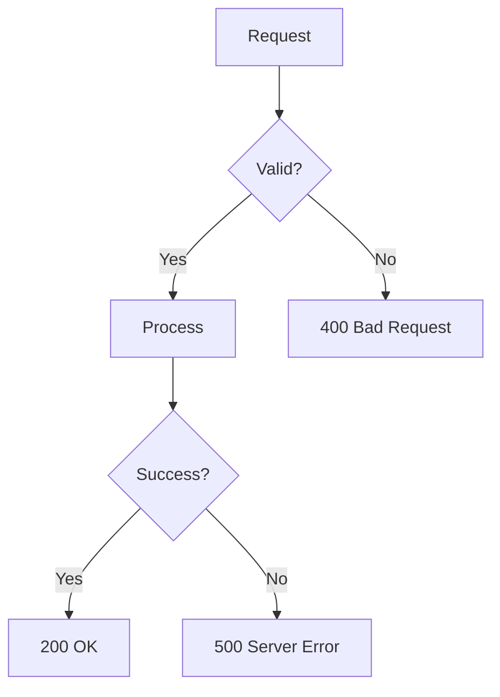
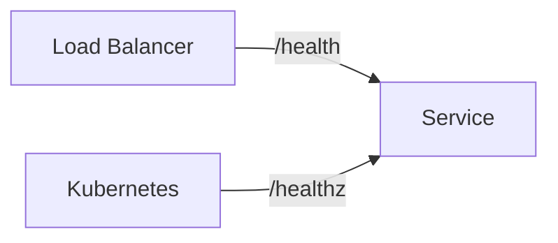
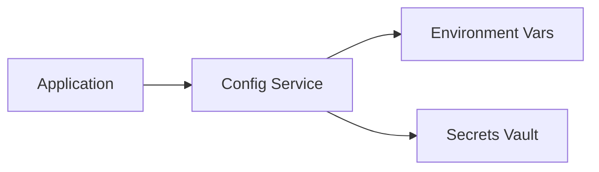
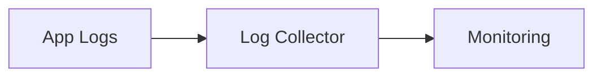
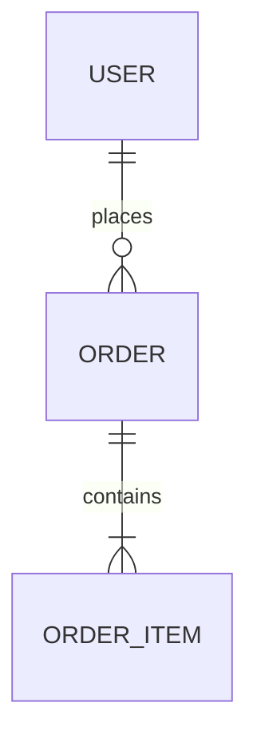

# Architectural Standards

> Source: Confluence - Architectural Standards
> Last Updated: 2026-01-24

---

## Documentation Standards

### 1. API Versioning

**Severity**: High | **Required**: Yes

All APIs must include version information in the path or header.



**Expected Format**:
- URL Path: `/api/v1/resource`
- Header: `Accept-Version: v1`

**Keywords**: `v1`, `v2`, `version`, `API version`, `/api/v`

---

### 2. Architecture Overview

**Severity**: Medium | **Required**: Yes

Documents must include an architecture overview section with:
- System context diagram
- Component descriptions
- Data flow



**Keywords**: `overview`, `diagram`, `description`, `purpose`, `scope`, `context`

---

### 3. Error Handling Strategy

**Severity**: High | **Required**: Yes

Error handling approach must be documented including:
- Error response format
- Error codes
- Retry strategies
- Fallback behavior



**Keywords**: `error`, `exception`, `handling`, `retry`, `fallback`, `error code`

---

## Naming Conventions

### 4. Component Naming

**Severity**: Medium | **Required**: Yes

Components should follow standard naming suffixes:

| Type | Suffix | Example |
|------|--------|---------|
| Services | `*Service` | `UserService` |
| Controllers | `*Controller` | `UserController` |
| Repositories | `*Repository` | `UserRepository` |
| Handlers | `*Handler` | `EventHandler` |

**Keywords**: `Service`, `Controller`, `Repository`, `Handler`, `Manager`

---

### 5. Health Check Endpoints

**Severity**: Medium | **Required**: Yes

All services must expose health check endpoints.



**Expected**: `/health`, `/healthz`, liveness probe, readiness probe

**Keywords**: `health`, `health check`, `liveness`, `readiness`, `status`

---

## Configuration Standards

### 6. Externalized Configuration

**Severity**: Medium | **Required**: Yes

Configuration must be externalized, not hardcoded.



**Keywords**: `configuration`, `config`, `environment`, `settings`, `env var`

---

### 7. Logging Standards

**Severity**: Medium | **Required**: Yes

Logging approach must be documented.



**Keywords**: `logging`, `log`, `audit`, `trace`, `monitoring`, `observability`

---

### 8. Database Schema Documentation

**Severity**: Low | **Required**: No

Database schema or ERD should be included.



**Keywords**: `schema`, `database`, `table`, `entity`, `ERD`, `data model`

---

## Structured Rules

```json
{
  "category": "architectural-standards",
  "rules": [
    {"id": "STD-001", "name": "API Versioning", "severity": "high", "required": true, "keywords": ["v1", "v2", "version", "API version"]},
    {"id": "STD-002", "name": "Architecture Overview", "severity": "medium", "required": true, "keywords": ["overview", "diagram", "description", "context"]},
    {"id": "STD-003", "name": "Error Handling", "severity": "high", "required": true, "keywords": ["error", "exception", "handling", "retry", "fallback"]},
    {"id": "STD-004", "name": "Component Naming", "severity": "medium", "required": true, "keywords": ["Service", "Controller", "Repository", "Handler"]},
    {"id": "STD-005", "name": "Health Check Endpoints", "severity": "medium", "required": true, "keywords": ["health", "liveness", "readiness"]},
    {"id": "STD-006", "name": "Externalized Configuration", "severity": "medium", "required": true, "keywords": ["configuration", "config", "environment"]},
    {"id": "STD-007", "name": "Logging Standards", "severity": "medium", "required": true, "keywords": ["logging", "log", "monitoring", "observability"]},
    {"id": "STD-008", "name": "Database Schema", "severity": "low", "required": false, "keywords": ["schema", "database", "ERD", "data model"]}
  ]
}
```
